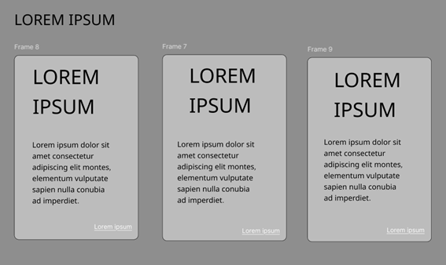

<h1 align="center">Informe de Trabajo Final</h1>
<strong>Universidad Peruana de Ciencias Aplicadas</strong><br>
<br><strong>Ingeniería de sistemas y Computación | Ingeniería de software</strong>

<!--Logo UPC-->
<p align="center">
    </img>
</p>

<!--Profesor, seccion, etc-->
<p align="left">
    <strong>Docente: </strong>Efraín Ricardo Bautista Ubillús<br><!--El br es para el salto de línea-->
    <strong>Sección: </strong>4307<br>
    <strong>Ciclo: </strong>2025 - 10<br>
    <strong>Startup: </strong>Café Metrix<br>
    <strong>Producto: </strong>Café Lab
</p>

<!--Desarrollo de aplicaciones open source-->
<h1 align="center">DESARROLLO DE APLICACIONES OPEN SOURCE</h1>

<!--Nombres de integrantes-->
<div style="text-align:center;">
    <h3><p align="center">Integrantes del equipo:</p></h3>
    <table align="center" border="1" cellpadding="8" cellspacing="0" style="border-collapse: collapse;">
        <tr>
            <th style="text-align:center; border: 1px solid #ddd;">Nombres y Apellidos</th>
            <th style="text-align:center; border: 1px solid #ddd;">Código</th>
        </tr>
        <tr>
            <td style="border: 1px solid #ddd;">Henry Kalet Esteban Roman</td>
            <td style="border: 1px solid #ddd;">U202310210</td>
        </tr>
        <tr>
            <td style="border: 1px solid #ddd;">Guillermo Fabián Tantaleán Mesta</td>
            <td style="border: 1px solid #ddd;">U202311958</td>
        </tr>
        <tr>
            <td style="border: 1px solid #ddd;">Adrian Ricardo Donayre Alvarez</td>
            <td style="border: 1px solid #ddd;">U202310187</td>
        </tr>
        <tr>
            <td style="border: 1px solid #ddd;">Christian Fabrizio Inga Orihuela</td>
            <td style="border: 1px solid #ddd;">U20231C111</td>
        </tr>
        <tr>
            <td style="border: 1px solid #ddd;">Carlos Fredy Fernandez Camayo</td>
            <td style="border: 1px solid #ddd;">U202320083</td>
        </tr>
         <tr>
            <td style="border: 1px solid #ddd;">Juan Diego Mondoñedo Rodriguez</td>
            <td style="border: 1px solid #ddd;">U202110373</td>
        </tr>
    </table>
</div>

<!--FECHA QUE SE MODIFICA-->
<div align="center" style="font-weight: bold;">21 DE JUNIO DE 2025</div><br>

<!--Registro de versiones-->
<h1 align="left">Registro de versiones del Informe</h1>
</br>
<table border="1" cellpadding="10" cellspacing="0" style="border-collapse: collapse; width: 100%;">
  <tr>
    <td align="center" style="border: 1px solid #ddd; padding: 8px;">Versión</td>
    <td align="center" style="border: 1px solid #ddd; padding: 8px;">Fecha</td>
    <td align="center" style="border: 1px solid #ddd; padding: 8px;">Autores</td>
    <td align="center" style="border: 1px solid #ddd; padding: 8px;">Descripción</td>
  </tr>
  <tr>
    <td style="border: 1px solid #ddd; padding: 8px;">TB1</td>
    <td style="border: 1px solid #ddd; padding: 8px;">26/04/2025</td>
    <td style="border: 1px solid #ddd; padding: 8px;">
      <ul>
        <li>Guillermo Tantaleán</li>
        <li>Henry Esteban</li>
        <li>Adrian Donayre</li>
        <li>Christian Inga</li>
        <li>Carlos Fernandez</li>
      </ul>
    </td>
    <td style="border: 1px solid #ddd; padding: 8px;">            
      <ul>
        <li>Capítulo I: Introducción</li>
        <li>Capítulo II: Requirements Elicitation & Analysis</li>
        <li>Capítulo III: Requirements Specification</li>
        <li>Capítulo IV: Product Design</li>
        <li>Capítulo V: Product Implementation, Validation & Deployment hasta el primer sprint</li>
        <li>Avance de Conclusiones, Bibliografía y Anexos</li>
      </ul>
    </td>
  </tr>
  <tr>
    <td style="border: 1px solid #ddd; padding: 8px;">TP</td>
    <td style="border: 1px solid #ddd; padding: 8px;">15/05/2025</td>
    <td style="border: 1px solid #ddd; padding: 8px;">
      <ul>
        <li>Guillermo Tantaleán</li>
        <li>Henry Esteban</li>
        <li>Adrian Donayre</li>
        <li>Christian Inga</li>
        <li>Carlos Fernandez</li>
      </ul>
    </td>
    <td style="border: 1px solid #ddd; padding: 8px;">            
      <ul>
        <li>Capítulo V: Product Implementation, Validation & Deployment hasta el segundo sprint</li>
        <li>Avance de Conclusiones, Bibliografía y Anexos</li>
      </ul>
    </td>
  </tr>
  <tr>
    <td style="border: 1px solid #ddd; padding: 8px;">TB2</td>
    <td style="border: 1px solid #ddd; padding: 8px;">15/06/2025</td>
    <td style="border: 1px solid #ddd; padding: 8px;">
      <ul>
        <li>Guillermo Tantaleán</li>
        <li>Henry Esteban</li>
        <li>Adrian Donayre</li>
        <li>Christian Inga</li>
        <li>Carlos Fernandez</li>
        <li>Juan Diego Mondoñedo</li>
      </ul>
    </td>
    <td style="border: 1px solid #ddd; padding: 8px;">            
      <ul>
        <li>Capítulo V: Product Implementation, Validation & Deployment, tercer sprint</li>
        <li>Avance de Conclusiones, Bibliografía y Anexos</li>
      </ul>
    </td>
  </tr>
</table><br>

<!--Link al repositorio en la organización-->
# Project Report Collaboration Insights

**TB1 Network Graph**
<figure style="text-align: center;">
    
</figure>

**TB1 Contributors**
<figure style="text-align: center;">
    
</figure>

**TB1 Pulse**
<figure style="text-align: center;">
    
</figure>

<h1>TB1</h1>

<p>Para el desarrollo del informe perteneciente a la entrega TB1, se dividió la implementación de secciones de la siguiente forma para cada integrante del equipo:</p>

<table align="center" border="1" cellpadding="10" cellspacing="0" style="border-collapse: collapse; width: 100%;">
  <tr>
    <td align="center" style="border: 1px solid #ddd; padding: 8px;">Integrante</td>
    <td align="center" style="border: 1px solid #ddd; padding: 8px;">Tareas Asignadas</td>
  </tr>
  <tr>
    <td style="border: 1px solid #ddd; padding: 8px;">Guillermo Tantaleán</td>
    <td style="border: 1px solid #ddd; padding: 8px;">Realicé el branding (logo y variantes), todo el apartado de Style Guidelines, Information Architecture, además del software development environment configuration y source code management.</td>
  </tr>
  <tr>
    <td style="border: 1px solid #ddd; padding: 8px;">Henry Esteban</td>
    <td style="border: 1px solid #ddd; padding: 8px;">Redacté el apartado de antecedentes y problemática, estructuré el análisis de entrevistas, elaboré el To-Be Scenario Mapping, algunas user stories y participé en el diseño de wireframes y mockups de la landing page.</td>
  </tr>
  <tr>
    <td style="border: 1px solid #ddd; padding: 8px;">Adrian Donayre</td>
    <td style="border: 1px solid #ddd; padding: 8px;">Descripción de la startup, diseño de entrevistas, registro de entrevistas, user stories, product backlog, landing page wireframes, web aplication wireframes, Aspect Leaders and Collaborators, sprint backlog 1</td>
  </tr>
  <tr>
    <td style="border: 1px solid #ddd; padding: 8px;">Christian Inga</td>
    <td style="border: 1px solid #ddd; padding: 8px;">Registro de entrevistas, ubiquitous language, Web application wireframes, web application wireflows, web application mockups, web application prototyping.</td>
  </tr>
  <tr>
    <td style="border: 1px solid #ddd; padding: 8px;">Carlos Fernandez</td>
    <td style="border: 1px solid #ddd; padding: 8px;">Desarrollo de Entrevistas, user personas, User journey Mapping, Empathy mapping, Impact Mapping,Carlos Fredy Fenandez Camayo Desarrollo de Entrevistas, user personas, User journey Mapping, Empathy mapping, Impact Mapping Desarrollo de User Stories. landing page wireframe, mock up y web application, Despliegue de Landing page en Netlify</td>
  </tr>
</table>

**TP1 Network Graph**
<figure style="text-align: center;">
    
</figure>

**TP1 Contributors**
<figure style="text-align: center;">
    
</figure>

**TP1 Pulse**
<figure style="text-align: center;">
    
</figure>

<h1>TP</h1>

<p>Para el desarrollo del informe perteneciente a la entrega TP, se dividió la implementación de secciones de la siguiente forma para cada integrante del equipo:</p>

<table align="center" border="1" cellpadding="10" cellspacing="0" style="border-collapse: collapse; width: 100%;">
  <tr>
    <td align="center" style="border: 1px solid #ddd; padding: 8px;">Integrante</td>
    <td align="center" style="border: 1px solid #ddd; padding: 8px;">Tareas Asignadas</td>
  </tr>
  <tr>
    <td style="border: 1px solid #ddd; padding: 8px;">Guillermo Tantaleán</td>
    <td style="border: 1px solid #ddd; padding: 8px;">Realicé la edición del informe para agregar los nuevos trabajos realizados en el TP, ordené los user stories y technical stories</td>
  </tr>
  <tr>
    <td style="border: 1px solid #ddd; padding: 8px;">Henry Esteban</td>
    <td style="border: 1px solid #ddd; padding: 8px;">Integré las imágenes correspondiente de los reportes de github desarrollo del informe.</td>
  </tr>
  <tr>
    <td style="border: 1px solid #ddd; padding: 8px;">Adrian Donayre</td>
    <td style="border: 1px solid #ddd; padding: 8px;">Realicé la implementación del sprint backlog 1 y 2</td>
  </tr>
  <tr>
    <td style="border: 1px solid #ddd; padding: 8px;">Christian Inga</td>
    <td style="border: 1px solid #ddd; padding: 8px;">Mejoré la implementación del Lean UX Canvas y corregí el timing de las entrevistas para que se muestren de forma ascendente.</td>
  </tr>
  <tr>
    <td style="border: 1px solid #ddd; padding: 8px;">Carlos Fernandez</td>
    <td style="border: 1px solid #ddd; padding: 8px;">Ordené los user stories y technical stories según corresponde a la importancia del producto.</td>
  </tr>
</table>

**TP1 Network Graph**
<figure style="text-align: center;">
    
</figure>

**TP1 Contributors**
<figure style="text-align: center;">
    
</figure>

**TP1 Pulse**
<figure style="text-align: center;">
    
</figure>

<h1>TB2</h1>

<p>Para el desarrollo del informe perteneciente a la TB2, se dividió la implementación de secciones de la siguiente forma para cada integrante del equipo:</p>

<table align="center" border="1" cellpadding="10" cellspacing="0" style="border-collapse: collapse; width: 100%;">
  <tr>
    <td align="center" style="border: 1px solid #ddd; padding: 8px;">Integrante</td>
    <td align="center" style="border: 1px solid #ddd; padding: 8px;">Tareas Asignadas</td>
  </tr>
  <tr>
    <td style="border: 1px solid #ddd; padding: 8px;">Guillermo Tantaleán</td>
    <td style="border: 1px solid #ddd; padding: 8px;">Realicé la edición del informe para agregar los nuevos trabajos realizados en el TP, ordené los user stories y technical stories</td>
  </tr>
  <tr>
    <td style="border: 1px solid #ddd; padding: 8px;">Henry Esteban</td>
    <td style="border: 1px solid #ddd; padding: 8px;">asumí un rol activo en la organización general del equipo. Coordiné la distribución de tareas y aseguré el cumplimiento de los entregables en los plazos establecidos. A nivel técnico, desarrollé las bases del backend para los Web Services y realicé correcciones funcionales y visuales tanto en el Frontend como en el Landing Page. Asimismo, estuve a cargo de la edición de los videos “About-The-Product” y “About-The-Team”. También lideré la mejora continua de artefactos presentados en sprints anteriores, implementando ajustes basados en retroalimentación y principios de usabilidad.</td>
  </tr>
  <tr>
    <td style="border: 1px solid #ddd; padding: 8px;">Adrian Donayre</td>
    <td style="border: 1px solid #ddd; padding: 8px;">Realicé la implementación del sprint backlog 1 y 2</td>
  </tr>
  <tr>
    <td style="border: 1px solid #ddd; padding: 8px;">Christian Inga</td>
    <td style="border: 1px solid #ddd; padding: 8px;">Mejoré la implementación del Lean UX Canvas y corregí el timing de las entrevistas para que se muestren de forma ascendente.</td>
  </tr>
  <tr>
    <td style="border: 1px solid #ddd; padding: 8px;">Carlos Fernandez</td>
    <td style="border: 1px solid #ddd; padding: 8px;">Ordené los user stories y technical stories según corresponde a la importancia del producto. Redaccion de entrevistas de validacion y heuristicas</td>

  </tr>
  <tr>
    <td style="border: 1px solid #ddd; padding: 8px;">Juan Diego Mondoñedo</td>
    <td style="border: 1px solid #ddd; padding: 8px;">Recreé la landing page en angular, desarrolle el tercer sprint.</td>
  </tr>
</table>

<!--ÍNDICE-->
# Contenido 
[Student Outcome](#student-outcome)

[Capítulo I: Introducción](#capítulo-i-introducción)
- [1.1. Startup Profile](#11-startup-profile)
  - [1.1.1. Descripción de la Startup](#111-descripción-de-la-startup)
  - [1.1.2. Perfiles de integrantes del equipo](#112-perfiles-de-integrantes-del-equipo)
- [1.2. Solution Profile](#12-solution-profile)
  - [1.2.1 Antecedentes y problemática](#121-antecedentes-y-problemática)
  - [1.2.2 Lean UX Process](#122-lean-ux-process)
    - [1.2.2.1. Lean UX Problem Statements](#1221-lean-ux-problem-statements)
    - [1.2.2.2. Lean UX Assumptions](#1222-lean-ux-assumptions)
    - [1.2.2.3. Lean UX Hypothesis Statements](#1223-lean-ux-hypothesis-statements)
    - [1.2.2.4. Lean UX Canvas](#1224-lean-ux-canvas)
- [1.3. Segmentos objetivo](#13-segmentos-objetivo)
- [Capítulo II: Requirements Elicitation \& Analysis](#capítulo-ii-requirements-elicitation--analysis)
  - [2.1. Competidores](#21-competidores)
    - [2.1.1. Análisis competitivo](#211-análisis-competitivo)
    - [2.1.2. Estrategias y tácticas frente a competidores](#212-estrategias-y-tácticas-frente-a-competidores)
  - [2.2. Entrevistas](#22-entrevistas)
    - [2.2.1. Diseño de entrevistas](#221-diseño-de-entrevistas)
    - [2.2.2. Registro de entrevistas](#222-registro-de-entrevistas)
    - [2.2.3. Análisis de entrevistas](#223-análisis-de-entrevistas)
  - [2.3. Needfinding](#23-needfinding)
    - [2.3.1. User Personas](#231-user-personas)
    - [2.3.2. User Task Matrix](#232-user-task-matrix)
    - [2.3.3. User Journey Mapping](#233-user-journey-mapping)
    - [2.3.4. Empathy Mapping](#234-empathy-mapping)
    - [2.3.5. As-is Scenario Mapping](#235-as-is-scenario-mapping)
  - [2.4. Ubiquitous Language](#24-ubiquitous-language)
- [Capítulo III: Requirements Specification](#capítulo-iii-requirements-specification)
  - [3.1. To-Be Scenario Mapping](#31-to-be-scenario-mapping)
  - [3.2. User Stories](#32-user-stories)
  - [3.3. Impact Mapping](#33-impact-mapping)
  - [3.4. Product Backlog](#34-product-backlog)
- [Capítulo IV: Product Design](#capítulo-iv-product-design)
  - [4.1. Style Guidelines](#41-style-guidelines)
    - [4.1.1. General Style Guidelines](#411-general-style-guidelines)
    - [4.1.2. Web Style Guidelines](#412-web-style-guidelines)
  - [4.2. Information Architecture](#42-information-architecture)
    - [4.2.1. Organization Systems](#421-organization-systems)
    - [4.2.2. Labeling Systems](#422-labeling-systems)
    - [4.2.3. SEO Tags and Meta Tags](#423-seo-tags-and-meta-tags)
    - [4.2.4. Searching Systems](#424-searching-systems)
    - [4.2.5. Navigation Systems](#425-navigation-systems)
  - [4.3. Landing Page UI Design](#43-landing-page-ui-design)
    - [4.3.1. Landing Page Wireframe](#431-landing-page-wireframe)
    - [4.3.2. Landing Page Mock-up](#432-landing-page-mock-up)
  - [4.4. Web Applications UX/UI Design](#44-web-applications-uxui-design)
    - [4.4.1. Web Applications Wireframes](#441-web-applications-wireframes)
    - [4.4.2. Web Applications Wireflow Diagrams](#442-web-applications-wireflow-diagrams)
    - [4.4.3. Web Applications Mock-ups](#443-web-applications-mock-ups)
    - [4.4.4. Web Applications User Flow Diagrams](#444-web-applications-user-flow-diagrams)
  - [4.5. Web Applications Prototyping](#45-web-applications-prototyping)
  - [4.6. Domain-Driven Software Architecture](#46-domain-driven-software-architecture)
    - [4.6.1. Software Architecture Context Diagram](#461-software-architecture-context-diagram)
    - [4.6.2. Software Architecture Container Diagrams](#462-software-architecture-container-diagrams)
    - [4.6.3. Software Architecture Components Diagrams](#463-software-architecture-components-diagrams)
  - [4.7. Software Object-Oriented Design](#47-software-object-oriented-design)
    - [4.7.1. Class Diagrams](#471-class-diagrams)
    - [4.7.2. Class Dictionary](#472-class-dictionary)
  - [4.8. Database Design](#48-database-design)
    - [4.8.1. Database Diagram](#481-database-diagram)
  - [4.9. Backend Diagrams](#49-backend-diagrams)
- [Capítulo V: Product Implementation, Validation \& Deployment](#capítulo-v-product-implementation-validation--deployment)
  - [5.1. Software Configuration Management](#51-software-configuration-management)
    - [5.1.1. Software Development Environment Configuration](#511-software-development-environment-configuration)
    - [5.1.2. Source Code Management](#512-source-code-management)
    - [5.1.3. Source Code Style Guide \& Conventions](#513-source-code-style-guide--conventions)
    - [5.1.4. Software Deployment Configuration](#514-software-deployment-configuration)
  - [5.2. Landing Page, Services \& Applications Implementation](#52-landing-page-services--applications-implementation)
    - [5.2.1. Sprint 1](#521-sprint-1)
      - [5.2.1.1. Sprint Planning 1](#5211-sprint-planning-1)
      - [5.2.1.2. Aspect Leaders and Collaborators](#5212-aspect-leaders-and-collaborators)
      - [5.2.1.3. Sprint Backlog 1.](#5213-sprint-backlog-1)
      - [5.2.1.4. Development Evidence for Sprint Review](#5214-development-evidence-for-sprint-review)
      - [5.2.1.5. Execution Evidence for Sprint Review](#5215-execution-evidence-for-sprint-review)
      - [5.2.1.6. Services Documentation Evidence for Sprint Review](#5216-services-documentation-evidence-for-sprint-review)
      - [5.2.1.7. Software Deployment Evidence for Sprint Review](#5217-software-deployment-evidence-for-sprint-review)
      - [5.2.1.8. Team Collaboration Insights during Sprint](#5218-team-collaboration-insights-during-sprint)
    - [5.2.2. Sprint 2](#522-sprint-2)
      - [5.2.2.1. Sprint Planning 2](#5221-sprint-planning-2)
      - [5.2.2.2. Aspect Leaders and Collaborators](#5222-aspect-leaders-and-collaborators)
      - [5.2.2.3. Sprint Backlog 2.](#5223-sprint-backlog-2)
      - [5.2.2.4. Development Evidence for Sprint Review](#5224-development-evidence-for-sprint-review)
      - [5.2.2.5. Execution Evidence for Sprint Review](#5225-execution-evidence-for-sprint-review)
      - [5.2.2.6. Services Documentation Evidence for Sprint Review](#5226-services-documentation-evidence-for-sprint-review)
      - [5.2.2.7. Software Deployment Evidence for Sprint Review](#5227-software-deployment-evidence-for-sprint-review)
      - [5.2.2.8. Team Collaboration Insights during Sprint](#5228-team-collaboration-insights-during-sprint)
    - [5.2.3. Sprint 3](#523-sprint-3)
      - [5.2.3.1. Sprint Planning 2](#5231-sprint-planning-3)
      - [5.2.3.2. Aspect Leaders and Collaborators](#5232-aspect-leaders-and-collaborators)
      - [5.2.3.3. Sprint Backlog 2.](#5233-sprint-backlog-3)
      - [5.2.3.4. Development Evidence for Sprint Review](#5234-development-evidence-for-sprint-review)
      - [5.2.3.5. Execution Evidence for Sprint Review](#5235-execution-evidence-for-sprint-review)
      - [5.2.3.6. Services Documentation Evidence for Sprint Review](#5236-services-documentation-evidence-for-sprint-review)
      - [5.2.3.7. Software Deployment Evidence for Sprint Review](#5237-software-deployment-evidence-for-sprint-review)
      - [5.2.3.8. Team Collaboration Insights during Sprint](#5238-team-collaboration-insights-during-sprint)
  - [5.3. Validation Interviews](#53-validation-interviews)
    - [5.3.1. Diseño de Entrevistas](#531-diseño-de-entrevistas)
    - [5.3.2. Registro de Entrevistas](#532-registro-de-entrevistas)
    - [5.3.3. Evaluaciones según heurísticas](#533-evaluaciones-según-heurísticas)
  - [5.4. Video About-the-Product](#54-video-about-the-product)
- [Conclusiones y recomendaciones](#conclusiones-y-recomendaciones)
- [Video About-the-Team](#video-about-the-team)
- [Bibliografía](#bibliografía)
- [Anexos](#anexos)
  


<!--STUDENT OUTCOME-->
# Student Outcome
<div style="text-align:center;">
    <table align="center" border="1" cellpadding="8" cellspacing="0" style="border-collapse: collapse; width: 100%;">
        <tr>
            <th style="text-align:center; border: 1px solid #ddd;">Student Outcomes</th>
            <th style="text-align:center; border: 1px solid #ddd;">Acciones realizadas</th>
            <th style="text-align:center; border: 1px solid #ddd;">Conclusiones</th>
        </tr>
        <tr>
            <td style="border: 1px solid #ddd; vertical-align: top;">
            3.c1. Comunica oralmente con efectividad a diferentes rangos de audiencia</td>
            <td style="border: 1px solid #ddd; vertical-align: top;">
                <strong>Guillermo Tantaleán</strong><br>
                TB1: <br>Durante el TB1, me comuniqué oralmente con efectividad al participar en la planificación del Sprint 1, donde expliqué de manera clara los avances de wireframes y mockups de la landing page para diversos públicos del equipo. También aporté en reuniones para estructurar el análisis de entrevistas, asegurándome de adaptar mi lenguaje a interlocutores técnicos y no técnicos.<br><br>
                TP: <br>Durante las reuniones del equipo para organizar las tareas del TP, me encargué de explicar claramente cómo íbamos a estructurar las user stories y technical stories, asegurándome de que todos entendieran su orden y prioridad.<br><br>
                TB2: <br>Durante la entrega,expuse avances técnicos, resolví mis dudas con compañeros y comuniqué decisiones de diseño. También presenté oralmente el funcionamiento del feature de sesiones de cata, inventario y production cost management.
<br><br>
                <strong>Henry Esteban</strong><br>
                TB1: <br>Logré comunicarme efectivamente con diferentes audiencias al estructurar y presentar la problemática y los segmentos objetivo de manera clara y adaptada al perfil de los usuarios, además de explicar conceptos durante las reuniones de coordinación del análisis de entrevistas y del diseño de la landing page, asegurando una comprensión común entre los integrantes del equipo.<br><br>
                TP: <br>En las coordinaciones para la edición del informe del TP, pude expresar mis ideas de manera clara al proponer la organización del contenido, logrando consenso en las decisiones tomadas.<br><br>
                TB2: <br>Durante este Sprint, fui responsable de la sección 5.3.3 Sprint Backlog 3 y asumí un rol activo en la organización general del equipo. Coordiné la distribución de tareas y aseguré el cumplimiento de los entregables en los plazos establecidos. A nivel técnico, desarrollé las bases del backend para los Web Services y realicé correcciones funcionales y visuales tanto en el Frontend como en el Landing Page. Asimismo, estuve a cargo de la edición de los videos “About-The-Product” y “About-The-Team”. También lideré la mejora continua de artefactos presentados en sprints anteriores, implementando ajustes basados en retroalimentación y principios de usabilidad.<br><br>
                <strong>Adrian Donayre</strong><br>
                TB1: <br>Al revisar los avances de los demás, brindé retroalimentación verbal sobre la estructura del backlog y la presentación de los reportes, cuidando mi forma de comunicar según el contexto de cada tarea.<br><br>
                TP: <br>En las coordinaciones para la edición del informe del TP, pude expresar mis ideas de manera clara al proponer la organización del contenido, logrando consenso en las decisiones tomadas.<br><br>
                TB2: <br>Realicé 2 entrevistas de validación con nuestros segmentos objetivos, adaptando mi estilo de comunicación y nivel de detalle según el perfil de los entrevistados. Por otro lado, realicé mejoras y correcciones en el front-end y back-end. Transmití verbalmente al equipo las conclusiones extraídas de las entrevistas, empleando un lenguaje claro y preciso para garantizar que las recomendaciones surgidas de cada sesión se comprendieran y aplicaran correctamente.<br><br>
                <strong>Christian Inga</strong><br>
                TB1: <br>Logré comunicarme de manera efectiva con diferentes audiencias al realizar las entrevistas, también mediante el lenguaje ubicuo, ya que este es muy importante para que todos se puedan entender durante el desarrollo del proyecto.<br><br>
                TP: <br>Al momento de validar que el informe tuviera coherencia entre las secciones, presenté mis observaciones oralmente al grupo para facilitar los ajustes necesarios, priorizando la claridad y el tono colaborativo.<br><br>
                TB2: <br>Realicé entrevistas de validación con nuestros segmentos objetivos para recopilar feedback. Por otro lado, realicé mejoras y correcciones en el apartado de recetas en el front-end. Además, comuniqué mis hallazgos y propuestas oralmente al equipo, usando un lenguaje claro y colaborativo, de modo que los ajustes se integraran de forma coherente con los objetivos del proyecto.<br><br>
                <strong>Carlos Fernandez</strong><br>
                TB1: <br>Para una adecuado desarrollo del proyecto, comunique oportunamente las ideas que se plasmaron, asi como el uso de herramientas adecuadas para concoer mas a los usuario, asi como las entrevistas, donde pude conocer mas a los segmentos objetivos y sus necesidades, las cuales abarcariamos mediante el desarrollo de una landing page. <br><br>
                TP: <br>Participé activamente en conversaciones con el team leader y compañeros para coordinar tareas pendientes del TP, explicando con claridad los cambios que estaba realizando y cómo se relacionaban con el resto del informe.<br><br>
                TB2: <br>Para las correcciones del frontend comunique oportunamente sobre la mejora continua y detalles a tomar en cuenta para el funcionamiento adecuado y visualizacion correcta de elementos y durante las entrevistas se logro reconocer los principales reconomientos e indicaciones a tomar en cuenta para el desarrollo adecuado, asimismo la revision adecuada y comunicacion sobre la implementacion de backend e indicaciones oportunas en reuniones de equipo.<br><br>
                <strong>Juan Diego Mondoñedo</strong><br>
                TB2: <br>Participé activamente en la planificación y desarrollo del 3er sprint, comunicándome con mis compañeros para la delegación de tareas y obteniendo actualizaciones de los avances para actualizar los sprints a la par del desarrollo<br><br>
            </td>
        <td style="border: 1px solid #ddd; vertical-align: top;">Durante el TB1, el equipo demostró comunicación oral efectiva con diversas audiencias al explicar avances de wireframes y mockups de la landing page, adaptando el lenguaje según el perfil del interlocutor. Se realizaron entrevistas a usuarios, se tradujeron requisitos técnicos en user stories comprensibles y se utilizó un lenguaje ubicuo para asegurar la comprensión común. El equipo comunicó ideas y necesidades del proyecto de manera clara, utilizando las herramientas adecuadas para comprender a los usuarios, lo que fue fundamental para la coordinación exitosa del Sprint 1 y el desarrollo de la landing page.
       <br> <br> Como equipo, organizamos reuniones efectivas donde cada integrante comunicó sus avances y dificultades, logrando una colaboración fluida que permitió mejorar la calidad del trabajo entregado en el TP.
        </td>
        </tr>
        <tr>
            <td style="border: 1px solid #ddd; vertical-align: top;">
             3.c2. Comunica por escrito con efectividad a diferentes rangos de audiencia</td>
            <td style="border: 1px solid #ddd; vertical-align: top;">
                <strong>Henry Esteban</strong><br>
                TB1: <br>Redacté el apartado de antecedentes y la problemática objetivo utilizando un lenguaje técnico claro y coherente, elaboré el análisis de entrevistas de forma organizada y detallada, y aporté en la documentación del To-Be Scenario Mapping, user stories y wireframes, transmitiendo la información de manera precisa para distintos públicos lectores del informe final.<br><br>
                TP: <br>Me encargué de editar el informe del TP, cuidando que la redacción de las nuevas secciones fuera clara, ordenada y adecuada para una lectura técnica fluida, facilitando así su revisión por parte del equipo y los evaluadores.<br><br>
                TB2: <br>Durante este Sprint, contribuí a la documentación técnica del proyecto, cuidando la claridad y el orden en los entregables escritos para facilitar su comprensión tanto por parte del equipo como del docente revisor. Redacté y estructuré el Sprint Backlog 3 de forma precisa y coherente, y también colaboré en la corrección de artefactos previos, enfocándome en mejorar la calidad de la redacción. Concluyo que adaptar el lenguaje y la estructura del contenido escrito según el público objetivo es clave para una comunicación efectiva y profesional.<br><br>
                <strong>Adrian Donayre</strong><br>
                TB1: <br>Logré comunicarme por escrito efectivamente con diferentes audiencias al documentar entrevistas adaptando el registro según el usuario, redactar user stories en formato comprensible para técnicos y no técnicos, crear descripciones claras de la startup para diferentes stakeholders, documentar wireframes con anotaciones precisas y elaborar el product backlog con especificaciones detalladas para el equipo de desarrollo.<br><br>
                TP: <br>	Al subir mis cambios al repositorio, documenté claramente los commits y mensajes para que otros pudieran entender las ediciones realizadas en el informe, promoviendo la trazabilidad de las contribuciones.
                <br><br>
                TB2: <br>Elaboré por escrito los resúmenes de las entrevistas de validación dirigidas a nuestros segmentos objetivo. Posteriormente, redacté un el análisis de las respuestas. De este modo, aseguré que se recibiera la información con el nivel de detalle y el estilo de comunicación adecuados, facilitando su comprensión y la aplicación efectiva de las recomendaciones.<br><br>
                <strong>Christian Inga</strong><br>
                TB1: <br>Logré comunicarme por escrito satisfactoriamente con diferentes audiencias, ya que las entrevistas ayudan a entender mejor las necesidades de nuestros usuarios. También con los wireflows de manera que se entienda los flujos.<br><br>
                TP: <br>	Aporté en la mejora de la redacción de algunas secciones del TP, cuidando aspectos de estilo, ortografía y consistencia, para asegurar que el informe tuviera un lenguaje profesional y técnico adecuado.
                <br><br>
                TB2: <br>Diseñé las preguntas de las entrevistas de validación, adaptando el lenguaje y la estructura de las preguntas según nuestros segmentos objetivos. Estas preguntas fueron las que se usaron para que todos entrevistemos a los usuarios, asegurando que cada grupo comprendiera el propósito y el alcance de las entrevistas, lo que facilitó su ejecución uniforme.<br><br>
                <strong>Carlos Fernandez</strong><br>
                TB1: <br>La comunicacion adecuada con la audiencia, en especial durante las entrevistas, me ha permitido mejorar mis habilidades comunicativas, asi como descriptivas. En el presente documento pude plasmar los pensamientos y necesidades de los segmentos objetivos mediante plataformas como Uxpressia, asi como el adecuado texto utilizado en los wireframe y Mock Up.<br><br>
                TP: <br>	Revisé el documento del informe del TP con atención a la coherencia textual entre secciones, proponiendo ajustes escritos para mantener un hilo conductor claro que permitiera una lectura comprensible del proceso del proyecto.
                <br><br>
                TB2: <br> Revision continua de codigo frontend y backend, comunicacion objetiva sobre las mejoras a implementarse, asi como la redaccion de analisis de entrevistas para considerar observaciones y mejors a aplicarse, ademas de poder actualizar la documentacion mediante la actividades y responsabilidades a entregarse<br><br>
                <strong>Guillermo Fabián Tantaleán Mesta</strong><br>
                TB1: <br>Redacté de manera clara y coherente el apartado de antecedentes y la problemática objetivo del proyecto, elaboré el análisis de entrevistas, y documenté procesos en el desarrollo de user stories, To-Be Scenario Mapping y Web Style Guidelines, adaptando el lenguaje técnico para que fuera comprensible a diferentes audiencias lectoras del informe final. <br>
                TP: <br>Redacté las secciones relacionadas con los user stories y technical stories, organizándolos de forma lógica y comprensible, utilizando una estructura coherente que facilitara su comprensión por todos los miembros del grupo.<br><br>
                TB2: <br>Documenté el desarrollo de mis funcionalidades en el proyecto mediante comentarios en el código, comandos y descripciones en las tareas del repositorio. Además, redacté explicaciones claras sobre la lógica detrás del feature de sesiones de cata y los cambios realizados en el backend, permitiendo que tanto desarrolladores como docentes puedan comprender el funcionamiento sin ambigüedades.
<br>
              </td>
              <strong>Juan Diego Mondoñedo Rodriguez</strong><br>
                TB2: <br>Redacté las secciones del Sprint planning, Aspect Leaders and Collaborators y Sprint backlog del 2do y 3er sprint.<br><br>
              </td>
        </td>
        <td style="border: 1px solid #ddd; vertical-align: top;">Durante el TB1, el equipo demostró comunicación escrita efectiva con diversas audiencias a través de la redacción clara de documentos técnicos como antecedentes, problemática objetivo y análisis de entrevistas. Se documentaron user stories en formato comprensible para lectores técnicos y no técnicos, se crearon descripciones de la startup adaptadas a diferentes stakeholders, y se elaboraron wireframes con anotaciones precisas. El equipo también desarrolló documentación para el product backlog, To-Be Scenario Mapping y Web Style Guidelines, adaptando el lenguaje técnico para diversos públicos. Las entrevistas escritas y los wireflows contribuyeron a la comprensión de las necesidades de los usuarios, mientras que plataformas como Uxpressia permitieron plasmar efectivamente los requerimientos en el informe final.
        <br> <br> Como grupo, redactamos el informe del TP colaborativamente, combinando nuestras habilidades para presentar los avances del proyecto con un lenguaje claro, técnico y adecuado para diferentes audiencias.
</td>
</table>
</div>
<!--TODAS LAS SECCIONES A COMPLETAR-->

# Capítulo I: Introducción
## 1.1. Startup Profile
En esta sección se brinda la descripción de nuestra startup, producto y miembros de equipo.
### 1.1.1. Descripción de la Startup
**Café Metrix** es una startup enfocada en desarrollar soluciones tecnológicas para la industria del café de especialidad. Nace de la pasión por combinar tecnología accesible con el arte del café.

Así, nace **Café Lab**, el cual es un sistema integral diseñado para baristas profesionales y cafeterías de especialidad que busca resolver dos problemas fundamentales en la industria: la falta de herramientas integradas para documentar, replicar y compartir procesos clave del café, y la desarticulación entre el tueste del grano y la experiencia final en taza.

La solución consiste en una plataforma dual que combina software y componentes IoT, proporcionando control total sobre el café desde el grano verde hasta la preparación final. Permite documentar perfiles de tueste, controlar el almacenamiento del café verde, digitalizar procesos de calibración, conectar la forma en que tuestan el café con cómo sabe finalmente (alineando parámetros técnicos del tostado con el perfil en taza) y reforzar la transparencia de la cadena productiva (mostrando de dónde viene el café y cómo se ha procesado en cada etapa).

**Misión**: Elevar la calidad y consistencia del café, documentando cada etapa del proceso para garantizar resultados excepcionales y sostenibles.

**Visión**: Ser líder en el estándar tecnológico que revoluciona la industria del café de especialidad.

#### Logo, isotipo y logotipo de Café Lab:


### 1.1.2. Perfiles de integrantes del equipo
<table border="1">
  <tr>
    <td></td>
    <td>Mi nombre es <strong>Adrian Donayre</strong>, tengo 19 
    años y actualmente estoy cursando el quinto ciclo de la 
    carrera de Ingeniería de Software en la UPC. Tengo habilidad en los lenguajes C++ y javascript. Así mismo, cuento con experiencia en monitoreo de infraestructura en herramientas como Azure, NR y Kemp. Personalmente, opino que lo que hagamos en la universidad se verá reflejado en nuestra vida profesional. Por ello me esfuerzo en ampliar mis conocimientos y conseguir nuevas experiencias que me sumen para seguir mejorando.</td>
  </tr>
  <tr>
    <td> </td>
    <td>Mi nombre es <strong>Guillermo Tantaleán</strong>, tengo 18 años y estoy cursando el quinto ciclo de Ingeniería de Software en la UPC. Me apasiona el desarrollo web y de aplicaciones móviles. Tengo habilidades para gestión de proyectos, trabajo en equipo, y ventas.</td>
  </tr>
  <tr>
  <td> </td>
    <td>Mi nombre es <strong>Henry Esteban</strong>, tengo 19 años y me encuentro en ing de software. Me considero atractivo a abrir nuevas experiencias y ser mejor persona cada día, me gusta aprender y siempre escucho los buenos consejos</td>
  </tr>
  <tr> 
    <td>   </td>
    <td> Mi nombre es <strong>Carlos Fernandez</strong>, tengo 21 años y estudio la carrera de Ingenieria de Software, me encuentro preparando en algunas areas como desarrollo de aplicaciones moviles con Flutter y desarrollo de videojuegos como Unity y Godot, considero que un desempeño adecuado en la universidad me ayudara a mejorar mis habilidades y conocimiento en el desarrollo de proyectos </td>
  </tr>
  <tr>
    <td></td>
    <td> Mi nombre es <strong>Christian Inga</strong>, tengo 19 años y actualmente estoy estudiando la carrera de Ingenieria de Software. Tengo conocimientos en los lenguajes de programación de C++, Python y Javascript. Considero que puedo adaptarme a diferentes formas de trabajo para alcanzar un objetivo. Me considero una persona responsable y confiable. </td>
  </tr>
  <tr>
    <td></td>
    <td> Mi nombre es <strong>Juan Diego Mondoñedo</strong>, tengo 21 años y soy estudiante de la carrera de Ingenieria de Software. Soy una persona adaptable a las circunstancias y puedo amoldar mis estrategias de trabajo para cumplir las expectativas de cualquier equipo. </td>
  </tr>
</table>

## 1.2. Solution Profile
### 1.2.1 Antecedentes y problemática
**Who (¿Quiénes?):** 

Baristas profesionales y dueños de cafeterías de especialidad que manejan procesos desde el tueste hasta la preparación, así como emprendedores del rubro que buscan escalar su operación manteniendo la calidad.

**What (¿Qué sucede?):**

Actualmente utilizan herramientas manuales o genéricas que no permiten documentar ni replicar parámetros técnicos clave, lo que genera inconsistencias en la calidad del café, desconexión entre procesos y pérdida de trazabilidad.

**When (¿Cuándo ocurre?):**

Cuando se intenta replicar perfiles de tueste, preparar recetas específicas o cumplir con estándares de calidad de forma profesional sin contar con herramientas digitales adaptadas al rubro.

**Where (¿Dónde ocurre?):**

En laboratorios de café, tostadores pequeños, cafeterías urbanas o rurales y negocios en expansión que buscan formalizar su operación.

**Why (¿Por qué es un problema?):**

La falta de integración entre los procesos técnicos (almacenamiento, tueste, calibración, cata, extracción) dificulta la estandarización, reduce la calidad percibida y limita la posibilidad de crecer o competir en el mercado de cafés de especialidad.

**How (¿Cómo lo solucionan hoy?):**

Mediante registros manuales en cuadernos, hojas de Excel, softwares genéricos no adaptados al café, sin conexión entre lotes, recetas y resultados.

**How much (¿Cuánto cuesta no resolverlo?):**

Genera pérdida de reputación, inconsistencias en la calidad, dificultad para cumplir certificaciones y pérdida de clientes exigentes. Además, impide escalar el negocio con eficiencia.

### 1.2.2 Lean UX Process
#### 1.2.2.1. Lean UX Problem Statements
Nuestro sistema para baristas y cafeterías de especialidad fue diseñado para lograr que los usuarios puedan documentar, replicar y mejorar procesos como el tueste, la preparación y la cata, además de asegurar trazabilidad y control desde el grano verde hasta la taza.

Hemos observado que el producto no está cumpliendo completamente con estos objetivos, ya que los procesos están desarticulados, no hay conexión entre etapas como el almacenamiento, el tueste y la extracción, y muchos datos importantes se pierden o no se registran. Esto provoca errores, variabilidad en la calidad, pérdida de información y poca confianza del cliente final.

¿Cómo podríamos mejorar la plataforma para que los usuarios sean más exitosos mediante una integración real de procesos, alertas en tiempo real sobre el estado del grano, y herramientas que permitan ver y comparar datos técnicos y sensoriales, basándonos en métricas como consistencia en recetas, reducción de pérdidas y mejora en la trazabilidad?
#### 1.2.2.2. Lean UX Assumptions
**¿Quién es el usuario?**

El usuario principal de este producto son baristas profesionales y cafeterías de especialidad. Los baristas profesionales se encargan de gestionar todo el proceso del café, desde la compra del café verde hasta su preparación en taza. Buscan consistencia, calidad y trazabilidad para ofrecer un café superior, ya sea en competencias, consultorías o para clientes exigentes. Por otro lado, las cafeterías de especialidad se enfocan en ofrecer cafés de origen con características únicas y diferenciadas. Estas cafeterías necesitan herramientas para asegurar la calidad del café, cumplir con certificaciones y fidelizar a sus clientes a través de la transparencia y el seguimiento de cada etapa del proceso.

**¿Dónde encaja nuestro producto en su vida?**

El producto encaja perfectamente en el flujo de trabajo diario de los baristas y las cafeterías, proporcionando una herramienta integral para documentar, estandarizar y optimizar cada uno de los pasos del proceso de preparación del café. Desde el tueste del grano, pasando por la calibración de los molinos, hasta la cata y la preparación final, el producto facilita la replicabilidad de los procesos y mejora la consistencia de la calidad del café. Además, el sistema ayuda a las cafeterías a gestionar la trazabilidad del café, asegurando que cumplan con las normativas de certificación y mantengan un registro detallado desde el origen del grano hasta la taza que llega al cliente.

**¿Qué problemas tiene nuestro producto y cómo se pueden resolver?**

El primer problema que enfrentan los usuarios es la falta de herramientas integradas para la documentación y replicación de procesos. Muchos baristas y cafeterías trabajan con métodos desarticulados y no tienen una forma eficiente de documentar sus procedimientos. Nuestro producto resuelve esto mediante una plataforma que integra el software, permitiendo a los usuarios documentar y comparar perfiles de tueste, calibración de molinos y catas. El segundo problema es la falta de trazabilidad en los procesos, lo que genera inconsistencias y pérdidas de calidad. La plataforma resuelve esto al ofrecer trazabilidad completa desde el grano verde hasta la taza, asegurando que las variables críticas sean controladas y monitorizadas. 

**¿Cuándo y cómo se usará nuestro producto?**

El producto se utilizará en todo el ciclo de vida del café. Desde la recepción y almacenamiento del café verde hasta el proceso de tueste, calibración, cata y preparación final. Los baristas y administradores de cafeterías utilizarán la plataforma de manera continua en su jornada diaria, ajustando los parámetros de tueste, calibrando los molinos, y evaluando las catas de café. La herramienta será accesible tanto en plataformas web como móviles, lo que permitirá a los usuarios acceder a los datos y realizar ajustes desde cualquier lugar. 

**¿Qué características son importantes?**

Las características clave de nuestro producto incluyen una interfaz intuitiva, que permita a los baristas y administradores navegar y usar la plataforma sin complicaciones. La trazabilidad completa es otra característica esencial, permitiendo que los usuarios rastreen el café desde su origen hasta la taza, asegurando que cada variable crítica sea registrada y controlada. También es crucial que el sistema envíe alertas automáticas sobre el estado del café verde, como cambios en la temperatura o humedad, para prevenir el deterioro del grano. La documentación y comparativa de los diferentes perfiles de tueste y catas permite replicar los procesos exitosos y mejorar la calidad. Además, el producto debe incluir capacitación y soporte, proporcionando guías de uso y recursos educativos para maximizar la efectividad del sistema.

**¿Cómo debe verse nuestro producto y cómo debe comportarse?**

Visualmente, el producto debe ser claro, moderno y profesional, con un diseño minimalista que facilite la comprensión de los datos. La interfaz debe incluir gráficos fáciles de interpretar y una visualización intuitiva de los diferentes parámetros del proceso de café, como las curvas de tueste, los parámetros de extracción y los perfiles sensoriales. En cuanto a su comportamiento, la plataforma debe ser rápida y confiable, con tiempos de respuesta mínimos para que los usuarios puedan tomar decisiones en tiempo real. Las alertas automáticas deben ser precisas y oportunas, mientras que la navegación debe ser fluida tanto en la aplicación web como móvil. Además, el sistema debe permitir una rápida configuración de los perfiles de tueste, calibraciones y ajustes según las necesidades de cada usuario.
#### 1.2.2.3. Lean UX Hypothesis Statements
**Hypothesis Statement 1:**  
**Creemos que si** CaféLab proporciona a baristas y cafeterías una plataforma digital que permita documentar, replicar y compartir procesos clave como el tueste, la calibración del molino, la cata y la preparación.

**Sabremos** que hemos tenido éxito.

**Cuando** la consistencia del café mejore en un 40% y la satisfacción del cliente aumente en un 30%.

**Hypothesis Statement 2:**  
**Creemos que si** CaféLab implementa un módulo que alinee los parámetros técnicos del tueste (como humedad, temperatura de carga y curva de tueste) con el perfil final en taza.

**Sabremos** que hemos tenido éxito.

**Cuando** los baristas reduzcan las inconsistencias en la extracción en un 35% y disminuyan las pérdidas de calidad en un 25%.

**Hypothesis Statement 3:**  
**Creemos que si** CaféLab integra el sensor IoT TrackSilo para monitorear en tiempo real la temperatura (18-22°C) y la humedad (55-65%) del café verde, con alertas tempranas y registro por lote.

**Sabremos** que hemos tenido éxito.

**Cuando** los usuarios reduzcan las pérdidas de calidad por mala conservación en un 30% y mejoren los resultados del tueste en un 20%.
#### 1.2.2.4. Lean UX Canvas

<td></td>

Enlace para acceder al [Canvas](https://app.mural.co/t/workspace06322/m/workspace06322/1746663843706/9d4cdde362fcb2e2e7ab63b79b9f4cbbbb9cf6c0?sender=udb49d0aae562d2e192373949).

## 1.3. Segmentos objetivo

### Segmentación del Dominio del Problema
Esta sección describe a los segmentos clave vinculados al dominio del problema en el contexto del café de especialidad, integrando características demográficas y datos estadísticos de respaldo, a fin de contextualizar la necesidad de soluciones tecnológicas específicas para cada perfil de usuario.
#### 1. Baristas Profesionales

El segmento de baristas profesionales está compuesto por individuos altamente capacitados que participan activamente en múltiples etapas del proceso del café, incluyendo la compra de grano verde, su almacenamiento, tueste, molienda y preparación final. Este perfil se caracteriza por un alto nivel de especialización técnica y un enfoque en la excelencia sensorial y la estandarización de procesos.

Demográficamente, según la **Specialty Coffee Association (SCA)**, este grupo suele estar integrado por personas entre los 25 y 40 años, con una creciente presencia de mujeres (aproximadamente el 34% del total de profesionales certificados por la SCA en América Latina, 2022). Se concentran principalmente en zonas urbanas de alto dinamismo cultural y económico, donde el consumo de café de especialidad ha crecido sostenidamente en los últimos años. En países latinoamericanos como México, Colombia y Perú, se estima que el número de baristas certificados ha aumentado entre un 15% y 20% anual desde 2018 (SCA, 2023).

Desde el punto de vista funcional, estos profesionales requieren registrar curvas de tueste con precisión, ajustar perfiles según el tipo de grano y replicar recetas bajo estándares estrictos de control de calidad. Buscan herramientas que refuercen su propuesta de valor mediante el uso de datos técnicos (temperaturas, tiempos, tasas de desarrollo) y sensoriales (puntajes SCA, notas de cata, intensidad aromática), especialmente en contextos competitivos, consultorías o servicios personalizados a clientes exigentes.

La trazabilidad, la consistencia y la capacidad de documentar procesos son aspectos críticos para este grupo, que actúa como actor clave en la profesionalización y tecnificación del sector cafetalero.

#### 2. Cafeterías de Especialidad (Administradores y Dueños)

El segundo segmento corresponde a administradores y propietarios de cafeterías de especialidad, cuya operación se centra en la oferta de cafés de origen con atributos diferenciados. Este grupo combina un enfoque comercial con una orientación ética hacia la transparencia, la sostenibilidad y la relación directa con productores.

A nivel demográfico, estos actores suelen tener entre 30 y 50 años, con formación en administración, gastronomía o emprendimiento. Según el informe *“Coffee Shops Market in Latin America”* de **Euromonitor International (2023)**, más del 70% de las cafeterías de especialidad en crecimiento se ubican en centros urbanos y están dirigidas por emprendedores que gestionan entre 3 y 10 empleados por unidad de negocio.

En cuanto a tendencias, el crecimiento del mercado de café de especialidad ha sido del 9,4% anual en América Latina entre 2017 y 2022, y se espera que continúe con una tasa superior al 7% anual hasta 2027 (**Allied Market Research, 2022**). Este crecimiento está vinculado a la demanda de consumidores por productos con origen claro, procesos sostenibles y diferenciación sensorial.

Las necesidades de este segmento se enfocan en asegurar la trazabilidad del grano desde su origen hasta la taza, con el fin de fortalecer la fidelización del cliente mediante narrativas de origen verificables y certificaciones como **ORGÁNICO**, **COMERCIO JUSTO** y **MEDIO AMBIENTE**. Asimismo, requieren herramientas que integren gestión de inventario, seguimiento del proceso de tueste y control de calidad en el punto de venta.

Estas cafeterías no solo representan una oportunidad de mercado, sino también un nodo estratégico en la cadena de valor, ya que comunican directamente con el consumidor final, trasladando los valores de sostenibilidad, calidad y origen.

# Capítulo II: Requirements Elicitation & Analysis

## 2.1. Competidores
**Cropster**: Cropster es una plataforma líder global en la gestión del café de especialidad, con herramientas para tueste, inventario, cata y análisis de datos. Se enfoca en optimizar procesos y facilitar la colaboración en la cadena del café.

**Artisan**: Artisan es un software gratuito y de código abierto para registrar y analizar perfiles de tueste, popular entre tostadores y baristas con presupuestos limitados.

**CoffeeMind**: CoffeeMind combina educación y herramientas digitales para baristas, con un enfoque en cata sensorial y formación profesional, ofreciendo módulos para registrar y analizar perfiles de sabor.

### 2.1.1. Análisis competitivo

#### Competitive Analysis


<table border="1" cellpadding="8" cellspacing="0" style="border-collapse: collapse; width: 100%;">
    <tr>
        <th colspan="6" style="text-align:center; border: 1px solid #000;">Competitive Analysis Landscape</th>
    </tr>
    <tr>
        <th style="text-align:center; border: 1px solid #000;">¿Por qué llevar a cabo este análisis?</th>
        <td colspan="5" style="border: 1px solid #000;">Este análisis busca identificar las fortalezas, debilidades y estrategias de los competidores de CaféLab en el mercado del café de especialidad, para entender cómo posicionar nuestra solución (software + IoT) y destacar frente a competidores establecidos.</td>
    </tr>
    <tr>
        <th style="border: 1px solid #000;"></th>
        <th style="text-align:center; border: 1px solid #000;"></th>
        <th style="text-align:center; border: 1px solid #000;">CaféLab</th>
        <th style="text-align:center; border: 1px solid #000;">Cropster</th>
        <th style="text-align:center; border: 1px solid #000;">Ikawa</th>
        <th style="text-align:center; border: 1px solid #000;">Beanconqueror</th>
    </tr>
    <tr>
        <th rowspan="3" style="text-align:center; border: 1px solid #000;">Perfil</th>
        <td style="border: 1px solid #000;"><strong>Overview</strong></td>
        <td style="border: 1px solid #000;">Plataforma web para baristas y cafeterías, con módulos para tueste, cata, calibración, trazabilidad e IoT (TrackSilo).</td>
        <td style="border: 1px solid #000;">Plataforma líder para tueste, cata y trazabilidad, usada por tostadores profesionales.</td>
        <td style="border: 1px solid #000;">Solución para tueste y análisis, con hardware y software integrados.</td>
        <td style="border: 1px solid #000;">App gratuita para baristas, enfocada en cata y calibración de espresso.</td>
    </tr>
    <tr>
        <td style="border: 1px solid #000;"><strong>Ventaja competitiva ¿Qué valor ofrece a los clientes?</strong></td>
        <td style="border: 1px solid #000;">Integración de IoT (TrackSilo) para monitoreo de almacenamiento, y trazabilidad completa.</td>
        <td style="border: 1px solid #000;">Amplia experiencia en el mercado y comunidad de usuarios grande.</td>
        <td style="border: 1px solid #000;">Hardware de tueste de alta precisión integrado con software.</td>
        <td style="border: 1px solid #000;">Gratuita, de código abierto y centrada en la comunidad de baristas.</td>
    </tr>
    <tr>
        <td style="border: 1px solid #000;"><strong>Clientes</strong></td>
        <td style="border: 1px solid #000;">Baristas profesionales y cafeterías de especialidad.</td>
        <td style="border: 1px solid #000;">Tostadores grandes y cafeterías de especialidad.</td>
        <td style="border: 1px solid #000;">Baristas y pequeños tostadores.</td>
        <td style="border: 1px solid #000;">Baristas aficionados y profesionales pequeños.</td>
    </tr>
    <tr>
        <th rowspan="2" style="text-align:center; border: 1px solid #000;">Perfil de Marketing</th>
        <td style="border: 1px solid #000;"><strong>Mercado objetivo</strong></td>
        <td style="border: 1px solid #000;">Cafeterías de especialidad en América Latina, con planes de expansión global.</td>
        <td style="border: 1px solid #000;">Mercado global, especialmente en Europa y Norteamérica.</td>
        <td style="border: 1px solid #000;">Mercado global, con enfoque en pequeños tostadores.</td>
        <td style="border: 1px solid #000;">Baristas individuales a nivel global.</td>
    </tr>
    <tr>
        <td style="border: 1px solid #000;"><strong>Estrategias de marketing</strong></td>
        <td style="border: 1px solid #000;">Marketing digital (redes sociales, blogs), alianzas con asociaciones de café y ferias.</td>
        <td style="border: 1px solid #000;">Presencia en eventos de café, marketing de contenido y asociaciones con tostadores.</td>
        <td style="border: 1px solid #000;">Enfoque en innovación de hardware, demostraciones en ferias de café.</td>
        <td style="border: 1px solid #000;">Comunidad de código abierto, marketing de boca en boca.</td>
    </tr>
    <tr>
        <th rowspan="3" style="text-align:center; border: 1px solid #000;">Perfil de Producto</th>
        <td style="border: 1px solid #000;"><strong>Productos & Servicios</strong></td>
        <td style="border: 1px solid #000;">Plataforma web con módulos de tueste, cata, calibración, trazabilidad y sensor IoT (TrackSilo).</td>
        <td style="border: 1px solid #000;">Plataforma de software para gestión de tueste, cata, trazabilidad e integración con equipos de tostado.</td>
        <td style="border: 1px solid #000;">Roaster IoT (50-120g) con app para control de tueste y análisis, incluyendo integración con Cropster.</td>
        <td style="border: 1px solid #000;">Aplicación móvil gratuita para registro de cata, tueste y calibración de espresso.</td>
    </tr>
    <tr>
        <td style="border: 1px solid #000;"><strong>Precios & Costos</strong></td>
        <td style="border: 1px solid #000;">Suscripciones escalonadas: Base Cafetal ($50/mes), Artista del Tueste ($100/mes), D' Especialidad ($200/mes).</td>
        <td style="border: 1px solid #000;">Suscripciones premium (desde $50/mes, con costos adicionales por integración y equipos).</td>
        <td style="border: 1px solid #000;">Compra del hardware ($2,500-$3,500) + suscripción opcional para app ($20/mes).</td>
        <td style="border: 1px solid #000;">Gratuita, con opciones de donación o compras dentro de la app.</td>
    </tr>
    <tr>
        <td style="border: 1px solid #000;"><strong>Canales de distribución (web/móvil)</strong></td>
        <td style="border: 1px solid #000;">Plataforma web (sin app móvil).</td>
        <td style="border: 1px solid #000;">Plataforma web y app móvil para gestión.</td>
        <td style="border: 1px solid #000;">App móvil (iOS/Android) + hardware físico.</td>
        <td style="border: 1px solid #000;">App móvil (iOS/Android).</td>
    </tr>
    <tr>
        <th rowspan="4" style="text-align:center; border: 1px solid #000;">ANÁLISIS SWOT</th>
        <td style="border: 1px solid #000;"><strong>Fortalezas</strong></td>
        <td style="border: 1px solid #000;">Integración de IoT para monitoreo de almacenamiento, trazabilidad completa, enfoque en América Latina.</td>
        <td style="border: 1px solid #000;">Reputación consolidada, soporte técnico robusto, integración con múltiples equipos de tostado.</td>
        <td style="border: 1px solid #000;">Innovación en hardware IoT, precisión en tueste de muestra, colaboración con Cropster.</td>
        <td style="border: 1px solid #000;">Accesibilidad gratuita, comunidad activa, facilidad de uso para principiantes.</td>
    </tr>
    <tr>
        <td style="border: 1px solid #000;"><strong>Debilidades</strong></td>
        <td style="border: 1px solid #000;">Sin aplicación móvil, equipo pequeño, aún no consolidado en el mercado global.</td>
        <td style="border: 1px solid #000;">Costos elevados, dependencia de equipos específicos, curva de aprendizaje.</td>
        <td style="border: 1px solid #000;">Costo inicial alto, limitado a muestras pequeñas, dependencia de hardware.</td>
        <td style="border: 1px solid #000;">Funcionalidades limitadas, falta de soporte profesional, dependencia de la comunidad.</td>
    </tr>
    <tr>
        <td style="border: 1px solid #000;"><strong>Oportunidades</strong></td>
        <td style="border: 1px solid #000;">Creciente interés en trazabilidad y sostenibilidad en el café, mercado en expansión en América Latina.</td>
        <td style="border: 1px solid #000;">Expansión a mercados emergentes, mayor integración con IoT y análisis avanzado.</td>
        <td style="border: 1px solid #000;">Creciente demanda de equipos portátiles, integración con más plataformas de software.</td>
        <td style="border: 1px solid #000;">Aumentar funciones premium, atraer a más usuarios profesionales.</td>
    </tr>
    <tr>
        <td style="border: 1px solid #000;"><strong>Amenazas</strong></td>
        <td style="border: 1px solid #000;">Competencia de plataformas establecidas como Cropster, posibles barreras regulatorias para IoT.</td>
        <td style="border: 1px solid #000;">Competencia de soluciones gratuitas como Beanconqueror, cambios en precios de suscripción.</td>
        <td style="border: 1px solid #000;">Competencia de otros fabricantes de hardware, limitaciones técnicas en escalabilidad.</td>
        <td style="border: 1px solid #000;">Competencia de soluciones pagadas más completas, falta de monetización sostenible.</td>
    </tr>
</table>

### 2.1.2. Estrategias y tácticas frente a competidores
Nuestra estrategia se basa en la diferenciación tecnológica y la accesibilidad para baristas y cafeterías de especialidad, ofreciendo una solución integral que combine software y hardware (IoT). Así, nuestras tácticas clave son:

🟩 **Optimizar la Experiencia del Usuario en la Plataforma**  
Garantizar que la interfaz de CaféLab sea intuitiva, visualmente atractiva y fácil de usar para baristas y administradores de cafeterías, con dashboards claros para monitorear almacenamiento, tueste y cata, lo que impulsa la adopción y fideliza a los usuarios frente a competidores más complejos como Cropster.

🟩 **Colaborar con Certificadoras y Comunidades de Café**  
Establecer alianzas con certificadoras (como Rainforest Alliance o Fair Trade) y comunidades de baristas (como asociaciones locales o eventos internacionales) para validar la trazabilidad de CaféLab y facilitar la conexión con cafeterías que buscan cumplir certificaciones, diferenciándose de Artisan y CoffeeMind.

🟩 **Realizar Campañas Educativas sobre Calidad y Trazabilidad**  
Promover buenas prácticas de almacenamiento, tueste y cata a través de contenido digital (blogs, videos, webinars) y redes sociales, destacando cómo CaféLab y el sensor TrackSilo aseguran la calidad del café desde el grano hasta la taza, educando a baristas y cafeterías sobre los beneficios de la trazabilidad frente a métodos manuales.

🟩 **Fomentar la Adopción de CaféLab**  
Ofrecer el Plan Base Cafetal gratuito con funcionalidades clave (registro básico de tuestes y catas), e incentivos como acceso a hexágonos sensoriales personalizados o descuentos en los planes premium durante los primeros meses, para atraer a usuarios iniciales, validar el modelo y generar confianza frente a competidores como Cropster y CoffeeMind.
## 2.2. Entrevistas
### 2.2.1. Diseño de entrevistas

#### Preguntas dirigidas a Baristas Profesionales:

**Preguntas principales:**

1. ¿Qué aspecto de tu método actual para registrar tus perfiles de tueste y recetas te gustaría que fuera más eficiente o preciso? ¿Hay alguna información valiosa que actualmente sea difícil de capturar o que lleve demasiado tiempo documentar?
2. ¿Qué sistema has desarrollado para capturar y gestionar toda la información sobre origen, altitud, variedad y procesamiento? ¿Hay algún dato que te gustaría replicar más veces pero es complicado hacerlo con tus métodos actuales?
3. ¿Qué sistema has empleado para capturar y gestionar toda la información sobre origen, altitud, variedad y procesamiento? ¿Hay algún dato que te gustaría registrar pero es complicado hacerlo con tus métodos actuales?
4. ¿Qué estrategia has desarrollado para documentar y ajustar los parámetros de molienda para tus diferentes métodos de preparación? ¿Cuál es el desafío más frustrante que enfrentas al intentar mantener esta precisión?
5. ¿Qué método has encontrado más efectivo para registrar tus evaluaciones sensoriales y conectarlas directamente con tus perfiles de tueste?
6. ¿Qué tipo de información te han solicitado jueces o clientes sofisticados que te haya costado proporcionar de manera profesional? ¿Cómo has resuelto este desafío?
7. ¿Qué sistema has desarrollado para transportar todo tu conocimiento técnico y artístico en competencias, consultorías o colaboraciones? ¿Cuál es el punto débil de este proceso que te gustaría resolver?
8. ¿Qué metodología has implementado para rastrear el estado de tu café verde y tostado a lo largo del tiempo? ¿Qué información adicional sobre tus lotes te ayudaría a tomar decisiones más precisas sobre su uso óptimo?
9. ¿Cuáles son esos puntos críticos que encuentras más desafiantes al intentar documentar y reproducir una curva de tueste específica? ¿Qué soluciones creativas has desarrollado para superar estas limitaciones?
10. ¿Qué herramientas digitales has incorporado que realmente han transformado algún aspecto de tu proceso? ¿Dónde sientes que la tecnología actual todavía te deja con necesidades sin resolver?
11. Si existiera una plataforma integral que conectara cada fase del proceso —desde la recepción del grano verde hasta la experiencia final en taza—, ¿qué funcionalidades específicas considerarías absolutamente esenciales? Considerando el impacto en tu eficiencia y calidad.

---

#### Preguntas dirigidas a Dueños/Administradores de Cafeterías de Especialidad:

**Preguntas principales:**

1. ¿Qué certificaciones son importantes para tu negocio (orgánico, comercio justo, etc.)? ¿Cómo gestionas actualmente la documentación relacionada?
2. ¿Cómo comunicas a tus clientes la información sobre las características especiales del café que ofreces? ¿Cuál es la información más solicitada por ellos?
3. ¿Cómo registras y evalúas a tus proveedores de café verde? ¿Qué datos son cruciales para tu proceso de selección?
4. ¿Cómo controlas las condiciones de almacenamiento de tus granos de café verde? ¿Has experimentado pérdidas por deterioro y cómo podrías haberlas evitado?
5. ¿Qué estrategias implementas para mantener la consistencia en la calidad del café servido cuando cuentas con diferentes baristas en tu equipo?
6. ¿Qué sistema has desarrollado para transportar todo tu conocimiento técnico y artístico en competencias, eventos o colaboraciones? ¿Cuál es el punto débil de este proceso que te gustaría resolver?
7. ¿Cómo documentas y transmites el conocimiento técnico sobre tus cafés a tu equipo? ¿Qué herramientas utilizas para este proceso?
8. ¿Cómo calculan actualmente el rendimiento y la rentabilidad por lote de café? ¿Qué métricas te gustaría poder medir con más precisión?
9. ¿Qué información consideras fundamental para garantizar la trazabilidad completa desde el origen hasta la taza? ¿Cómo la organizas actualmente?
10. ¿Qué herramientas digitales utilizas actualmente para la gestión de tu cafetería? ¿Qué procesos siguen siendo principalmente manuales o análogos?
11. Si existiera una plataforma integral que conectara cada fase del proceso —desde la recepción del grano verde hasta la experiencia final en taza—, ¿qué funcionalidades específicas considerarías absolutamente esenciales? Considerando el impacto en tu eficiencia y calidad.

---
### 2.2.2. Registro de entrevistas 

#### Entrevistas a baristas profesionales

<table border="1">
  <tr>
    <th>Campo</th>
    <th>Información</th>
  </tr>
  <tr>
    <td>Entrevistado 1</td>
    <td>Alejandra Avellaneda</td>
  </tr>
  <tr>
    <td>Edad</td>
    <td>27</td>
  </tr>
  <tr>
    <td>Distrito</td>
    <td>Surco</td>
  </tr>
  <tr>
    <td></td>
    <td>Alejandra trabaja en el área operativa de una cadena de cafeterías, donde se encarga de estandarizar las recetas y asegurar la consistencia en la calidad del café entre tiendas. Tiene conocimientos técnicos sobre calibración, evaluación sensorial y trazabilidad del grano, y maneja protocolos detallados para eventos fuera del entorno habitual. Utiliza balanzas de precisión y máquinas programables como parte de sus herramientas diarias. Si bien reconoce que ciertos datos sensibles no pueden compartirse por temas de confidencialidad, considera que una plataforma digital que integre información de trazabilidad, tueste y calidad sensorial podría ser de gran valor para su operación.</td>
  </tr>
  <tr>
    <td>Timing:00:00-06:55</td>
    <td>    <a href="https://upcedupe-my.sharepoint.com/:v:/g/personal/u202310210_upc_edu_pe/ESlL0dXXzIFHvNO_L7wd6lAB96OjUBRnmY5j9-DMdWezVg?e=6ZBgG7&nav=eyJyZWZlcnJhbEluZm8iOnsicmVmZXJyYWxBcHAiOiJTdHJlYW1XZWJBcHAiLCJyZWZlcnJhbFZpZXciOiJTaGFyZURpYWxvZy1MaW5rIiwicmVmZXJyYWxBcHBQbGF0Zm9ybSI6IldlYiIsInJlZmVycmFsTW9kZSI6InZpZXcifX0%3D">
        Ver grabación</td>
  </tr>
</table>
</table>

<table border="1">
  <tr>
    <th>Campo</th>
    <th>Información</th>
  </tr>
  <tr>
    <td>Entrevistado 2</td>
    <td>Victor Cruz</td>
  </tr>
  <tr>
    <td>Edad</td>
    <td>23</td>
  </tr>
  <tr>
    <td>Distrito</td>
    <td>Santiago de Surco</td>
  </tr>
  <tr>
    <td></td>
    <td>Víctor Cruz es un barista autodidacta con experiencia en café de especialidad, formado a través de investigación personal, observación en cafeterías y visitas a fincas productoras de café como las de Villa Rica. Su enfoque destaca por la curiosidad y el aprendizaje empírico, aunque reconoce limitaciones en la documentación de métodos tradicionales como el tueste a leña. Sus principales desafíos incluyen la calibración precisa de máquinas inestables, la estandarización de recetas entre baristas, y el control del inventario ante la falta de tiempo y recursos. Utiliza métodos como el V60 para evaluación sensorial y busca profesionalizar aún más su práctica para aplicar su conocimiento a nivel internacional. Considera clave contar con una plataforma integral que permita rastrear todo el proceso del café, desde el grano verde hasta la taza de café final, y destaca el valor de la tecnología para mejorar consistencia, trazabilidad y eficiencia.</td>
  </tr>
  <tr>
    <td>Timing:06:55-13:26</td>
    <td>    <a href="https://upcedupe-my.sharepoint.com/:v:/g/personal/u202310210_upc_edu_pe/ESlL0dXXzIFHvNO_L7wd6lAB96OjUBRnmY5j9-DMdWezVg?e=6ZBgG7&nav=eyJyZWZlcnJhbEluZm8iOnsicmVmZXJyYWxBcHAiOiJTdHJlYW1XZWJBcHAiLCJyZWZlcnJhbFZpZXciOiJTaGFyZURpYWxvZy1MaW5rIiwicmVmZXJyYWxBcHBQbGF0Zm9ybSI6IldlYiIsInJlZmVycmFsTW9kZSI6InZpZXcifX0%3D">
        Ver grabación</td>
  </tr>
</table>

<table border="1">
  <tr>
    <th>Campo</th>
    <th>Información</th>
  </tr>
  <tr>
    <td>Entrevistado 3</td>
    <td>Anyela Guillermo</td>
  </tr>
  <tr>
    <td>Edad</td>
    <td>24</td>
  </tr>
  <tr>
    <td>Distrito</td>
    <td>San Borja</td>
  </tr>
  <tr>
    <td></td>
    <td>Anyela es una barista con 3 años de experiencia en café de especialidad y participante en competencias de latte art. Sus principales desafíos incluyen mantener la consistencia entre baristas, documentar recetas, encontrar temperaturas ideales para métodos filtrados, preservar propiedades del café mediante almacenamiento adecuado y lograr precisión en calibraciones. Aunque utiliza registros manuales, identifica la necesidad de herramientas tecnológicas para evaluación del café, análisis de variedades y monitoreo de almacenamiento. Considera valioso implementar una plataforma integral que conecte todo el proceso del café y espacios tipo laboratorio que integren teoría y práctica, desde el cultivo hasta la taza final.</td>
  </tr>
  <tr>
    <td>Timing:13:26-19:48</td>
    <td>    <a href="https://upcedupe-my.sharepoint.com/:v:/g/personal/u202310210_upc_edu_pe/ESlL0dXXzIFHvNO_L7wd6lAB96OjUBRnmY5j9-DMdWezVg?e=6ZBgG7&nav=eyJyZWZlcnJhbEluZm8iOnsicmVmZXJyYWxBcHAiOiJTdHJlYW1XZWJBcHAiLCJyZWZlcnJhbFZpZXciOiJTaGFyZURpYWxvZy1MaW5rIiwicmVmZXJyYWxBcHBQbGF0Zm9ybSI6IldlYiIsInJlZmVycmFsTW9kZSI6InZpZXcifX0%3D">
        Ver grabación</td>
  </tr>

#### Entrevistas a dueños o administradores de cafeterías de especialidad
<table border="1">
  <tr>
    <th>Campo</th>
    <th>Información</th>
  </tr>
  <tr>
    <td>Entrevistado 1</td>
    <td>Raul Donayre</td>
  </tr>
  <tr>
    <td>Edad</td>
    <td>42</td>
  </tr>
  <tr>
    <td>Distrito</td>
    <td>San Borja</td>
  </tr>
  <tr>
    <td></td>
    <td>Raul describió sus principales desafíos operativos y necesidades tecnológicas. Actualmente maneja de forma manual y desorganizada aspectos cruciales como certificaciones, información de proveedores y trazabilidad del café, lo que dificulta responder ágilmente a los clientes. Utiliza métodos básicos para comunicar las características especiales del café, incluyendo tarjetas informativas, aunque reconoce que necesita algo más visual y atractivo. Para mantener la consistencia entre baristas, implementa un sistema de mentoría y reuniones semanales de cata, pero admite que su documentación y capacitación necesitan actualización. En cuanto a tecnología, usa principalmente Excel, una caja registradora digital y aplicaciones básicas de tueste, pero carece de un sistema integral. Su principal necesidad es una plataforma que mejore la eficiencia operativa y la experiencia del cliente, permitiendo mostrar el valor agregado de sus productos para justificar precios más altos y aumentar la rentabilidad del negocio. El dueño enfatiza que cualquier solución debe ser tangible y visible para los clientes, ayudando a gestionar todo el proceso desde la recepción del grano hasta la taza final.</td>
  </tr>
  <tr>
    <td>Timing:19:48-26:13</td>
    <td>    <a href="https://upcedupe-my.sharepoint.com/:v:/g/personal/u202310210_upc_edu_pe/ESlL0dXXzIFHvNO_L7wd6lAB96OjUBRnmY5j9-DMdWezVg?e=6ZBgG7&nav=eyJyZWZlcnJhbEluZm8iOnsicmVmZXJyYWxBcHAiOiJTdHJlYW1XZWJBcHAiLCJyZWZlcnJhbFZpZXciOiJTaGFyZURpYWxvZy1MaW5rIiwicmVmZXJyYWxBcHBQbGF0Zm9ybSI6IldlYiIsInJlZmVycmFsTW9kZSI6InZpZXcifX0%3D">
        Ver grabación</td>
  </tr>
</table>

<table border="1">
  <tr>
    <th>Campo</th>
    <th>Información</th>
  </tr>
  <tr>
    <td>Entrevistado 2</td>
    <td>Omar Ortiz</td>
  </tr>
  <tr>
    <td>Edad</td>
    <td>47</td>
  </tr>
  <tr>
    <td>Distrito</td>
    <td>San Borja</td>
  </tr>
  <tr>
    <td></td>
    <td>Omar cuenta con una certificación internacional como barista por la SCA y actualmente es dueño de una cafetería especializada. Tiene un conocimiento sólido sobre los procesos del café, desde la selección del grano y sus características (como altura, proceso y humedad), hasta el control del tueste y la calibración diaria de las bebidas. Se encarga personalmente del almacenamiento y monitoreo del grano, utilizando herramientas como Excel para llevar registros de peso, rendimiento y trazabilidad. Aunque se maneja bien con herramientas digitales básicas, reconoce que ciertos procesos manuales podrían optimizarse mediante una plataforma digital especializada. Publica contenido educativo sobre café en LinkedIn, lo cual también refuerza su rol como formador dentro del rubro.</td>
  </tr>
  <tr>
    <td>Timing:26:13-32:40</td>
    <td>    <a href="https://upcedupe-my.sharepoint.com/:v:/g/personal/u202310210_upc_edu_pe/ESlL0dXXzIFHvNO_L7wd6lAB96OjUBRnmY5j9-DMdWezVg?e=6ZBgG7&nav=eyJyZWZlcnJhbEluZm8iOnsicmVmZXJyYWxBcHAiOiJTdHJlYW1XZWJBcHAiLCJyZWZlcnJhbFZpZXciOiJTaGFyZURpYWxvZy1MaW5rIiwicmVmZXJyYWxBcHBQbGF0Zm9ybSI6IldlYiIsInJlZmVycmFsTW9kZSI6InZpZXcifX0%3D">
        Ver grabación</td>
  </tr>
</table>

<table border="1">
  <tr>
    <th>Campo</th>
    <th>Información</th>
  </tr>
  <tr>
    <td>Entrevistado 3</td>
    <td>Ivo Kalinowski</td>
  </tr>
  <tr>
    <td>Edad</td>
    <td>28</td>
  </tr>
  <tr>
    <td>Distrito</td>
    <td>San Borja</td>
  </tr>
  <tr>
    <td></td>
    <td>Ivo es dueño de una cafetería de especialidad y cuenta con una amplia experiencia en el manejo integral del café, desde la selección del grano hasta la experiencia final en taza. Aunque actualmente no trabaja con cafés certificados, valora su importancia y reconoce la necesidad de herramientas digitales para gestionar mejor la documentación relacionada. La comunicación de las características del café hacia sus clientes es principalmente oral, apoyada en pizarras, y considera útil un sistema visual y estandarizado para este fin. Evalúa a sus proveedores mediante catas y relaciones de confianza, sin un registro formal, y le interesaría contar con una plataforma para organizar esa información. El almacenamiento de café lo gestiona de forma empírica, pero ha experimentado pérdidas que podrían evitarse con monitoreo digital. Para mantener la consistencia entre baristas, implementa protocolos de preparación y entrenamiento constante, aunque identifica la necesidad de una herramienta para estandarizar y compartir recetas. Transmite el conocimiento técnico de manera oral y presencial, y ve valor en una bitácora digital que permita documentar recetas, aprendizajes y procesos. Utiliza Excel y WhatsApp como herramientas principales, pero admite que muchos procesos siguen siendo manuales. Está interesado en una plataforma integral que permita gestionar trazabilidad, control de calidad, inventario, recetas, capacitación y costos de forma centralizada, mejorando así la eficiencia y la calidad de su operación.</td>
  </tr>
  <tr>
    <td>Timing:32:40-40:46</td>
    <td>    <a href="https://upcedupe-my.sharepoint.com/:v:/g/personal/u202310210_upc_edu_pe/ESlL0dXXzIFHvNO_L7wd6lAB96OjUBRnmY5j9-DMdWezVg?e=6ZBgG7&nav=eyJyZWZlcnJhbEluZm8iOnsicmVmZXJyYWxBcHAiOiJTdHJlYW1XZWJBcHAiLCJyZWZlcnJhbFZpZXciOiJTaGFyZURpYWxvZy1MaW5rIiwicmVmZXJyYWxBcHBQbGF0Zm9ybSI6IldlYiIsInJlZmVycmFsTW9kZSI6InZpZXcifX0%3D">
        Ver grabación</td>
  </tr>
</table>


### 2.2.3. Análisis de entrevistas
<h4>Análisis del segmento de administradores o dueños de cafeterías de especialidad</h4>

<p>
Los entrevistados de este segmento presentan un perfil técnico-operativo consolidado, con experiencia directa en todos los procesos del café de especialidad. El 100% de ellos manifestó dominar aspectos como la selección del grano, el control del tueste y la calibración de bebidas, realizando estas tareas de forma personal o supervisada. Asimismo, todos coincidieron en que si bien utilizan herramientas como Excel y WhatsApp para registrar información clave (peso, rendimiento, trazabilidad, recetas y comunicación interna), muchos de estos procesos siguen siendo manuales, desorganizados y propensos a errores o pérdida de información.
</p>

<p>
En cuanto a la gestión de proveedores, se evidencia que no existe un sistema formal de evaluación ni documentación; esta suele hacerse por medio de relaciones de confianza y catas, lo cual limita la trazabilidad y dificulta la toma de decisiones. Además, dos de cada tres entrevistados indicaron que han sufrido pérdidas en la calidad del grano debido a malas condiciones de almacenamiento, y reconocen que un sistema digital con alertas podría evitar dichos inconvenientes.
</p>

<p>
Otro punto crítico identificado fue la transmisión del conocimiento técnico dentro del equipo. Aunque se aplican métodos como reuniones de cata o mentorías internas, se destacó la falta de documentación estructurada que permita estandarizar procesos, capacitar al personal y mantener la consistencia entre baristas. También se detectó que la comunicación con el cliente sobre el valor agregado del café (origen, procesos, certificaciones) es limitada y poco visual, lo que afecta la percepción de calidad y dificulta justificar precios diferenciados.
</p>

<p>
Finalmente, el 100% de los entrevistados expresó interés en implementar una plataforma integral que les permita gestionar de forma centralizada la trazabilidad, el control de calidad, el inventario, las recetas y la capacitación del personal. Se valora especialmente la posibilidad de contar con herramientas visuales, módulos intuitivos y registros estructurados para mejorar la eficiencia operativa, elevar la calidad del producto final y fortalecer la experiencia del cliente.
</p>
<h4>Análisis del segmento de baristas profesionales</h4>

<p>
Los baristas entrevistados comparten un alto nivel de compromiso con la calidad y la estandarización de procesos, aunque sus perfiles son diversos en cuanto a formación y experiencia. Todos ellos demostraron conocimientos técnicos sobre calibración, evaluación sensorial y trazabilidad del grano, además de aplicar metodologías específicas para mantener la consistencia del café en sus espacios de trabajo, ya sea en cadenas, cafeterías independientes o a través de prácticas autodidactas.
</p>

<p>
Uno de los retos comunes identificados es la dificultad para estandarizar recetas entre baristas, especialmente cuando se utilizan métodos de preparación variados o cuando las máquinas presentan inestabilidad. A ello se suma la necesidad de documentar procesos como curvas de tueste, temperaturas ideales o ajustes de molienda, tareas que actualmente se hacen de forma manual o informal. Esta situación incrementa el riesgo de variabilidad en la calidad del café y limita la posibilidad de replicar resultados exitosos.
</p>

<p>
Asimismo, los entrevistados señalaron que la gestión del almacenamiento del café no siempre se realiza en condiciones óptimas, lo que puede afectar las propiedades del grano. También se evidenció un interés claro en herramientas que faciliten el análisis de variedades, la evaluación sensorial detallada y la integración de datos técnicos con perfiles de sabor, en especial en contextos de competencias o eventos formativos.
</p>

<p>
El 100% de los baristas entrevistados manifestó la necesidad de contar con una plataforma digital integral que conecte todas las etapas del proceso, desde el grano verde hasta la taza final. Este sistema debería permitir la documentación estructurada de recetas, perfiles de tueste, calibraciones y resultados sensoriales, además de facilitar el trabajo colaborativo entre miembros del equipo. Se valoran especialmente los entornos tipo laboratorio, que integren teoría y práctica, y que permitan profesionalizar aún más la labor del barista mediante el uso eficiente de la tecnología.
</p>

## 2.3. Needfinding
### 2.3.1. User Personas
**Administradores y dueños de cafeterias de especialidad**
<td></td>

**Barista Profesional**
<td></td>

### 2.3.2. User Task Matrix

En esta sección se presentan los **User Task Matrix** correspondientes a los segmentos objetivos del proyecto (barista profesional y dueño de cafetería de especialidad).  
A continuación, se detallan las tareas que ambos realizan en su rutina profesional, asociadas a la preparación, análisis y gestión de café de especialidad.

<table border="1" align="center">
        <tr>
            <th rowspan="2">TASK</th>
            <th colspan="2">Barista Profesional</th>
            <th colspan="2">Dueño de cafetería de especialidad</th>
        </tr>
        <tr>
            <th>FRECUENCY</th>
            <th>IMPORTANCE</th>
            <th>FRECUENCY</th>
            <th>IMPORTANCE</th>
        </tr>
        <tr>
            <td>Calibrar máquina de espresso</td>
            <td>Always</td>
            <td>High</td>
            <td>Sometimes</td>
            <td>Medium</td>
        </tr>
        <tr>
            <td>Registrar parámetros de extracción</td>
            <td>Always</td>
            <td>High</td>
            <td>Sometimes</td>
            <td>Medium</td>
        </tr>
        <tr>
            <td>Cata sensorial de cafés</td>
            <td>Often</td>
            <td>High</td>
            <td>Often</td>
            <td>High</td>
        </tr>
        <tr>
            <td>Registrar recetas de preparación</td>
            <td>Always</td>
            <td>High</td>
            <td>Sometimes</td>
            <td>Medium</td>
        </tr>
        <tr>
            <td>Recomendar mejoras en recetas</td>
            <td>Often</td>
            <td>Medium</td>
            <td>Sometimes</td>
            <td>High</td>
        </tr>
        <tr>
            <td>Registrar consumo de café molido/tostado</td>
            <td>Often</td>
            <td>High</td>
            <td>Always</td>
            <td>High</td>
        </tr>
        <tr>
            <td>Compartir información con el equipo</td>
            <td>Always</td>
            <td>Medium</td>
            <td>Always</td>
            <td>High</td>
        </tr>
        <tr>
            <td>Documentar perfiles de tueste</td>
            <td>Sometimes</td>
            <td>Medium</td>
            <td>Always</td>
            <td>High</td>
        </tr>
        <tr>
            <td>Supervisar procesos de calidad</td>
            <td>Rarely</td>
            <td>Medium</td>
            <td>Always</td>
            <td>High</td>
        </tr>
        <tr>
            <td>Realizar pedidos o gestionar inventario</td>
            <td>Sometimes</td>
            <td>Medium</td>
            <td>Always</td>
            <td>High</td>
        </tr>
        <tr>
            <td>Analizar datos para mejorar procesos</td>
            <td>Sometimes</td>
            <td>Medium</td>
            <td>Often</td>
            <td>High</td>
        </tr>
        <tr>
            <td>Buscar registros antiguos</td>
            <td>Sometimes</td>
            <td>Medium</td>
            <td>Often</td>
            <td>Medium</td>
        </tr>
        <tr>
            <td>Coordinar con proveedores de café</td>
            <td>Never</td>
            <td>Low</td>
            <td>Often</td>
            <td>High</td>
        </tr>
        <tr>
            <td>Usar herramientas digitales de control</td>
            <td>Often</td>
            <td>Medium</td>
            <td>Often</td>
            <td>High</td>
        </tr>
        <tr>
            <td>Capacitarse o aprender sobre café</td>
            <td>Always</td>
            <td>High</td>
            <td>Sometimes</td>
            <td>Medium</td>
        </tr>
</table>

El análisis de las tareas de baristas profesionales y dueños de cafeterías de especialidad revela diferentes enfoques en el negocio del café: los baristas se concentran en tareas técnicas diarias como calibrar la máquina de espresso, registrar parámetros de extracción y preparación, y realizar catas sensoriales, todas orientadas a la consistencia y perfeccionamiento en taza, con interés en formación continua; mientras que los dueños priorizan aspectos estratégicos como documentar perfiles de tueste, supervisar calidad, gestionar inventarios, analizar datos para decisiones estratégicas y capacitar al equipo, enfocándose en control, trazabilidad y eficiencia operativa.

Coinciden en valorar las catas sensoriales, el registro de información para mejorar procesos y el uso de WhatsApp y Google Sheets como herramientas, pero difieren principalmente en que los baristas ejecutan tareas técnicas relacionadas con el café en barra, mientras los dueños administran procesos más amplios abarcando calidad, compras, capacitación y toma de decisiones.
 abarcan calidad, compras, capacitación y toma de decisiones estratégicas.


### 2.3.3. User Journey Mapping
En la presente sección se ilustra el recorrido end-to-end del sistema integral para baristas y cafeterías de especialidad, centrado en el segmento objetivo: dueños y gerentes de cafeterías. El User Journey Mapping describe las distintas etapas por las que atraviesa el usuario, desde el momento en que toma conocimiento de la solución tecnológica, pasando por su decisión de registrarse y configurarla según las necesidades de su operación, su uso activo en el día a día para estandarizar procesos y mejorar la trazabilidad, hasta llegar a la eventual decisión de dejar de utilizarla, ya sea por motivos estratégicos o de presupuesto.

**Dueño de cafeteria:**
<td></td>


**Barista Profesional:**
<td></td>


### 2.3.4. Empathy Mapping
**Administradores y dueños de cafeterias de especialidad**
<td></td>


**Barista Profesional**
<td></td>

### 2.3.5. As-is Scenario Mapping
Para llevar a cabo el As-is Scenario Mapping, el equipo realizó un proceso de needfinding con el fin de comprender mejor el negocio y determinar la situación actual de las operaciones en las cafeterías de especialidad y el trabajo de los baristas. Este proceso permitió identificar las diferentes fases correspondientes a cada uno de los segmentos objetivos, brindando un entendimiento más profundo del flujo de trabajo y revelando las limitaciones y desafíos del sistema actual.

**Administradores y dueños de cafeterías de especialidad**
<td></td>


**Barista Profesional**
<td></td>

## 2.4. Ubiquitous Language
En este proyecto, el uso de **Domain-Driven Design (DDD)** permite alinear el desarrollo de software con la realidad del negocio del café de especialidad. Uno de los pilares de DDD es el Lenguaje Ubicuo (Ubiquitous Language), el cual es un conjunto de términos compartidos que se construyen en colaboración entre desarrolladores, diseñadores y expertos del dominio, en nuestro caso, entre los desarrolladores, baristas y administradores de cafeterías.

**Glosario de Términos:**

<table border = 1>
  <thead>
    <tr>
      <th>Término (Inglés)</th>
      <th>Término (Español)</th>
      <th>Definición</th>
    </tr>
  </thead>
  <tbody>
    <tr>
      <td><strong>Coffee Lot</strong></td>
      <td>Lote de Café</td>
      <td>Conjunto de granos de café que comparten origen, variedad, proceso y cosecha.</td>
    </tr>
    <tr>
      <td><strong>Storage Conditions</strong></td>
      <td>Condiciones de Almacenamiento</td>
      <td>Parámetros ambientales (temperatura y humedad relativa) que afectan la calidad del grano de café verde y que deben mantenerse dentro de rangos óptimos.</td>
    </tr>
    <tr>
      <td><strong>Roast Profile</strong></td>
      <td>Perfil de Tueste</td>
      <td>Conjunto de parámetros que describen cómo se ha tostado un lote de café.</td>
    </tr>
    <tr>
      <td><strong>Roast Curve</strong></td>
      <td>Curva de Tueste</td>
      <td>Gráfica que muestra la evolución de temperatura del grano y del ambiente durante el proceso de tueste.</td>
    </tr>
    <tr>
      <td><strong>Calibration</strong></td>
      <td>Calibración</td>
      <td>Ajuste de variables en la preparación para estandarizar resultados sensoriales de una bebida.</td>
    </tr>
    <tr>
      <td><strong>Traceability</strong></td>
      <td>Trazabilidad</td>
      <td>Capacidad de seguir el recorrido del café desde su origen hasta la taza, incluyendo certificaciones y condiciones.</td>
    </tr>
    <tr>
      <td><strong>Cupping</strong></td>
      <td>Cata</td>
      <td>Evaluación sensorial del café basada en atributos como acidez, cuerpo, aroma y sabor.</td>
    </tr>
    <tr>
      <td><strong>Sensory Hexagon</strong></td>
      <td>Hexágono Sensorial</td>
      <td>Visualización gráfica, en un hexágono de radar,  de los atributos sensoriales del café, útil para comparar cafés según su perfil en taza.</td>
    </tr>
    <tr>
      <td><strong>Recipe Portfolio</strong></td>
      <td>Portafolio de Recetas</td>
      <td>Colección digital de recetas vinculadas a métodos, bebidas, clientes o competencias.</td>
    </tr>
    <tr>
      <td><strong>Green Inventory</strong></td>
      <td>Inventario de Café Verde</td>
      <td>Registro y control del café sin tostar, incluyendo lotes, estado y trazabilidad.</td>
    </tr>
    <tr>
      <td><strong>Roasted Inventory</strong></td>
      <td>Inventario de Café Tostado</td>
      <td>Registro del café ya tostado disponible, asociado a sus respectivos perfiles y lotes.</td>
    </tr>
    <tr>
      <td><strong>Certification</strong></td>
      <td>Certificación</td>
      <td>Documentación que acredita prácticas éticas o sostenibles de cada lote, tales como orgánico, comercio justo, etc.</td>
    </tr>
    <tr>
      <td><strong>TrackSilo</strong></td>
      <td>TrackSilo</td>
      <td>Dispositivo IoT que monitorea temperatura y humedad de los sacos de café verde, y alerta sobre condiciones fuera del rango óptimo.</td>
    </tr>
    <tr>
      <td><strong>Yield Analysis</strong></td>
      <td>Análisis de Rendimiento</td>
      <td>Cálculo de pérdida de peso tras el tueste y análisis económico del proceso.</td>
    </tr>
  </tbody>
</table>


# Capítulo III: Requirements Specification

## 3.1. To-Be Scenario Mapping
En el caso del To-be Scenario Mapping, el equipo definió cómo se visualizaría el flujo de trabajo una vez que la solución CaféLab haya sido implementada en los dos segmentos objetivos. El propósito de este artefacto es analizar y mejorar los aspectos negativos identificados en el As-is Scenario, optimizando los procesos de monitoreo, registro y retroalimentación, y elevando la calidad del café, la eficiencia operativa y la capacidad para tomar decisiones informadas.

**Administradores y dueños de cafeterias de especialidad**
<td></td>

**Barista Profesional**
<td></td>


## 3.2. User Stories
Las user stories son una forma de convertir el lenguaje informal de los usuarios del sistema en requerimientos de software que deben ser considerados durante el desarrollo de la plataforma. Una user story bien construida le permite al desarrollador comprender la funcionalidad requerida, su propósito y el valor que aporta al usuario final. Para el proyecto Café Lab, se presenta un conjunto de user y technical stories que guían el desarrollo de la aplicación web, incluyendo módulos funcionales, vistas especializadas y componentes técnicos orientados a la trazabilidad y estandarización del café de especialidad.

<table border="1">
<tr>
<th>Epic/User Story ID</th>
<th>Título</th>
<th>Descripción</th>
<th>Criterios de Aceptación</th>
<th>Relacionado con (Epic ID)</th>
</tr>
<tr>
<td>US01</td>
<td>Registro de Proveedores</td>
<td>Como dueño de cafetería de especialidad, quiero registrar y evaluar a mis proveedores para mantener un control de calidad y trazabilidad de origen</td>
<td><strong>Escenario 1:</strong> Creación de nuevo proveedor.<br><strong>Dado que</strong> se establece relación con un nuevo proveedor de café<br><strong>Cuando</strong> el usuario inresa los datos completos (nombre, ubicación, contacto, tipos de café)<br><strong>Entonces</strong> el sistema registra la información y genera un perfil de proveedor.<br><br><strong>Escenario 2:</strong> Evaluación de proveedor.<br><strong>Dado que</strong> se han recibido lotes de un proveedor específico<br><strong>Cuando</strong> el usuario completa el formulario de evaluación con criterios definidos<br><strong>Entonces</strong> el sistema guarda la evaluación en el historial del proveedor.</td>
<td>EP02</td>
</tr>
<tr>
<td>TS01</td>
<td>POST HTTPS Proveedores</td>
<td>Como desarrollador, quiero registrar nuevos proveedores mediante una API para ampliar la red de suministro</td>
<td><strong>Escenario 1:</strong><br><strong>Dado que</strong> tengo acceso a la API de proveedores<br><strong>Cuando</strong> solicito registrar un proveedor con datos completos<br><strong>Entonces</strong> recibo confirmación del proveedor creado con su identificador.<br><br><strong>Escenario 2:</strong><br><strong>Dado que</strong> tengo acceso a la API de proveedores<br><strong>Cuando</strong> solicito registrar un proveedor con datos incompletos<br><strong>Entonces</strong> recibo un mensaje con los campos requeridos faltantes.</td>
<td>N/A</td>
</tr>
<tr>
<td>TS02</td>
<td>GET HTTPS Proveedores</td>
<td>Como desarrollador, quiero consultar proveedores mediante una API para mostrar opciones disponibles</td>
<td><strong>Escenario 1:</strong><br><strong>Dado que</strong> tengo acceso a la API de proveedores<br><strong>Cuando</strong> solicito la lista de proveedores con filtros<br><strong>Entonces</strong> recibo los proveedores que cumplen los criterios.<br><br><strong>Escenario 2:</strong><br><strong>Dado que</strong> tengo acceso a la API de proveedores<br><strong>Cuando</strong> solicito proveedores con parámetros incorrectos<br><strong>Entonces</strong> recibo un mensaje indicando los parámetros inválidos.</td>
<td>N/A</td>
</tr>
<tr>
<td>US02</td>
<td>Gestión de Lotes de Café Verde</td>
<td>Como barista profesional o dueño de cafetería de especialidad, quiero registrar y hacer seguimiento de cada lote de café verde para mantener control de inventario y trazabilidad</td>
<td><strong>Escenario 1:</strong> Ingreso de nuevo lote.<br><strong>Dado que</strong> se recibe un nuevo lote de café verde<br><strong>Cuando</strong> el usuario registra sus características completas (origen, variedad, proceso, altitud, peso)<br><strong>Entonces</strong> el sistema genera un código único de trazabilidad para ese lote.<br><br><strong>Escenario 2:</strong> Actualización de estado.<br><strong>Dado que</strong> un lote cambia de condición durante su ciclo de vida<br><strong>Cuando</strong> el usuario actualiza su estado (almacenado, en tueste, agotado)<br><strong>Entonces</strong> el sistema registra la fecha, hora y responsable del cambio de estado.</td>
<td>EP02</td>
</tr>
<tr>
<td>TS03</td>
<td>POST HTTPS Lotes</td>
<td>Como desarrollador, quiero registrar nuevos lotes de café mediante una API para mantener el inventario actualizado</td>
<td><strong>Escenario 1:</strong><br><strong>Dado que</strong> tengo acceso a la API de lotes<br><strong>Cuando</strong> solicito registrar un lote con datos completos<br><strong>Entonces</strong> recibo confirmación del lote creado con su código de trazabilidad.<br><br><strong>Escenario 2:</strong><br><strong>Dado que</strong> tengo acceso a la API de lotes<br><strong>Cuando</strong> solicito registrar un lote con un proveedor inexistente<br><strong>Entonces</strong> recibo un mensaje indicando que el proveedor no existe.</td>
<td>N/A</td>
</tr>
<tr>
<td>TS04</td>
<td>PATCH HTTPS Lotes</td>
<td>Como desarrollador, quiero actualizar el estado de lotes mediante una API para reflejar cambios en el ciclo de vida</td>
<td><strong>Escenario 1:</strong><br><strong>Dado que</strong> tengo acceso a la API de lotes<br><strong>Cuando</strong> solicito cambiar el estado de un lote a un valor válido<br><strong>Entonces</strong> recibo el lote con su estado actualizado.<br><br><strong>Escenario 2:</strong><br><strong>Dado que</strong> tengo acceso a la API de lotes<br><strong>Cuando</strong> solicito un cambio de estado no permitido<br><strong>Entonces</strong> recibo un mensaje con los cambios de estado permitidos.</td>
<td>N/A</td>
</tr>
<tr>
<td>US03</td>
<td>Registro de Certificaciones</td>
<td>Como dueño de cafetería de especialidad, quiero documentar las certificaciones de mis cafés para validar y comunicar su valor agregado</td>
<td><strong>Escenario 1:</strong> Registro de certificación.<br><strong>Dado que</strong> un lote cuenta con certificaciones oficiales (orgánico, comercio justo)<br><strong>Cuando</strong> el usuario adjunta la documentación correspondiente al perfil del lote<br><strong>Entonces</strong> el sistema valida y vincula la certificación, haciéndola verificable.<br><br><strong>Escenario 2:</strong> Generación de etiquetas.<br><strong>Dado que</strong> el usuario necesita comunicar certificaciones a clientes<br><strong>Cuando</strong> selecciona un lote certificado y solicita generar etiquetas<br><strong>Entonces</strong> el sistema produce etiquetas digitales con los sellos correspondientes.</td>
<td>EP02</td>
</tr>
<tr>
<td>TS05</td>
<td>POST HTTPS Certificaciones</td>
<td>Como desarrollador, quiero registrar certificaciones mediante una API para validar la calidad y origen del café</td>
<td><strong>Escenario 1:</strong><br><strong>Dado que</strong> tengo acceso a la API de certificaciones<br><strong>Cuando</strong> solicito registrar una certificación válida para un lote<br><strong>Entonces</strong> recibo confirmación de la certificación registrada.<br><br><strong>Escenario 2:</strong><br><strong>Dado que</strong> tengo acceso a la API de certificaciones<br><strong>Cuando</strong> solicito registrar un tipo de certificación no soportado<br><strong>Entonces</strong> recibo un mensaje con los tipos de certificación válidos.</td>
<td>N/A</td>
</tr>
<tr>
<td>TS06</td>
<td>GET HTTPS Certificaciones</td>
<td>Como desarrollador, quiero obtener certificaciones mediante una API para mostrar valor agregado del producto</td>
<td><strong>Escenario 1:</strong><br><strong>Dado que</strong> tengo acceso a la API de certificaciones<br><strong>Cuando</strong> solicito las certificaciones de un lote existente<br><strong>Entonces</strong> recibo todas las certificaciones asociadas al lote.<br><br><strong>Escenario 2:</strong><br><strong>Dado que</strong> tengo acceso a la API de certificaciones<br><strong>Cuando</strong> solicito certificaciones de un lote que no existe<br><strong>Entonces</strong> recibo un mensaje indicando que el lote no existe.</td>
<td>N/A</td>
</tr>
<tr>
<td>US04</td>
<td>Creación de Perfil de Tueste</td>
<td>Como barista profesional, quiero crear perfiles de tueste personalizados para documentar y replicar mis mejores resultados</td>
<td><strong>Escenario 1:</strong> Creación manual de perfil.<br><strong>Dado que</strong> el usuario desarrolla un nuevo perfil de tueste<br><strong>Cuando</strong> ingresa todos los parámetros requeridos (temperatura inicial, curva, tiempo, desarrollo)<br><strong>Entonces</strong> el sistema guarda el perfil en su biblioteca personal.<br><br><strong>Escenario 2:</strong> Duplicación y modificación.<br><strong>Dado que</strong> el usuario quiere adaptar un perfil existente<br><strong>Cuando</strong> selecciona la opción "duplicar" y modifica valores específicos<br><strong>Entonces</strong> el sistema crea una nueva variante manteniendo referencia al perfil original.</td>
<td>EP03</td>
</tr>
<tr>
<td>TS07</td>
<td>POST HTTPS Perfiles-Tueste</td>
<td>Como desarrollador, quiero crear perfiles de tueste mediante una API para estandarizar procesos</td>
<td><strong>Escenario 1:</strong><br><strong>Dado que</strong> tengo acceso a la API de perfiles de tueste<br><strong>Cuando</strong> solicito crear un perfil con parámetros completos<br><strong>Entonces</strong> recibo confirmación del perfil creado en la biblioteca.<br><br><strong>Escenario 2:</strong><br><strong>Dado que</strong> tengo acceso a la API de perfiles de tueste<br><strong>Cuando</strong> solicito crear un perfil con temperaturas fuera de rango<br><strong>Entonces</strong> recibo un mensaje con los rangos permitidos.</td>
<td>N/A</td>
</tr>
<tr>
<td>US05</td>
<td>Registro de Sesión de Tueste</td>
<td>Como barista profesional, quiero documentar cada sesión de tueste asociada a un lote específico para mantener trazabilidad y control de calidad</td>
<td><strong>Escenario 1:</strong> Inicio de sesión de tueste.<br><strong>Dado que</strong> el usuario comienza el proceso de tostar un lote específico<br><strong>Cuando</strong> selecciona el lote de origen y el perfil de tueste a utilizar<br><strong>Entonces</strong> el sistema inicia el registro de la sesión con timestamp.<br><br><strong>Escenario 2:</strong> Registro manual de puntos.<br><strong>Dado que</strong> el usuario observa cambios durante el proceso de tueste<br><strong>Cuando</strong> ingresa lecturas de temperatura y tiempo en puntos significativos<br><strong>Entonces</strong> el sistema construye la curva real de tueste basada en estos datos.</td>
<td>EP03</td>
</tr>
<tr>
<td>TS08</td>
<td>POST HTTPS SesionesTueste</td>
<td>Como desarrollador, quiero registrar sesiones de tueste mediante una API para documentar cada proceso</td>
<td><strong>Escenario 1:</strong><br><strong>Dado que</strong> tengo acceso a la API de sesiones de tueste<br><strong>Cuando</strong> solicito iniciar una sesión con lote y perfil válidos<br><strong>Entonces</strong> recibo confirmación de la sesión iniciada.<br><br><strong>Escenario 2:</strong><br><strong>Dado que</strong> tengo acceso a la API de sesiones de tueste<br><strong>Cuando</strong> solicito iniciar sesión con un lote ya agotado<br><strong>Entonces</strong> recibo un mensaje indicando que el lote no está disponible.</td>
<td>N/A</td>
</tr>
<tr>
<td>TS09</td>
<td>PATCH HTTPS SesionesTueste</td>
<td>Como desarrollador, quiero actualizar lecturas de una sesión de tueste mediante una API para construir la curva real</td>
<td><strong>Escenario 1:</strong><br><strong>Dado que</strong> tengo acceso a la API de sesiones de tueste<br><strong>Cuando</strong> envío nuevas lecturas de tiempo y temperatura<br><strong>Entonces</strong> recibo confirmación de la lectura registrada.<br><br><strong>Escenario 2:</strong><br><strong>Dado que</strong> tengo acceso a la API de sesiones de tueste<br><strong>Cuando</strong> envío lecturas a una sesión ya finalizada<br><strong>Entonces</strong> recibo un mensaje indicando que la sesión está cerrada.</td>
<td>N/A</td>
</tr>
<tr>
<td>US06</td>
<td>Análisis Comparativo de Tuestes</td>
<td>Como barista profesional, quiero comparar diferentes sesiones de tueste para identificar patrones y optimizar resultados</td>
<td><strong>Escenario 1:</strong> Selección de sesiones a comparar.<br><strong>Dado que</strong> el usuario tiene múltiples sesiones de tueste registradas<br><strong>Cuando</strong> selecciona dos o más sesiones para análisis comparativo<br><strong>Entonces</strong> el sistema muestra las curvas superpuestas con códigos de color diferenciados.<br><br><strong>Escenario 2:</strong> Análisis de variables específicas.<br><strong>Dado que</strong> el usuario desea estudiar factores concretos del tueste<br><strong>Cuando</strong> selecciona variables específicas de interés (tiempo desarrollo, temperatura final)<br><strong>Entonces</strong> el sistema muestra su correlación con los resultados sensoriales registrados.</td>
<td>EP03</td>
</tr>
<tr>
<td>TS10</td>
<td>GET HTTPS Análisis-Tueste</td>
<td>Como desarrollador, quiero obtener análisis comparativo de tuestes mediante una API para identificar patrones</td>
<td><strong>Escenario 1:</strong><br><strong>Dado que</strong> tengo acceso a la API de análisis<br><strong>Cuando</strong> solicito comparar varias sesiones de tueste<br><strong>Entonces</strong> recibo las curvas comparativas y correlaciones.<br><br><strong>Escenario 2:</strong><br><strong>Dado que</strong> tengo acceso a la API de análisis<br><strong>Cuando</strong> solicito comparar demasiadas sesiones<br><strong>Entonces</strong> recibo un mensaje indicando el límite máximo permitido.</td>
<td>N/A</td>
</tr>
<tr>
<td>US07</td>
<td>Biblioteca de Defectos de Tueste</td>
<td>Como barista profesional, quiero acceder a una biblioteca de defectos comunes para identificar y corregir problemas en mis tuestes</td>
<td><strong>Escenario 1:</strong> Consulta de defecto.<br><strong>Dado que</strong> el usuario observa anomalías en su café recién tostado<br><strong>Cuando</strong> busca en el sistema por características visuales o descriptivas del problema<br><strong>Entonces</strong> el sistema muestra posibles defectos coincidentes con sus causas y soluciones.<br><br><strong>Escenario 2:</strong> Documentación de soluciones.<br><strong>Dado que</strong> el usuario identifica un defecto específico en su tueste<br><strong>Cuando</strong> accede a la ficha detallada del defecto en la biblioteca<br><strong>Entonces</strong> el sistema presenta causas probables y soluciones recomendadas con ejemplos.</td>
<td>EP03</td>
</tr>
<tr>
<td>TS11</td>
<td>GET HTTPS DefectosTueste</td>
<td>Como desarrollador, quiero consultar defectos comunes en tueste mediante una API para asistir en diagnóstico de problemas</td>
<td><strong>Escenario 1:</strong><br><strong>Dado que</strong> tengo acceso a la API de defectos<br><strong>Cuando</strong> busco defectos con criterios específicos<br><strong>Entonces</strong> recibo los defectos coincidentes y sus soluciones.<br><br><strong>Escenario 2:</strong><br><strong>Dado que</strong> tengo acceso a la API de defectos<br><strong>Cuando</strong> busco sin especificar ningún criterio<br><strong>Entonces</strong> recibo un mensaje solicitando al menos un parámetro de búsqueda.</td>
<td>N/A</td>
</tr>
<tr>
<td>US08</td>
<td>Cata Digital Estructurada</td>
<td>Como barista profesional, quiero registrar evaluaciones sensoriales estructuradas para documentar las características de cada lote y tueste</td>
<td><strong>Escenario 1:</strong> Creación de nueva cata.<br><strong>Dado que</strong> el usuario prueba un café recién tostado<br><strong>Cuando</strong> inicia una nueva sesión de cata vinculada al lote y tueste específicos<br><strong>Entonces</strong> el sistema presenta el formulario completo de evaluación sensorial.<br><br><strong>Escenario 2:</strong> Evaluación por atributos.<br><strong>Dado que</strong> el usuario sigue un protocolo estandarizado de cata<br><strong>Cuando</strong> califica cada atributo sensorial (acidez, cuerpo, dulzor, etc.) en la escala definida<br><strong>Entonces</strong> el sistema genera automáticamente el perfil sensorial completo.</td>
<td>EP04</td>
</tr>
<tr>
<td>TS12</td>
<td>POST HTTPS Catas</td>
<td>Como desarrollador, quiero registrar evaluaciones sensoriales mediante una API para documentar características del café</td>
<td><strong>Escenario 1:</strong><br><strong>Dado que</strong> tengo acceso a la API de catas<br><strong>Cuando</strong> envío una evaluación completa de un café<br><strong>Entonces</strong> recibo confirmación de la cata registrada.<br><br><strong>Escenario 2:</strong><br><strong>Dado que</strong> tengo acceso a la API de catas<br><strong>Cuando</strong> envío una cata sin identificar el lote o tueste<br><strong>Entonces</strong> recibo un mensaje indicando que se requiere identificar el café.</td>
<td>N/A</td>
</tr>
<tr>
<td>US09</td>
<td>Visualización de Perfiles Sensoriales</td>
<td>Como barista profesional o dueño de cafetería de especialidad, quiero visualizar perfiles sensoriales en formato de hexágono o gráfico de radar para interpretar y comparar cualidades</td>
<td><strong>Escenario 1:</strong> Generación de hexágono sensorial.<br><strong>Dado que</strong> el usuario ha completado una evaluación de cata<br><strong>Cuando</strong> solicita la visualización gráfica de los resultados<br><strong>Entonces</strong> el sistema genera el hexágono con los seis atributos principales evaluados.<br><br><strong>Escenario 2:</strong> Comparación de perfiles.<br><strong>Dado que</strong> el usuario desea contrastar diferentes cafés evaluados<br><strong>Cuando</strong> selecciona múltiples catas para visualización simultánea<br><strong>Entonces</strong> el sistema muestra los hexágonos superpuestos con códigos de color diferenciados.</td>
<td>EP04</td>
</tr>
<tr>
<td>TS13</td>
<td>GET HTTPS PerfilesSensoriales</td>
<td>Como desarrollador, quiero obtener perfiles sensoriales mediante una API para visualizar y comparar cualidades</td>
<td><strong>Escenario 1:</strong><br><strong>Dado que</strong> tengo acceso a la API de perfiles sensoriales<br><strong>Cuando</strong> solicito un perfil sensorial existente<br><strong>Entonces</strong> recibo los datos para generar el hexágono sensorial.<br><br><strong>Escenario 2:</strong><br><strong>Dado que</strong> tengo acceso a la API de perfiles sensoriales<br><strong>Cuando</strong> solicito un perfil que no existe<br><strong>Entonces</strong> recibo un mensaje indicando que el perfil no se encontró.</td>
<td>N/A</td>
</tr>
<tr>
<td>US10</td>
<td>Correlación Tueste-Sabor</td>
<td>Como barista profesional, quiero visualizar la correlación entre parámetros de tueste y resultados sensoriales para optimizar mis perfiles</td>
<td><strong>Escenario 1:</strong> Análisis de factor específico.<br><strong>Dado que</strong> el usuario busca entender la influencia de un parámetro técnico<br><strong>Cuando</strong> selecciona una variable concreta de tueste (ej. tiempo de desarrollo)<br><strong>Entonces</strong> el sistema muestra gráficos de correlación con atributos sensoriales registrados.<br><br><strong>Escenario 2:</strong> Identificación de patrones.<br><strong>Dado que</strong> el usuario busca consistencia en resultados sensoriales<br><strong>Cuando</strong> analiza múltiples sesiones que produjeron perfiles similares<br><strong>Entonces</strong> el sistema identifica y destaca patrones comunes en los perfiles de tueste.</td>
<td>EP04</td>
</tr>
<tr>
<td>TS14</td>
<td>GET HTTPS Correlaciones</td>
<td>Como desarrollador, quiero obtener correlaciones entre tueste y sabor mediante una API para optimizar procesos</td>
<td><strong>Escenario 1:</strong><br><strong>Dado que</strong> tengo acceso a la API de análisis<br><strong>Cuando</strong> solicito correlaciones entre parámetros específicos<br><strong>Entonces</strong> recibo los datos de correlación estadística.<br><br><strong>Escenario 2:</strong><br><strong>Dado que</strong> tengo acceso a la API de análisis<br><strong>Cuando</strong> solicito correlacionar parámetros incompatibles<br><strong>Entonces</strong> recibo un mensaje con los parámetros que pueden correlacionarse.</td>
<td>N/A</td>
</tr>
<tr>
<td>US11</td>
<td>Historial de Catas</td>
<td>Como barista profesional, quiero acceder al historial de catas por lote, origen o periodo para analizar tendencias y consistencia</td>
<td><strong>Escenario 1:</strong> Filtrado por criterios múltiples.<br><strong>Dado que</strong> el usuario busca catas específicas en su historial<br><strong>Cuando</strong> aplica filtros combinados (fecha, origen, variedad, procesamiento)<br><strong>Entonces</strong> el sistema muestra resultados que cumplen todos los criterios establecidos.<br><br><strong>Escenario 2:</strong> Análisis de evolución temporal.<br><strong>Dado que</strong> el usuario quiere evaluar cambios en el tiempo de un mismo café<br><strong>Cuando</strong> selecciona un lote específico con múltiples catas realizadas<br><strong>Entonces</strong> el sistema presenta gráficos de evolución de atributos a lo largo del tiempo.</td>
<td>EP04</td>
</tr>
<tr>
<td>US12</td>
<td>Creación de Recetas de Preparación</td>
<td>Como barista profesional, quiero crear y documentar recetas detalladas para cada método de preparación y tipo de café</td>
<td><strong>Escenario 1:</strong> Creación de receta estándar.<br><strong>Dado que</strong> el usuario desarrolla una nueva receta de preparación<br><strong>Cuando</strong> registra todos los parámetros requeridos (ratio, temperatura, tiempo, molienda, método)<br><strong>Entonces</strong> el sistema guarda la receta completa en su biblioteca personal.<br><br><strong>Escenario 2:</strong> Vinculación a lote específico.<br><strong>Dado que</strong> el usuario optimiza una receta para un café particular<br><strong>Cuando</strong> asocia la receta a un lote específico registrado en el sistema<br><strong>Entonces</strong> el sistema establece la trazabilidad completa desde origen hasta método de preparación.</td>
<td>EP05</td>
</tr>
<tr>
<td>TS15</td>
<td>POST HTTPS Recetas</td>
<td>Como desarrollador, quiero registrar recetas de preparación mediante una API para documentar métodos óptimos</td>
<td><strong>Escenario 1:</strong><br><strong>Dado que</strong> tengo acceso a la API de recetas<br><strong>Cuando</strong> envío una receta completa de preparación<br><strong>Entonces</strong> recibo confirmación de la receta guardada.<br><br><strong>Escenario 2:</strong><br><strong>Dado que</strong> tengo acceso a la API de recetas<br><strong>Cuando</strong> envío una receta con método de preparación inválido<br><strong>Entonces</strong> recibo un mensaje con los métodos válidos.</td>
<td>N/A</td>
</tr>
<tr>
<td>US13</td>
<td>Calibración de Molienda</td>
<td>Como barista profesional, quiero documentar configuraciones de molienda para diferentes equipos y métodos para mantener consistencia entre preparaciones</td>
<td><strong>Escenario 1:</strong> Registro de nueva calibración.<br><strong>Dado que</strong> el usuario ajusta un molino para un método específico<br><strong>Cuando</strong> documenta la configuración precisa (número, apertura) en el sistema<br><strong>Entonces</strong> la calibración queda registrada con fecha, equipo y método asociados.<br><br><strong>Escenario 2:</strong> Referencia visual comparativa.<br><strong>Dado que</strong> el usuario necesita una referencia objetiva de molienda<br><strong>Cuando</strong> adjunta foto de la molienda y registra el tiempo resultante de extracción<br><strong>Entonces</strong> el sistema almacena estos datos como estándar visual para comparaciones futuras.</td>
<td>EP05</td>
</tr>
<tr>
<td>TS16</td>
<td>POST HTTPS Calibraciones</td>
<td>Como desarrollador, quiero registrar calibraciones de molienda mediante una API para mantener consistencia entre preparaciones</td>
<td><strong>Escenario 1:</strong><br><strong>Dado que</strong> tengo acceso a la API de calibraciones<br><strong>Cuando</strong> envío una nueva calibración con todos los datos<br><strong>Entonces</strong> recibo confirmación de la calibración registrada.<br><br><strong>Escenario 2:</strong><br><strong>Dado que</strong> tengo acceso a la API de calibraciones<br><strong>Cuando</strong> envío una imagen en formato no soportado<br><strong>Entonces</strong> recibo un mensaje con los formatos de imagen permitidos.</td>
<td>N/A</td>
</tr>
<tr>
<td>US14</td>
<td>Portafolio de Bebidas</td>
<td>Como barista profesional o dueño de cafetería de especialidad, quiero crear un portafolio digital de bebidas y recetas para presentar a clientes o eventos</td>
<td><strong>Escenario 1:</strong> Creación de ficha de bebida.<br><strong>Dado que</strong> el usuario desarrolla una bebida especial para su menú<br><strong>Cuando</strong> completa la ficha técnica (ingredientes, método, presentación, foto)<br><strong>Entonces</strong> el sistema incorpora la bebida a su portafolio digital profesional.<br><br><strong>Escenario 2:</strong> Organización por categorías personalizadas.<br><strong>Dado que</strong> el usuario maneja diversas bebidas en su portafolio<br><strong>Cuando</strong> las clasifica según tipos definidos (espresso, filtrado, signature, estacionales)<br><strong>Entonces</strong> el sistema genera un catálogo organizado y fácilmente consultable.</td>
<td>EP05</td>
</tr>
<tr>
<td>US15</td>
<td>Compartir Recetas</td>
<td>Como barista profesional, quiero compartir mis recetas con mi equipo para mantener consistencia en la preparación</td>
<td><strong>Escenario 1:</strong> Compartir con equipo interno.<br><strong>Dado que</strong> el usuario desarrolla una receta exitosa que debe estandarizarse<br><strong>Cuando</strong> la marca como "compartida con equipo" y define permisos<br><strong>Entonces</strong> el sistema la pone a disposición de todos los miembros autorizados.<br><br><strong>Escenario 2:</strong> Sugerencia de mejoras.<br><strong>Dado que</strong> un miembro del equipo prueba una receta compartida<br><strong>Cuando</strong> implementa variaciones y propone ajustes documentados<br><strong>Entonces</strong> el sistema notifica al creador original y registra las sugerencias manteniendo la versión original.</td>
<td>EP05</td>
</tr>
<tr>
<td>US16</td>
<td>Control de Inventario Integrado</td>
<td>Como dueño de cafetería de especialidad, quiero gestionar el inventario de café verde y tostado de forma integrada para optimizar recursos y prevenir desabastecimiento</td>
<td><strong>Escenario 1:</strong> Seguimiento centralizado de stock.<br><strong>Dado que</strong> el usuario maneja múltiples productos y estados del café<br><strong>Cuando</strong> accede al panel central de inventario<br><strong>Entonces</strong> el sistema muestra niveles actuales, movimientos recientes y alertas activas.<br><br><strong>Escenario 2:</strong> Registro de consumo con trazabilidad.<br><strong>Dado que</strong> el usuario utiliza café para producción diaria<br><strong>Cuando</strong> registra el consumo vinculándolo a lotes específicos y productos finales<br><strong>Entonces</strong> el sistema actualiza automáticamente las existencias y mantiene la trazabilidad.</td>
<td>EP06</td>
</tr>
<tr>
<td>TS17</td>
<td>GET HTTPS Inventario</td>
<td>Como desarrollador, quiero consultar el inventario integrado mediante una API para visualizar existencias</td>
<td><strong>Escenario 1:</strong><br><strong>Dado que</strong> tengo acceso a la API de inventario<br><strong>Cuando</strong> solicito el inventario con filtros específicos<br><strong>Entonces</strong> recibo el listado de existencias actualizado.<br><br><strong>Escenario 2:</strong><br><strong>Dado que</strong> tengo acceso a la API de inventario<br><strong>Cuando</strong> solicito información sin tener permisos suficientes<br><strong>Entonces</strong> recibo un mensaje indicando acceso denegado.</td>
<td>N/A</td>
</tr>
<tr>
<td>TS18</td>
<td>PATCH HTTPS Inventario</td>
<td>Como desarrollador, quiero actualizar el consumo de inventario mediante una API para mantener existencias actualizadas</td>
<td><strong>Escenario 1:</strong><br><strong>Dado que</strong> tengo acceso a la API de inventario<br><strong>Cuando</strong> registro el consumo de un producto con cantidad válida<br><strong>Entonces</strong> recibo confirmación del inventario actualizado.<br><br><strong>Escenario 2:</strong><br><strong>Dado que</strong> tengo acceso a la API de inventario<br><strong>Cuando</strong> registro un consumo mayor al disponible<br><strong>Entonces</strong> recibo un mensaje indicando stock insuficiente.</td>
<td>N/A</td>
</tr>
<tr>
<td>US17</td>
<td>Gestión de Costos de Producción</td>
<td>Como dueño de cafetería de especialidad, quiero registrar y analizar los costos de producción de cada lote para optimizar mi estructura de precios y rentabilidad</td>
<td><strong>Escenario 1:</strong> Registro completo de estructura de costos.<br><strong>Dado que</strong> el usuario necesita documentar todos los costos de un lote<br><strong>Cuando</strong> ingresa al módulo de costos y selecciona un lote procesado<br><strong>Entonces</strong> el sistema presenta un formulario con categorías predefinidas para cada tipo de costo (compra, transporte, almacenamiento, mano de obra, procesamiento).<br><br><strong>Escenario 2:</strong> Visualización de indicadores económicos.<br><strong>Dado que</strong> el usuario ha completado el registro de costos<br><strong>Cuando</strong> accede al dashboard económico del lote<br><strong>Entonces</strong> el sistema muestra automáticamente indicadores clave como costo por kilo, costo por taza y margen potencial según precios de mercado.</td>
<td>EP06</td>
</tr>
<tr>
<td>US18</td>
<td>Análisis de Eficiencia y Rendimiento</td>
<td>Como dueño de cafetería de especialidad, quiero monitorear y comparar el rendimiento productivo entre distintos lotes para identificar factores que afectan la eficiencia</td>
<td><strong>Escenario 1:</strong> Registro automático de indicadores de rendimiento.<br><strong>Dado que</strong> un lote ha sido procesado completamente<br><strong>Cuando</strong> el usuario finaliza el registro de tueste y producción<br><strong>Entonces</strong> el sistema calcula automáticamente métricas de rendimiento (% de merma, tiempo efectivo, productividad por hora).<br><br><strong>Escenario 2:</strong> Comparativa avanzada entre lotes.<br><strong>Dado que</strong> el usuario busca optimizar su producción<br><strong>Cuando</strong> accede a la herramienta de análisis y selecciona múltiples lotes con atributos similares<br><strong>Entonces</strong> el sistema genera una tabla comparativa que resalta variaciones significativas en rendimiento y señala posibles causas basadas en parámetros registrados.</td>
<td>EP06</td>
</tr>
<tr>
<td>US19</td>
<td>Reportes de Trazabilidad</td>
<td>Como dueño de cafetería de especialidad, quiero generar reportes de trazabilidad completa para comunicar transparencia y valor agregado</td>
<td><strong>Escenario 1:</strong> Generación de reporte integral por lote.<br><strong>Dado que</strong> el usuario necesita documentar la trazabilidad completa<br><strong>Cuando</strong> selecciona un lote específico que ha sido procesado<br><strong>Entonces</strong> el sistema genera un informe detallado con toda la cadena documentada desde origen.<br><br><strong>Escenario 2:</strong> Ficha técnica comercial para cliente.<br><strong>Dado que</strong> el usuario necesita comunicar el valor diferencial de su producto<br><strong>Cuando</strong> solicita generar una ficha para un producto específico de su catálogo<br><strong>Entonces</strong> el sistema produce un documento que incluye origen, procesamiento, tueste y perfil sensorial.</td>
<td>EP06</td>
</tr>
<tr>
<td>US20</td>
<td>Información del Producto</td>
<td>Como visitante de la landing page, quiero encontrar información clara sobre la plataforma para entender sus beneficios y decidir si me interesa</td>
<td><strong>Escenario 1:</strong> Primera visita al sitio.<br><strong>Dado que</strong> el visitante accede por primera vez al sitio web<br><strong>Cuando</strong> carga la página de inicio<br><strong>Entonces</strong> visualiza el mensaje principal (value proposition) y beneficios clave.<br><br><strong>Escenario 2:</strong> Exploración de características.<br><strong>Dado que</strong> el visitante desea conocer las funcionalidades<br><strong>Cuando</strong> navega por la sección de características destacadas<br><strong>Entonces</strong> encuentra información clara con ilustraciones visuales de cada funcionalidad.</td>
<td>EP07</td>
</tr>
<tr>
<td>US21</td>
<td>Secciones Específicas por Segmento</td>
<td>Como visitante de la landing page, quiero encontrar información adaptada a mi perfil profesional para evaluar si la solución responde a mis necesidades específicas</td>
<td><strong>Escenario 1:</strong> Sección para baristas.<br><strong>Dado que</strong> el visitante se identifica como barista profesional<br><strong>Cuando</strong> accede a la sección "Para Baristas"<br><strong>Entonces</strong> encuentra contenido adaptado a sus desafíos específicos y testimonios relevantes.<br><br><strong>Escenario 2:</strong> Sección para cafeterías.<br><strong>Dado que</strong> el visitante administra o es dueño de una cafetería<br><strong>Cuando</strong> accede a la sección "Para Cafeterías"<br><strong>Entonces</strong> encuentra contenido enfocado en gestión de negocios, trazabilidad y certificaciones.</td>
<td>EP07</td>
</tr>
<tr>
<td>US22</td>
<td>Contacto con Equipo</td>
<td>Como visitante de la landing page, quiero contactar con el equipo del sistema para resolver dudas específicas antes de registrarme</td>
<td><strong>Escenario 1:</strong> Envío de consulta.<br><strong>Dado que</strong> el visitante tiene preguntas sobre la plataforma<br><strong>Cuando</strong> completa el formulario de contacto con sus datos y consulta<br><strong>Entonces</strong> el sistema envía la información al equipo y muestra confirmación.<br><br><strong>Escenario 2:</strong> Solicitud de demostración.<br><strong>Dado que</strong> el visitante quiere ver el sistema en funcionamiento<br><strong>Cuando</strong> solicita una demostración personalizada mediante el formulario específico<br><strong>Entonces</strong> el sistema agenda la cita y envía confirmación con los detalles de conexión.</td>
<td>EP07</td>
</tr>
<tr>
<td>US23</td>
<td>Acceso directo a plataforma</td>
<td>Como visitante de la landing page, quiero redirigirme hacia la aplicación principal desde la landing page para comenzar a usar el sistema inmediatamente</td>
<td><strong>Escenario 1:</strong> Navegación exitosa<br><strong>Dado que</strong> el visitante quiere empezar a usar el sistema<br><strong>Cuando</strong> navegue por la landing page y pulse el botón de acceso a la plataforma<br><strong>Entonces</strong> será transferido correctamente a la interfaz principal del sistema.<br><br><strong>Escenario 2:</strong> Error de conexión<br><strong>Dado que</strong> el visitante intenta ingresar al sistema<br><strong>Cuando</strong> pulse el botón de acceso en la landing page y exista un problema de conexión o disponibilidad del servidor<br><strong>Entonces</strong> visualizará una notificación clara explicando el problema.</td>
<td>EP07</td>
</tr>
<tr>
<td>TS19</td>
<td>POST HTTPS Contacto</td>
<td>Como desarrollador, quiero procesar formularios de contacto mediante una API para gestionar comunicaciones con visitantes</td>
<td><strong>Escenario 1:</strong><br><strong>Dado que</strong> tengo acceso a la API pública<br><strong>Cuando</strong> envío un formulario de contacto completo<br><strong>Entonces</strong> recibo confirmación del mensaje enviado.<br><br><strong>Escenario 2:</strong><br><strong>Dado que</strong> tengo acceso a la API pública<br><strong>Cuando</strong> envío un formulario sin email de contacto<br><strong>Entonces</strong> recibo un mensaje indicando que el email es obligatorio.</td>
<td>N/A</td>
</tr>
<tr>
<td>US24</td>
<td>Registro y Autenticación (Usuarios)</td>
<td>Como barista profesional o dueño de cafetería de especialidad, quiero registrarme y acceder de forma segura para mantener la confidencialidad de mis datos</td>
<td><strong>Escenario 1:</strong> El usuario accede a la pantalla de registro.<br><strong>Dado que</strong> el usuario no tiene una cuenta en el sistema<br><strong>Cuando</strong> visualiza las opciones de registro (correo, Google, Facebook)<br><strong>Entonces</strong> el sistema permite elegir su método preferido y completar el registro.<br><br><strong>Escenario 2:</strong> El usuario inicia sesión.<br><strong>Dado que</strong> el usuario ya tiene una cuenta registrada<br><strong>Cuando</strong> ingresa sus credenciales correctamente<br><strong>Entonces</strong> el sistema le permite acceder a su panel personalizado.<br><br><strong>Escenario 3:</strong> El usuario ingresa credenciales incorrectas.<br><strong>Dado que</strong> el usuario tiene una cuenta<br><strong>Cuando</strong> ingresa datos erróneos<br><strong>Entonces</strong> el sistema muestra un mensaje de error y opciones de recuperación.</td>
<td>EP01</td>
</tr>
<tr>
<td>TS20</td>
<td>POST HTTPS Usuarios</td>
<td>Como desarrollador, quiero registrar nuevos usuarios mediante una API para permitir el acceso al sistema</td>
<td><strong>Escenario 1:</strong><br><strong>Dado que</strong> tengo acceso a la API de registro de usuarios<br><strong>Cuando</strong> solicito registrar un usuario con datos válidos<br><strong>Entonces</strong> recibo confirmación de usuario creado con su identificador.<br><br><strong>Escenario 2:</strong><br><strong>Dado que</strong> tengo acceso a la API de registro de usuarios<br><strong>Cuando</strong> solicito registrar un usuario con email ya existente<br><strong>Entonces</strong> recibo un mensaje indicando que el email ya está registrado.</td>
<td>N/A</td>
</tr>
<tr>
<td>TS21</td>
<td>POST HTTPS Autenticación</td>
<td>Como desarrollador, quiero autenticar usuarios mediante una API para validar credenciales y permitir acceso seguro</td>
<td><strong>Escenario 1:</strong><br><strong>Dado que</strong> tengo acceso a la API de autenticación<br><strong>Cuando</strong> envío credenciales válidas de un usuario<br><strong>Entonces</strong> recibo confirmación de acceso autorizado.<br><br><strong>Escenario 2:</strong><br><strong>Dado que</strong> tengo acceso a la API de autenticación<br><strong>Cuando</strong> envío credenciales incorrectas<br><strong>Entonces</strong> recibo un mensaje indicando error de autenticación.</td>
<td>N/A</td>
</tr>
<tr>
<td>US25</td>
<td>Perfil Personalizado</td>
<td>Como barista profesional o dueño de cafetería de especialidad, quiero configurar mi perfil profesional para personalizar mi experiencia y mostrar mi identidad dentro del sistema</td>
<td><strong>Escenario 1:</strong> Configuración inicial de perfil.<br><strong>Dado que</strong> el usuario ha completado el registro exitosamente<br><strong>Cuando</strong> accede por primera vez al sistema<br><strong>Entonces</strong> el sistema solicita completar información básica (nombre, rol, experiencia).<br><br><strong>Escenario 2:</strong> Actualización de perfil.<br><strong>Dado que</strong> el usuario desea modificar sus datos personales<br><strong>Cuando</strong> accede a la sección de perfil y realiza cambios<br><strong>Entonces</strong> el sistema guarda la información actualizada correctamente.</td>
<td>EP01</td>
</tr>
<tr>
<td>US26</td>
<td>Selección de Plan</td>
<td>Como barista profesional o dueño de cafetería de especialidad, quiero elegir entre los diferentes planes disponibles para acceder a las funcionalidades que mejor se adapten a mis necesidades</td>
<td><strong>Escenario 1:</strong> Visualización de planes.<br><strong>Dado que</strong> el usuario está registrado en el sistema<br><strong>Cuando</strong> accede a la sección de planes disponibles<br><strong>Entonces</strong> el sistema muestra una comparativa detallada de funcionalidades y precios.<br><br><strong>Escenario 2:</strong> Selección de plan gratuito.<br><strong>Dado que</strong> el usuario desea utilizar funcionalidades básicas<br><strong>Cuando</strong> selecciona "Plan Base Cafetal"<br><strong>Entonces</strong> el sistema le otorga acceso inmediato a las funcionalidades correspondientes.</td>
<td>EP01</td>
</tr>
<tr>
<td>TS22</td>
<td>GET HTTPS Planes</td>
<td>Como desarrollador, quiero obtener información sobre planes disponibles mediante una API para mostrar opciones de suscripción</td>
<td><strong>Escenario 1:</strong><br><strong>Dado que</strong> tengo acceso a la API de planes<br><strong>Cuando</strong> solicito la lista de planes disponibles<br><strong>Entonces</strong> recibo todos los planes con sus características y precios.<br><br><strong>Escenario 2:</strong><br><strong>Dado que</strong> tengo acceso a la API de planes<br><strong>Cuando</strong> solicito los planes y hay un problema técnico<br><strong>Entonces</strong> recibo un mensaje indicando que el servicio no está disponible.</td>
<td>N/A</td>
</tr>
<tr>
<td>TS23</td>
<td>POST HTTPS Planes</td>
<td>Como desarrollador, quiero suscribir usuarios a planes mediante una API para gestionar acceso a funcionalidades</td>
<td><strong>Escenario 1:</strong><br><strong>Dado que</strong> tengo acceso a la API de suscripciones<br><strong>Cuando</strong> solicito una suscripción con plan y pago válidos<br><strong>Entonces</strong> recibo confirmación de la suscripción activada.<br><br><strong>Escenario 2:</strong><br><strong>Dado que</strong> tengo acceso a la API de suscripciones<br><strong>Cuando</strong> solicito una suscripción con método de pago rechazado<br><strong>Entonces</strong> recibo un mensaje sobre el problema de pago.</td>
<td>N/A</td>
</tr>
</table>


## 3.3. Impact Mapping


## 3.4. Product Backlog
<table>
<table border="1" cellspacing="0" cellpadding="8">
  <thead>
    <tr>
      <th rowspan="2">#<br>Orden</th>
      <th rowspan="2">User<br>Story<br>Id</th>
      <th rowspan="2">Título</th>
      <th rowspan="2">Descripción</th>
      <th rowspan="2">Story<br>Points<br>(1/2/3/5/8)</th>
    </tr>
  </thead>
 </tr>
        <tr>
            <td class="center">1</td>
            <td>US20</td>
            <td>Información del Producto</td>
            <td>Como visitante de la landing page, quiero encontrar información clara sobre la plataforma para entender sus beneficios y decidir si me interesa</td>
            <td class="center">1</td>
        </tr>
        <tr>
            <td class="center">2</td>
            <td>US21</td>
            <td>Secciones Específicas por Segmento</td>
            <td>Como visitante de la landing page, quiero encontrar información adaptada a mi perfil profesional para evaluar si la solución responde a mis necesidades específicas</td>
            <td class="center">2</td>
        </tr>
        <tr>
            <td class="center">3</td>
            <td>US22</td>
            <td>Contacto con Equipo</td>
            <td>Como visitante de la landing page, quiero contactar con el equipo del sistema para resolver dudas específicas antes de registrarme</td>
            <td class="center">3</td>
        </tr>
        <tr>
            <td class="center">4</td>
            <td>US23</td>
            <td>Acceso directo a plataforma</td>
            <td>Como visitante de la landing page, quiero redirigirme hacia la aplicación principal desde la landing page para comenzar a usar el sistema inmediatamente</td>
            <td class="center">2</td>
        </tr>
        <tr>
            <td class="center">5</td>
            <td>US02</td>
            <td>Gestión de Lotes de Café Verde</td>
            <td>Como barista profesional o dueño de cafetería de especialidad, quiero registrar y hacer seguimiento de cada lote de café verde para mantener control de inventario y trazabilidad</td>
            <td class="center">5</td>
        </tr>
        <tr>
            <td class="center">6</td>
            <td>US12</td>
            <td>Creación de Recetas de Preparación</td>
            <td>Como barista profesional, quiero crear y documentar recetas detalladas para cada método de preparación y tipo de café</td>
            <td class="center">5</td>
        </tr>
        <tr>
            <td class="center">7</td>
            <td>US08</td>
            <td>Cata Digital Estructurada</td>
            <td>Como barista profesional, quiero registrar evaluaciones sensoriales estructuradas para documentar las características de cada lote y tueste</td>
            <td class="center">3</td>
        </tr>
        <tr>
            <td class="center">8</td>
            <td>US16</td>
            <td>Control de Inventario Integrado</td>
            <td>Como dueño de cafetería de especialidad, quiero gestionar el inventario de café verde y tostado de forma integrada para optimizar recursos y prevenir desabastecimiento</td>
            <td class="center">3</td>
        </tr>
        <tr>
            <td class="center">9</td>
            <td>US04</td>
            <td>Creación de Perfil de Tueste</td>
            <td>Como barista profesional, quiero crear perfiles de tueste personalizados para documentar y replicar mis mejores resultados</td>
            <td class="center">3</td>
        </tr>
        <tr>
            <td class="center">10</td>
            <td>US17</td>
            <td>Gestión de Costos de Producción</td>
            <td>Como dueño de cafetería de especialidad, quiero registrar y analizar los costos de producción de cada lote para optimizar mi estructura de precios y rentabilidad</td>
            <td class="center">3</td>
        </tr>
        <tr>
            <td class="center">11</td>
            <td>US18</td>
            <td>Análisis de Eficiencia y Rendimiento</td>
            <td>Como dueño de cafetería de especialidad, quiero monitorear y comparar el rendimiento productivo entre distintos lotes para identificar factores que afectan la eficiencia</td>
            <td class="center">3</td>
        </tr>
        <tr>
            <td class="center">12</td>
            <td>US09</td>
            <td>Visualización de Perfiles Sensoriales</td>
            <td>Como barista profesional o dueño de cafetería de especialidad, quiero visualizar perfiles sensoriales en formato de hexágono o gráfico de radar para interpretar y comparar cualidades</td>
            <td class="center">3</td>
        </tr>
        <tr>
            <td class="center">13</td>
            <td>US05</td>
            <td>Registro de Sesión de Tueste</td>
            <td>Como barista profesional, quiero documentar cada sesión de tueste asociada a un lote específico para mantener trazabilidad y control de calidad</td>
            <td class="center">3</td>
        </tr>
        <tr>
            <td class="center">14</td>
            <td>US01</td>
            <td>Registro de Proveedores</td>
            <td>Como dueño de cafetería de especialidad, quiero registrar y evaluar a mis proveedores para mantener un control de calidad y trazabilidad de origen</td>
            <td class="center">3</td>
        </tr>
        <tr>
            <td class="center">15</td>
            <td>US13</td>
            <td>Calibración de Molienda</td>
            <td>Como barista profesional, quiero documentar configuraciones de molienda para diferentes equipos y métodos para mantener consistencia entre preparaciones</td>
            <td class="center">2</td>
        </tr>
        <tr>
            <td class="center">16</td>
            <td>US10</td>
            <td>Correlación Tueste-Sabor</td>
            <td>Como barista profesional, quiero visualizar la correlación entre parámetros de tueste y resultados sensoriales para optimizar mis perfiles</td>
            <td class="center">5</td>
        </tr>
        <tr>
            <td class="center">17</td>
            <td>US19</td>
            <td>Reportes de Trazabilidad</td>
            <td>Como dueño de cafetería de especialidad, quiero generar reportes de trazabilidad completa para comunicar transparencia y valor agregado</td>
            <td class="center">3</td>
        </tr>
        <tr>
            <td class="center">18</td>
            <td>US03</td>
            <td>Registro de Certificaciones</td>
            <td>Como dueño de cafetería de especialidad, quiero documentar las certificaciones de mis cafés para validar y comunicar su valor agregado</td>
            <td class="center">2</td>
        </tr>
        <tr>
            <td class="center">19</td>
            <td>US14</td>
            <td>Portafolio de Bebidas</td>
            <td>Como barista profesional o dueño de cafetería de especialidad, quiero crear un portafolio digital de bebidas y recetas para presentar a clientes o eventos</td>
            <td class="center">3</td>
        </tr>
        <tr>
            <td class="center">20</td>
            <td>US06</td>
            <td>Análisis Comparativo de Tuestes</td>
            <td>Como barista profesional, quiero comparar diferentes sesiones de tueste para identificar patrones y optimizar resultados</td>
            <td class="center">5</td>
        </tr>
        <tr>
            <td class="center">21</td>
            <td>US15</td>
            <td>Compartir Recetas</td>
            <td>Como barista profesional, quiero compartir mis recetas con mi equipo para mantener consistencia en la preparación</td>
            <td class="center">3</td>
        </tr>
        <tr>
            <td class="center">22</td>
            <td>US11</td>
            <td>Historial de Catas</td>
            <td>Como barista profesional, quiero acceder al historial de catas por lote, origen o periodo para analizar tendencias y consistencia</td>
            <td class="center">5</td>
        </tr>
        <tr>
            <td class="center">23</td>
            <td>US07</td>
            <td>Biblioteca de Defectos de Tueste</td>
            <td>Como barista profesional, quiero acceder a una biblioteca de defectos comunes para identificar y corregir problemas en mis tuestes</td>
            <td class="center">2</td>
        </tr>
        <tr>
            <td class="center">24</td>
            <td>US24</td>
            <td>Registro y Autenticación (Usuarios)</td>
            <td>Como barista profesional o dueño de cafetería de especialidad, quiero registrarme y acceder de forma segura para mantener la confidencialidad de mis datos</td>
            <td class="center">5</td>
        </tr>
        <tr>
            <td class="center">25</td>
            <td>US25</td>
            <td>Perfil Personalizado</td>
            <td>Como barista profesional o dueño de cafetería de especialidad, quiero configurar mi perfil profesional para personalizar mi experiencia y mostrar mi identidad dentro del sistema</td>
            <td class="center">2</td>
        </tr>
        <tr>
            <td class="center">26</td>
            <td>US26</td>
            <td>Selección de Plan</td>
            <td>Como barista profesional o dueño de cafetería de especialidad, quiero elegir entre los diferentes planes disponibles para acceder a las funcionalidades que mejor se adapten a mis necesidades</td>
            <td class="center">3</td>
        </tr>
        <tr>
            <td class="center">27</td>
            <td>TS20</td>
            <td>POST HTTPS Usuarios</td>
            <td>Como desarrollador, quiero registrar nuevos usuarios mediante una API para permitir el acceso al sistema</td>
            <td class="center">1</td>
        </tr>
        <tr>
            <td class="center">28</td>
            <td>TS21</td>
            <td>POST HTTPS Autenticación</td>
            <td>Como desarrollador, quiero autenticar usuarios mediante una API para validar credenciales y permitir acceso seguro</td>
            <td class="center">2</td>
        </tr>
        <tr>
            <td class="center">29</td>
            <td>TS22</td>
            <td>GET HTTPS Planes</td>
            <td>Como desarrollador, quiero obtener información sobre planes disponibles mediante una API para mostrar opciones de suscripción</td>
            <td class="center">3</td>
        </tr>
        <tr>
            <td class="center">30</td>
            <td>TS03</td>
            <td>POST HTTPS Lotes</td>
            <td>Como desarrollador, quiero registrar nuevos lotes de café mediante una API para mantener el inventario actualizado</td>
            <td class="center">3</td>
        </tr>
        <tr>
            <td class="center">31</td>
            <td>TS15</td>
            <td>POST HTTPS Recetas</td>
            <td>Como desarrollador, quiero registrar recetas de preparación mediante una API para documentar métodos óptimos</td>
            <td class="center">2</td>
        </tr>
        <tr>
            <td class="center">32</td>
            <td>TS12</td>
            <td>POST HTTPS Catas</td>
            <td>Como desarrollador, quiero registrar evaluaciones sensoriales mediante una API para documentar características del café</td>
            <td class="center">2</td>
        </tr>
        <tr>
            <td class="center">33</td>
            <td>TS17</td>
            <td>GET HTTPS Inventario</td>
            <td>Como desarrollador, quiero consultar el inventario integrado mediante una API para visualizar existencias</td>
            <td class="center">3</td>
        </tr>
        <tr>
            <td class="center">34</td>
            <td>TS07</td>
            <td>POST HTTPS Perfiles-Tueste</td>
            <td>Como desarrollador, quiero crear perfiles de tueste mediante una API para estandarizar procesos</td>
            <td class="center">2</td>
        </tr>
        <tr>
            <td class="center">35</td>
            <td>TS14</td>
            <td>GET HTTPS Correlaciones</td>
            <td>Como desarrollador, quiero obtener correlaciones entre tueste y sabor mediante una API para optimizar procesos</td>
            <td class="center">3</td>
        </tr>
        <tr>
            <td class="center">36</td>
            <td>TS08</td>
            <td>POST HTTPS Sesiones-Tueste</td>
            <td>Como desarrollador, quiero registrar sesiones de tueste mediante una API para documentar cada proceso</td>
            <td class="center">3</td>
        </tr>
        <tr>
            <td class="center">37</td>
            <td>TS01</td>
            <td>POST HTTPS Proveedores</td>
            <td>Como desarrollador, quiero registrar nuevos proveedores mediante una API para ampliar la red de suministro</td>
            <td class="center">2</td>
        </tr>
        <tr>
            <td class="center">38</td>
            <td>TS16</td>
            <td>POST HTTPS Calibraciones</td>
            <td>Como desarrollador, quiero registrar calibraciones de molienda mediante una API para mantener consistencia entre preparaciones</td>
            <td class="center">2</td>
        </tr>
        <tr>
            <td class="center">39</td>
            <td>TS13</td>
            <td>GET HTTPS Perfiles-Sensoriales</td>
            <td>Como desarrollador, quiero obtener perfiles sensoriales mediante una API para visualizar y comparar cualidades</td>
            <td class="center">5</td>
        </tr>
        <tr>
            <td class="center">40</td>
            <td>TS18</td>
            <td>PATCH HTTPS Inventario</td>
            <td>Como desarrollador, quiero actualizar el consumo de inventario mediante una API para mantener existencias actualizadas</td>
            <td class="center">2</td>
        </tr>
        <tr>
            <td class="center">41</td>
            <td>TS05</td>
            <td>POST HTTPS Certificaciones</td>
            <td>Como desarrollador, quiero registrar certificaciones mediante una API para validar la calidad y origen del café</td>
            <td class="center">3</td>
        </tr>
        <tr>
            <td class="center">42</td>
            <td>TS19</td>
            <td>POST HTTPS Contacto</td>
            <td>Como desarrollador, quiero procesar formularios de contacto mediante una API para gestionar comunicaciones con visitantes</td>
            <td class="center">1</td>
        </tr>
        <tr>
            <td class="center">43</td>
            <td>TS10</td>
            <td>GET HTTPS Análisis-Tueste</td>
            <td>Como desarrollador, quiero obtener análisis comparativo de tuestes mediante una API para identificar patrones</td>
            <td class="center">5</td>
        </tr>
        <tr>
            <td class="center">44</td>
            <td>TS23</td>
            <td>POST HTTPS Planes</td>
            <td>Como desarrollador, quiero suscribir usuarios a planes mediante una API para gestionar acceso a funcionalidades</td>
            <td class="center">5</td>
        </tr>
        <tr>
            <td class="center">45</td>
            <td>TS02</td>
            <td>GET HTTPS Proveedores</td>
            <td>Como desarrollador, quiero consultar proveedores mediante una API para mostrar opciones disponibles</td>
            <td class="center">1</td>
        </tr>
        <tr>
            <td class="center">46</td>
            <td>TS04</td>
            <td>PATCH HTTPS Lotes</td>
            <td>Como desarrollador, quiero actualizar el estado de lotes mediante una API para reflejar cambios en el ciclo de vida</td>
            <td class="center">2</td>
        </tr>
        <tr>
            <td class="center">47</td>
            <td>TS06</td>
            <td>GET HTTPS Certificaciones</td>
            <td>Como desarrollador, quiero obtener certificaciones mediante una API para mostrar valor agregado del producto</td>
            <td class="center">1</td>
        </tr>
        <tr>
            <td class="center">48</td>
            <td>TS09</td>
            <td>PATCH HTTPS Sesiones-Tueste</td>
            <td>Como desarrollador, quiero actualizar lecturas de una sesión de tueste mediante una API para construir la curva real</td>
            <td class="center">5</td>
        </tr>
        <tr>
            <td class="center">49</td>
            <td>TS11</td>
            <td>GET HTTPS Defectos-Tueste</td>
            <td>Como desarrollador, quiero consultar defectos comunes en tueste mediante una API para asistir en diagnóstico de problemas</td>
            <td class="center">1</td> 
</table>

# Capítulo IV: Product Design
## 4.1. Style Guideline
### 4.1.1. General Style Guidelines
Los "style guideline" son un conjunto de principios visuales y comunicacionales que permite mantener coherencia y claridad en la interfaz del producto. En el caso de **Cafelab**, esta guía busca comunicar profesionalismo, precisión técnica y una identidad cercana al rubro del café de especialidad. 

**Branding:**
**Nombre de marca:**  
Cafelab representa un laboratorio digital para baristas y cafeterías de especialidad. El nombre fusiona la precisión técnica ("lab") con la calidez y cultura del café.


**Misión:**  
Brindar herramientas digitales que profesionalicen el trabajo del barista, integrando tecnología con el arte de la preparación del café.

**Visión:**  
Ser la plataforma líder en documentación, calibración y trazabilidad para negocios de café de especialidad en Latinoamérica.

**Colores:**
- **Primario:**
Verde Oliva `#618985`
- **Secundarios:** 
Negro Oliva `#414535` 
Leon`#C19875` 
- **Terciarios:** 
Hueso `#f8f7f2`  - Fondo 
Gris Ceniza `#96BBBB`

Color de Texto: 
- Sobre fondo oscuro: `#FFFFFF`
- Sobre fondo claro: `#414535`


- Color de Botones: 
Oscuro:
`#414535` 
Claro:
`#F8F8F8` 


**Tipografía:**

La tipografía define la jerarquía visual y la legibilidad de la plataforma. Se han definido los siguientes estilos:

- **Heading 01:** Montserrat SemiBold – 52px
- **Heading 02:** Montserrat Medium – 36px
- **Heading 03:** Arial Nova Bold – 24px
- **Heading 04:** Arial Nova Regular – 18px
- **Texto principal:** Arial Nova Regular – 16px
- **Texto técnico:** Roboto Mono – 14px


**Tono de comunicación:**
- Profesional pero cercano.
- Técnico, sin perder accesibilidad.
- Entusiasta y claro.
### 4.1.2. Web Style Guidelines
El enfoque de diseño web de Cafelab es limpio, moderno y centrado en la eficiencia operativa. El estilo busca balancear datos técnicos complejos con una experiencia visualmente amigable.

**Tarjetas y visualizaciones:**

- Se usan componentes visuales como "cards" para representar lotes, tuestes, recetas y catas.
- Visualizaciones clave como curvas de tueste y hexágonos sensoriales están integradas con alto contraste y claridad.
- Cada módulo se presenta con íconos representativos del proceso (tueste, molienda, método, etc.).

**Botones:**

- Botones primarios: Redondeados, fondo color negro oliva, texto blanco.
- Botones secundarios: Bordeados, fondo transparente, texto café.
- Uso de color rojo `#D32F2F` para acciones destructivas (eliminar lote, cancelar proceso).

**Tablas:**

- Las tablas muestran listas de lotes, tuestes, recetas o usuarios.
- Diseño limpio, encabezados destacados, intercalado de filas para facilitar la lectura.
- Columnas ordenables y con íconos de filtrado.

**Pantallas emergentes:**

- Pop-ups propios (no de navegador) para confirmación de acciones importantes.
- Fondo oscuro atenuado y foco visual centrado.
- Botones de acción y cierre claramente visibles.
## 4.2. Information Architecture
La arquitectura de información de Cafelab ha sido diseñada para guiar al usuario de forma lógica, eficiente y contextual a través de todas las funcionalidades de la plataforma. Cada módulo ha sido organizado con el objetivo de representar las etapas del proceso del café desde su estado verde hasta la taza final. Se busca facilitar tanto el registro de información técnica como su posterior análisis para toma de decisiones, con una experiencia fluida, clara y estructurada.

A continuación, se detallan los sistemas de organización, etiquetado, navegación, búsqueda y posicionamiento web considerados para garantizar una experiencia digital de calidad.

### 4.2.1. Organization Systems.
La organización del contenido en Cafelab ha sido diseñada teniendo en cuenta las distintas etapas del proceso del café y la variedad de perfiles de usuario. A lo largo de la plataforma, se utilizan diferentes tipos de organización visual para facilitar el acceso, comprensión y uso eficiente de las herramientas disponibles.

#### Organización jerárquica (Visual Hierarchy)

La estructura jerárquica se aplica principalmente en la Landing Page y en los paneles de administración. En estos espacios, se presenta la información de forma descendente según su relevancia, empezando por los valores de la marca, seguido de los beneficios, funcionalidades clave y finalmente los planes disponibles. Los títulos, botones de llamada a la acción y módulos destacados ocupan mayor espacio visual para guiar la atención del usuario. Este tipo de organización también se implementa en vistas como el perfil del barista o administrador, donde los datos personales y funciones de edición están claramente separados, priorizando la información antes que las acciones.

#### Organización secuencial (Step-by-step)

En procesos técnicos como el registro de una curva de tueste, la calibración de una receta o una sesión de cata, la aplicación guía al usuario paso a paso. El flujo está diseñado para que cada acción derive lógicamente en la siguiente, permitiendo una documentación completa y estructurada. Por ejemplo, en el registro de tueste, el usuario primero indica el lote, luego los parámetros técnicos, seguido por la curva de temperatura y finaliza con la comparación o guardado del perfil. Esta secuencia reduce errores y facilita la repetibilidad de procesos complejos.

#### Organización matricial

El panel de inicio (Dashboard) utiliza una organización matricial que permite al usuario tener una vista general del estado actual de su operación. En esta interfaz, se combinan tarjetas interactivas, indicadores visuales, gráficas e hipervínculos que llevan directamente a los módulos de tueste, cata, recetas o inventario. Esta disposición permite acceder rápidamente a áreas específicas sin necesidad de recorrer un camino lineal. La interfaz es especialmente útil para administradores que requieren monitoreo y toma de decisiones rápidas.

#### Categorización del contenido

Según el tipo de información y su propósito dentro de la plataforma, se aplican distintas formas de categorización:

- **Alfabética:** Utilizada en listados de métodos de preparación, variedades de café o recetas personalizadas. Facilita la localización rápida de elementos en bibliotecas extensas.
- **Cronológica:** Aplicada en historiales de cata, curvas de tueste y registros de inventario. Esta categorización es esencial para el análisis de evolución de lotes y procesos a lo largo del tiempo.
- **Por tópicos:** Implementada en la segmentación del contenido educativo, artículos técnicos o secciones informativas dentro del dashboard.
- **Según audiencia:** La plataforma adapta su contenido de inicio según el tipo de usuario. Por ejemplo, un administrador accede directamente al panel general con estadísticas e inventario, mientras que un barista profesional inicia en la vista de tuestes activos o próximas calibraciones.

Esta combinación de sistemas de organización permite que Cafelab ofrezca una experiencia flexible y funcional, respetando tanto la lógica del proceso cafetalero como las necesidades específicas de sus distintos usuarios.
### 4.2.2. Labeling Systems.
El sistema de etiquetado de Cafelab busca maximizar la claridad y minimizar la carga cognitiva del usuario mediante un lenguaje directo, técnico y específico del rubro cafetalero.

 Uso de etiquetas precisas, técnicas y consistentes: "Curva de Tueste", "Perfil Sensorial", "Lote #xxx", "Ratio", "Taza".
- Etiquetas breves en menús: `Inicio`, `Tueste`, `Cata`, `Recetas`, `Inventario`.
- Tarjetas y gráficos etiquetados con íconos + texto para facilitar el reconocimiento visual.
### 4.2.3. SEO Tags and Meta Tags
Los meta tags y SEO tags son elementos clave para mejorar el posicionamiento de la aplicación en motores de búsqueda, facilitar la indexación y enriquecer la experiencia en plataformas de redirección o previsualización (como redes sociales y navegadores). En Cafelab, estos elementos están optimizados tanto para la Landing Page como para la Web App una vez iniciada sesión.

**Landing Page:**
- Etiqueta de título: 
Utilizada para la lectura de los motores de búsqueda en los encabezados de las distintas páginas.
```html
<title>Cafelab – Dominio total sobre tu café</title>
```
```html
<title>Cafelab | Panel de Control</title>
```
- Etiqueta configuración de caracteres: 
Muestra correctamente los caracteres del alfabeto castellano.
```html
<meta charset="utf-8">
```
- Etiqueta de descripción: 
Nos sirve para que el motor de búsqueda tenga un resumen del contenido de la página. 

```html
<meta name="description" content="Plataforma integral para baristas y cafeterías que conecta el café verde con la taza final. Documenta, calibra y escala tu calidad.">
```
```html
<meta name="description" content="Gestión completa de tus tuestes, recetas y procesos desde un solo lugar.">

```
- Etiqueta de palabras clave: 
Utilizada para la lectura de los motores de búsqueda en los encabezados de las distintas páginas.
```html
<meta name="keywords" content="café de especialidad, barista, tueste, cata, trazabilidad, calibración, cafelab">
```
```html
<meta name="keywords" content="panel de tueste, perfil sensorial, barista app, café verde, recetas de café">
```
-  Etiqueta de autor y derechos de autor: 
Etiqueta que nos permite registrar la autoría de la página.
```html
<meta name="author" content="Equipo Cafelab - CafeMetrix">
<meta name="copyright" content="cafelab"/>
```


### 4.2.4. Searching Systems.
Los sistemas de búsqueda de Cafelab están diseñados para que el usuario pueda encontrar información específica de manera ágil, incluso dentro de grandes volúmenes de datos históricos o múltiples lotes activos.
- Búsqueda por texto: En tuestes, recetas, catas y lotes.
- Filtros combinables: Método de preparación, origen del grano, fecha, variedad.
- Resultados con etiquetas visuales (tipo de café, método, fecha) y opciones para ordenar y comparar.
### 4.2.5. Navigation Systems.
Los sistemas de navegación de Cafelab permiten al usuario recorrer los diferentes módulos y procesos de forma estructurada, intuitiva y adaptativa al dispositivo utilizado.

- Menú lateral fijo (web desktop): Accesos a los principales módulos.
- Menú hamburguesa (responsive): Versión simplificada para móviles.
- Barra superior contextual: Con accesos rápidos a perfil, notificaciones, ayuda.
- Flujo secuencial: Registro paso a paso para tuestes y catas.
- Breadcrumbs: En vistas de detalle, para mantener contexto.
- Call To Action claros: “Registrar nuevo tueste”, “Crear receta”, “Ver historial”.
## 4.3. Landing Page UI Design.
### 4.3.1. Landing Page Wireframe.
**Landing Page para Desktop Web Browser**
La versión wireframe de nuestra landing page presenta una estructura básica compuesta por diversos elementos fundamentales. En la parte superior se ubica la navegación principal representada mediante bloques simples que indican secciones como Beneficios, Planes, Contáctanos, Iniciar sesión y el selector de idioma. Las visualizaciones de datos se representan mediante áreas designadas para dashboards y gráficos, utilizando rectángulos con líneas básicas en su interior. Asimismo, los planes de suscripción se organizan en una cuadrícula de cuatro tarjetas, cada una como un rectángulo con espacios para encabezados y listas de características. Finalmente, la sección de testimonios se muestra con bloques para imágenes de perfil y áreas de texto para citas.





**Landing Page para Mobile Web Browser**
<br>


### 4.3.2. Landing Page Mock-up.
**Landing Page para Desktop Web Browser**
En nuestra versión mock-up se evidencia la implementación de los elementos de diseño específicos de Café Lab. Se aplicó la paleta de colores característica, que incluye tonos tierra y marrones cálidos como color primario, junto con verdes oscuros como color secundario, creando una estética que evoca la naturaleza del café y su proceso artesanal. La tipografía seleccionada se implementó de manera consistente en todos los elementos de texto, desde los encabezados principales hasta los párrafos descriptivos y botones de acción.


**Landing Page para Mobile Web Browser**


## 4.4. Web Applications UX/UI Design.
### 4.4.1. Web Applications Wireframes.
Enlace para acceder al [Figma](https://www.figma.com/design/ac0fpdPl6fqEDpJxCEYlY0/CafeLab?node-id=0-1&t=rINeeT0ZdWiMMppa-1)

**Web Application para Desktop Web Browser**
Sign Up - Bar - US01


Sign Up - Owner - US01


Message after correct Sign Up - US01


Message after correct Sign Up - US01


Sign In - US01


Message after incorrect Sign In - US01


Message after correct Sign In - US01


Select Suscription - US03


Payment - US?


User Profile - US02


Welcome - US?


Suppliers - US04


Supplier Registration - US04


Supplier Edition - US04


Supplier Information - US04


Coffee Lot - US05 y US06


Coffee Lot Registration - US05 y US06


Coffee Lot Edition - US05 y US06


Coffee Lot Information - US04


Roast Profiles - US07


Roast Profiles - US07


Roast Profiles Registration - US07


Roast Edition - US07


Favorite Profiles Filter - US07


Visualize a Roast Profile - US07


Roast Comparison - US09


Cupping Sesions


Cupping Sessions Filters - US11


Cupping Sessions Registration - US11


Cupping Session Sensory Hexagon - US12


Compare multiple Cupping Sessions 1 - US12


Compare multiple Cupping Sessions 2 - US12


Library Defect Consultation - US10


Defect Information - US10


Patterns of Roast with Cupping - US13


Library Relation of Roast with Cupping - US13


Portfolio and recipies - US15 and 17


Recipes - US17


Recipe Registration coffee extraction - US15


Recipe Registration espresso method - US15


Recipe Information coffee extraction - US18


Recipe Information espresso method - US18


Record Grind Calibration - US16


Calibration record


edit calibration


Inventary - US19


Inventary - US19


Register Production Cost Management 1 - US20


Production Cost Management 2 - US20


Production Cost Management 3 - US20


Production Cost Management 4 - US20


Production Cost Management 5 - US20


#### Web Application para Mobile Web Browser

**Sign Up**


**Log In**


**Welcome Page**


**Suppliers**


**Coffee Lot**


**Roast Profiles and Comparison**


**Cupping Sessions**


**Recipes**


**Grind Calibration**


**Defects Library**


**Patterns of Roast and Cupping**


**Inventory**


**Cost Management**


### 4.4.2. Web Applications Wireflow Diagrams.

*User Goal: Registrarse y elegir suscripción*
 <br>El usuario elegirá si es un barista o un dueño de cafetería, en base a esto el formulario de registro mostrará más o menos campos a completar, una vez registrados podrán elegir el plan que más deseen, luego, procederán a la pantalla de pago. Confirmado el pago, podrán acceder a las herramientas disponibles según su plan.
 
 
 
 *User Goal: Iniciar Sesión.*
 <br>El usuario de la aplicación ya cuenta con una cuenta, sea de barista o dueño de cafetería, si ingresa mal sus datos, se le pedirá que los ingrese nuevamente, una vez los datos sean correctos, podrá acceder a las herramientas según su plan.
 
 
 
 *User Goal: Editar su Perfil.*
 <br>Una vez el usuario haya entrado a la app web, puede ver su perfil mediante el botón de "Perfil", de este modo puede editar los datos que le gusten.
 
 
 
 *User Goal: Registrar, Editar y Observar sus Proveedores.*
 <br>El usuario desde la pantalla de inicio donde aparecen las herramientas, selecciona "Proveedores" accediendo a la pantalla de "Proveedores" el cuál tiene las funciones de registrar proveedores, editar los que ya están registrados y observar los datos del proveedor que gusten.

 
 
 *User Goal: Registrar, Editar y Observar sus Lotes de Café.*
 <br>Desde el inicio, el usuario selecciona la herramienta de "Lotes de Café" accediendo a una lista con sus lotes registrados, del mismo modo puede registrar nuevos lotes de café, editar los existentes o simplemente ver la información de alguno que elija.

 
 
 *User Goal: Registrar, Editar y Visualizar sus perfiles de tueste, también comparar entre dos de ellos.*
 <br>Desde el apartado de herramientas, selecciona "Perfiles de Tueste", de este modo puede observar en una tabla sus perfiles registrados, así como registrar uno nuevo, editar un existente, visualizar los datos y curva de tueste del que seleccione y también comparar las curvas de tueste entre dos perfiles.
 
 
 
 *User Goal: Registrar, Editar y Observar sus Catas con su hexágono sensorial.*
 <br>Desde el apartado de herramientas, selecciona "Catas", accediendo a la tabla que contiene sus catas registradas, desde esta pantalla puede registrar una cata, editar una existente, visualizar sus catas registradas junto con su hexágono sensorial si lo requiere. Por otro lado, también puede comparar los hexágonos sensoriales entre dos catas.
 
 
 
 *User Goal: Observar la biblioteca de defectos, con posibles causas y soluciones.*
 <br>Desde el apartado de herramientas, selecciona "Biblioteca de defectos", teniendo una lista con los defectos, si selecciones alguno puede observar sus posibles causas y las soluciones recomendadas.
 
 
 
 *User Goal: Identificar la relación entre el tueste y los sabores del café.*
 <br>Desde el apartado de herramientas, selecciona la "Relación tueste - sabor", donde puede seleccionar las catas que se visualizarán en el gráfico mostrando la concentración de tuestes exitosos de color morado, en términos de temperatura y tiempo. También desde este apartado, pueden acceder a la biblioteca que muestra las variables en el tostado que pueden influir en la taza final de café.
 
 
 
 *User Goal: Poder registrar, editar y visualizar sus recetas, así como portafolios con las recetas especiales.*
 <br>Desde el apartado de herramientas, selecciona "Recetas", de este modo accediendo a una pantalla que le muestra los portafolios que tiene y las recetas que están fuera de este portafolio, puede crear un nuevo portafolio o visualizar los ya creados con sus recetas asociadas, también puede asignar nuevas recetas a un portafolio. Puede crear una receta, al crear una debería seleccionar si está hecho por extracción o por método de espresso. Por otro lado, al visualizar las recetas hechas se le mostrará toda la información asociada.
 
 
 
 *User Goal: Tener un registro de las calibraciones de sus moliendas para un mejor resultado.*
 <br>Desde el apartado de herramientas, selecciona "Calibración de Molienda", en este apartado puede registrar o editar las calibraciones de las moliendas, de este modo teniendo un acabado igual para sus recetas.
 
 
 
 *User Goal: Tener un adecuado manejo de su inventario, pudiendo registrar lotes y visualizar información importante.*
 <br>Desde el apartado de herramientas, selecciona "Inventario", en el cual se puede observar la cantidad restante del lote seleccionado, puede registrar el consumo que se haga para las recetas, de esta forma teniendo un buen manejo de su inventario y stock.
 
 
 
 *User Goal: Poder gestionar sus costos de una manera eficiente, para optimizar sus ganancias y rentabilidad.*
 <br>Desde el apartado de herramientas, selecciona "Gestión de Costos", accediendo al proceso en el que puede registrar todos sus costos, como de materia prima, mano de obra, costos de transporte, etc., de este modo calculará su margen potencial y el precio sugerido por kg.
 
 

### 4.4.3. Web Applications Mock-ups.
#### Mock-ups for Desktops

Select Suscription - US03


Select Payment - US


Sing Up - Bar US01


Message after correct Sign Up - US01


Sign In - US01


Message after correct Sign In - US01


Message after incorrect Sign In - US01

Sign Up - Owner - US01

Message after correct Sign Up - US01

Sing in - Owner


Message after incorrect Sign In - US01


Message after correct Sign In - US01


User Profile - US02


Welcome - US?

Suppliers - US04

Supplier Registration - US04

Supplier Edition - US04

Supplier Information - US04


Coffee Lot - US05 y US06

Coffee Lot Registration - US05 y US06

Coffee Lot Edition - US05 y US06

Coffee Lot Information - US04


Roast Profiles - US07

Roast Profiles - US07

Roast Profiles Registration - US07

Roast Edition - US07

Favorite Profiles Filter - US07

Visualize a Roast Profile - US07

Roast Comparison - US09


Cupping Sessions - US11


Cupping Sessions Filters - US11

Cupping Sessions Registration - US11

Cupping Session Sensory Hexagon - US12

Compare multiple Cupping Sessions 1 - US12

Compare multiple Cupping Sessions 2 - US12


Library Defect Consultation - US10

Defect Information - US10

Defect Information - US10


Patterns of Roast with Cupping - US13

Library Relation of Roast with Cupping - US13


Portfolio and recipies - US15 and 18

Portfolio and recipies - US15 and 19

Portfolio and recipies - US15 and 20

Recipes - US17

Recipe Registration - US15

Recipe Registration - US15

Recipe Information coffee extraction - US18

Recipe Information espresso method - US18


Inventary - US19

Inventary - US19


Register Production Cost Management 1 - US20

Production Cost Management 2 - US20

Production Cost Management 3 - US20

Production Cost Management 4 - US20

Production Cost Management 5 - US20


#### Mock-ups for Mobiles

 *Register Mobile Mockups and Tools*

 

  *Sign in Mockups and Profile*

 
 
  *Suppliers Mockups*

 

*CoffeeLot Mockups*

 

*Roast Mockups*

 

 *Cupping Mockups*

 

  *Recipes Mockups*

 

  *Patterns Mockups*

 

  *Defect Mockups*

 

  *Calibration Mockups*

 

  *Inventory Mockups*

 

  *Costs Managament Mockups*

 


### 4.4.4. Web Applications User Flow Diagrams.
USER GOAL: Registrar bebida
Como usuario, puedo ingresar a la herramienta de registrar bebida, una vez dentro se puede agregar recetas de bebidas y portafolios, el cual es usa para almacenar agrupadamente para diferentes fines como participacion en concursos. Al registrar la bebida se puede contar con multiples campos para poder registrar adecuadamente valores que me importan para los detalles.


USER GOAL: Calibracion
Como usuario, puedo registrar las calibraciones registradas en las maquinas y herramientas que uso, de esta forma puedo replicar mis procesos en otros sitios, contando con la opcion de editar si en caso quiero modificar un valor. Esta herramienta tambien contribuye en la movilidad de mis calibraciones.


USER GOAL: Registrar Lotes de cafe
Como usuario, puedo registrar los lotes que agregue a la tienda, asi como contar con espacios que me ayuden a tener un resumen general de la informacion de los lotes, ya que puedo agregar varios lotes sin confunsiones sobre su informacion, asi como poder editar campos que considere necesarios.


USER GOAL: Registrar Costo por Lotes de cafe
Como usuario, puedo registrar los costes de cada lote, como la materia prima, la mano de obra involucrada, luego de completar otros costos como transporte y gastos adicionales que se pueden generar ocasionalmente. De esta forma se genra un resumen didactico facil de entender, asi como poder imprimirlo. Esta herrramienta ayuda a mejorar la trazabilidad de los costos y una mejora en la administracion de la empresa.


USER GOAL: Registrar Perfil de Tueste
Como usuario, puedo registrar perfiles de tueste que logre desarrollar mediante datos que tome en cuenta en el tueste, ademas de contar con una herramienta que genere curvas de tueste del perfil creado, asimismo poder comparar con otros perfiles, con el fin de encontrar patrones y mejorar la calidad sensorial


USER GOAL: Registro de Sesion de cata
Como usuario, puedo registrar sesiones de cata, las cuales puedo vincular a lotes y perfiles, para tener una mejor descripcion de sabores y comparaciones, de esta forma mejorar la calidad del producto final, ademas se puede generar un hexagono sensorial con el que peuda comparar resultados de otras sesiones de cata, finalmente puedo contar con un filtro de busqueda para proximamente buscar de forma rapida y directa.

## 4.5. Web Applications Prototyping.

En el desarrollo de prototipos, se tomo en cuenta los style guides, tanto como para desktop y mobile, asi mismo para sus versiones en landing page y web app. Se tomaron en cuenta lo siguiente: 

### Facilidad de reconocimiento
Se cuenta con campos que los usuarios puedan reconocer para completar sus datos, asi como elementos conocidos como iconos e imagenes, de esta forma el usuario reconoce facilmente la seccion donde se encuentra
### Diseño responsive
Se toma un diseño que pueda adaptarse a los dispositivos del usuario, de esta forma puede contar con mayor portabilidad, sin perder los estilos y organizacion de los elementos
### Informacion clara
Los mensajes mostrados son claros, entendibles y universales en la pagina, de esta forma el usuario no tiene que procesar mayo informacion de forma irrelevante para su experiencia en la plataforma


Enlace para acceder al video del [Web Applications Prototyping](https://upcedupe-my.sharepoint.com/:v:/g/personal/u202310210_upc_edu_pe/EQZJw-3YWw5PkjlVXyPWFRkBlS-RTsyw06rtt4pmib3URw?e=twr1MY&nav=eyJyZWZlcnJhbEluZm8iOnsicmVmZXJyYWxBcHAiOiJTdHJlYW1XZWJBcHAiLCJyZWZlcnJhbFZpZXciOiJTaGFyZURpYWxvZy1MaW5rIiwicmVmZXJyYWxBcHBQbGF0Zm9ybSI6IldlYiIsInJlZmVycmFsTW9kZSI6InZpZXcifX0%3D).

Enlace del prototipo [Figma](https://www.figma.com/proto/ac0fpdPl6fqEDpJxCEYlY0/CafeLab?page-id=140%3A178&node-id=642-1700&p=f&viewport=-12071%2C-1480%2C0.28&t=XMc9m3xS3bXemTM3-1&scaling=min-zoom&content-scaling=fixed&starting-point-node-id=642%3A1700&show-proto-sidebar=1)
## 4.6. Domain-Driven Software Architecture.

El Domain Driven Design (DDD) busca establecer un entendimiento común del dominio que engloba el espacio del problema, fomentando una mejor colaboración entre desarrolladores y expertos del dominio. Este enfoque no se limita a emplear un lenguaje ubicuo, sino que incluye un conjunto de patrones, procesos y diagramas de la arquitectura del sistema, artefactos diseñados para alinear el software con el dominio y fortalecer la perspectiva compartida que promueve DDD.

### 4.6.1. Software Architecture Context Diagram.

<td></td>


### 4.6.2. Software Architecture Container Diagrams.

<td></td>


### 4.6.3. Software Architecture Components Diagrams.

**Login-Logup - Frontend**
<td></td>

**Profiles Bounded Context - Backend**

<td></td>

**Coffee Production Bounded Context - Backend**

<td></td>

## 4.7. Software Object-Oriented Design.
### 4.7.1. Class Diagrams.

<td></td>


### 4.7.2. Class Dictionary.

<table border="1">
<tr>
<th>Class</th>
<th>Bounded Context</th>
<th>Entity/Value Object</th>
<th>Description</th>
<th>Attributes</th>
<th>Methods</th>
<th>Relationships</th>
</tr>
<tr>
<td><strong>SensoryEvaluation</strong></td>
<td>Sensory Evaluation</td>
<td>Entity</td>
<td>Represents a sensory evaluation (tasting) of a roasted coffee lot</td>
<td>- lotId: String<br>- roastSessionId: String<br>- attributes: Map of String to Float<br>- scores: Map of String to Float<br>- timestamp: DateTime<br>- compare(other: SensoryEvaluation)</td>
<td>generateProfile()</td>
<td>- 0..* to 1 CoffeeLot: evaluated in<br>- 0..* to 1 RoastSession: evaluated in</td>
</tr>
<tr>
<td><strong>Recipe</strong></td>
<td>Preparation Entity</td>
<td>Entity</td>
<td>Represents a coffee preparation recipe</td>
<td>- id: String<br>- userId: String<br>- name: String<br>- method: String<br>- ratio: Float<br>- temperature: Float<br>- time: Float<br>- grindSetting: String<br>- lotId: String<br>- permissions: List of String<br>- shareWithTeam(permissions: List of String)<br>- suggestImprovement(changes: String)</td>
<td>None</td>
<td>- 0..* to 1 User: created by<br>- 0..* to 1 CoffeeLot: associated with</td>
</tr>
<tr>
<td><strong>GrindCalibration</strong></td>
<td>Preparation Entity</td>
<td>Entity</td>
<td>Represents a grind calibration for coffee preparation</td>
<td>- id: String<br>- userId: String<br>- equipment: String<br>- grindSetting: String<br>- timestamp: DateTime<br>- image: String<br>- extractionTime: Float<br>- compareWith(other: GrindCalibration)</td>
<td>None</td>
<td>- 0..* to 1 User: documented<br>- 0..* to 1 Beverage: prepared with</td>
</tr>
<tr>
<td><strong>Beverage</strong></td>
<td>Preparation Entity</td>
<td>Entity</td>
<td>Represents a beverage created by a user in their portfolio</td>
<td>- id: String<br>- userId: String<br>- name: String<br>- category: String<br>- ingredients: List of String<br>- method: String<br>- grindSetting: String<br>- photo: String<br>- categorize(category: String)</td>
<td>None</td>
<td>- 0..* to 1 User: created</td>
</tr>
<tr>
<td><strong>Inventory</strong></td>
<td>Administration Entity</td>
<td>Entity</td>
<td>Represents the inventory of green and roasted coffee</td>
<td>- id: String<br>- items: Map of CoffeeLot to Float<br>- movements: List of Movement<br>- alerts: List of String<br>- updateStock(lot: CoffeeLot, quantity: Float)<br>- generateAlert()</td>
<td>None</td>
<td>- 1 to 0..* CoffeeLot: tracked<br>- 1 to 0..* Movement: has</td>
</tr>
<tr>
<td><strong>Movement</strong></td>
<td>Administration Value Object</td>
<td>Value Object</td>
<td>Represents an inventory movement (addition or subtraction)</td>
<td>- id: String<br>- quantity: Float<br>- timestamp: DateTime<br>- type: String</td>
<td>None</td>
<td>- 0..* to 1 Inventory: belongs to</td>
</tr>
<tr>
<td><strong>Cost</strong></td>
<td>Administration Entity</td>
<td>Entity</td>
<td>Represents the cost structure associated with a coffee lot</td>
<td>- id: String<br>- lotId: String<br>- categories: Map of String to Float<br>- totalCost: Float<br>- totalKg: Float<br>- costPerKg: Float</td>
<td>None</td>
<td>- 0..1 to 1 CoffeeLot: affects</td>
</tr>
<tr>
<td><strong>PerformanceAnalysis</strong></td>
<td>Administration Entity</td>
<td>Entity</td>
<td>Represents the performance analysis of a coffee lot production process</td>
<td>- id: String<br>- lotId: String<br>- margin: Float<br>- metrics: Map of String to Float<br>- compareWith(other: PerformanceAnalysis)</td>
<td>calculateMetrics()</td>
<td>- 0..1 to 1 CoffeeLot: associated with</td>
</tr>
<tr>
<td><strong>TraceabilityReport</strong></td>
<td>Administration Entity</td>
<td>Entity</td>
<td>Represents a traceability report for a coffee lot</td>
<td>- id: String<br>- lotId: String<br>- chainDetails: String</td>
<td>None</td>
<td>- 0..1 to 1 CoffeeLot: associated with</td>
</tr>
<tr>
<td><strong>ContactForm</strong></td>
<td>Landing Page Entity</td>
<td>Entity</td>
<td>Represents a contact form submission from the landing page</td>
<td>- name: String<br>- email: String<br>- message: String<br>- timestamp: DateTime</td>
<td>sendConfirmation() (None, standalone entity)</td>
<td>None</td>
</tr>
</table>


## 4.8. Database Design.
El diseño de base de datos es el proceso de organizar y estructurar los datos en un sistema, creando tablas, relaciones y reglas para garantizar eficiencia, integridad y facilidad de acceso. Este diseño asegura que los datos se almacenen de manera coherente y sean fáciles de gestionar, consultar y mantener a medida que el sistema crece y evoluciona.
### 4.8.1. Database Diagram.


## 4.9. Backend Diagrams.
#### Layers Diagram
<td></td>

#### Packages Diagram
<td></td>

#### Class Diagram
<td></td>

# Capítulo V: Product Implementation, Validation & Deployment

## 5.1. Software Configuration Management.
### 5.1.1. Software Development Environment Configuration.
#### Project Management
1. Trello: Para gestión general los sprints, tareas del equipo, etc.
  - Link: [Trello](https://trello.com/b/diGtoNBa/sprint-1)

#### Product UX/UI Design:
1. Figma: Para diseños como Wireframes, Mockups, Prototypes, etc.
  - Link: [Figma](https://www.figma.com/design/ac0fpdPl6fqEDpJxCEYlY0/CafeLab?node-id=140-178&t=fprZU86nz2ahB2Bi-1)
2. Vertabelo: Para diagramas de base de datos (ERD, diagramas de clases, etc.)
  - Link: [Vertabelo](https://vertabelo.com/)

#### Software Development:
1. Visual Studio Code: Para el desarrollo de la Landing Page del proyecto.
  - Link: [LandingPage](https://cafelab-landingpage-appweb.netlify.app/)

#### Software Documentation:
1. Visual Studio Code: Para la documentación de CaféLab se utilizó Visual Studio Code para el desarrollo de los capítulos en formato Markdown.
  - Link: [Documentation](Documentation)

### 5.1.2. Source Code Management.
Para todo el desarrollo de CaféLab se usará el flujo de trabajo de Gitflow.

## Flujo de trabajo GitFlow:
El flujo de trabajo Git Flow fue planteado por Vincent Driessen en "A successful Git branching model".

#### Main branch
La rama principal (main) es donde se mantiene el código más estable y desplegado.

#### Develop branch
La rama develop actúa como el área principal donde se integran los últimos avances y correcciones antes de hacerles merge a master.

#### Release branch
Las ramas release facilitan la preparación para una nueva versión del producto. Nos permiten aplicar correcciones menores en caso de imprevistos mientras develop sigue recibiendo nuevas funcionalidades.
- Deriva de: develop
- Se fusiona en: develop y master

#### Feature branch
Las ramas feature son utilizadas para desarrollar nuevas funcionalidades o mejoras específicas. Cada característica se desarrolla de forma aislada hasta estar lista para integrarse.
- Deriva de: develop
- Se fusiona de regreso a: develop

#### Hotfix branch
Las ramas hotfix se crean para corregir errores críticos detectados en producción, asegurando una reacción rápida sin interrumpir el trabajo de desarrollo continuo.
- Deriva de: master.
- Se fusiona en: master y develop.

## Conventional Commits
Aplicamos la convención Conventional Commits para redactar mensajes de commit claros, consistentes y semánticos. Esta práctica facilita el rastreo de cambios, la generación automática de registros de cambios y mejora la colaboración en equipo.

## Tipos De Conventional Commits

1. feat: Para introducir una nueva funcionalidad.
2. fix: Para corregir un error existente.
3. docs: Cambios relacionados a la documentación.
4. style: Modificaciones de formato que no afectan el comportamiento del código.
5. refactor: Reestructuraciones internas sin cambios funcionales o correcciones de errores.
6. test: Agregado o modificación de pruebas.
7. chore: Tareas de mantenimiento o cambios que no afectan el código de producción.
8. perf: Mejoras de rendimiento.

### 5.1.3. Source Code Style Guide & Conventions.
Todo el código de la solución deberá ser escrito completamente en inglés para mantener la consistencia internacional y facilitar su mantenimiento.

## HTML
- Emplear nombres de etiquetas y atributos en minúscula.
- Cerrar correctamente todas las etiquetas HTML.
- Especificar siempre los atributos alt, width, y height para imágenes para mejorar la accesibilidad.
- Evitar espacios innecesarios en los atributos HTML.

## CSS
- Asignar nombres de IDs y clases descriptivos que reflejen el propósito del elemento.
- Utilizar nombres cortos pero claros para IDs y clases.
- Aplicar propiedades abreviadas cuando sea posible para optimizar el código.
- Evitar el uso de unidades después de valores de cero (0).
- Ordenar las declaraciones CSS en orden alfabético para facilitar su lectura.

## JavaScript
- Mantener una sintaxis expandida: llaves de apertura en la misma línea de la declaración, cierre en línea nueva.
- Aplicar lowerCamelCase en el nombramiento de variables y funciones.
- Usar let y const para declarar variables en lugar de var.
- Asegurar que los nombres de las funciones sean descriptivos y en lowerCamelCase.

## Lenguaje Gherkin
- Redactar títulos descriptivos y concisos para escenarios (Feature, Scenario).
- Respetar estrictamente la estructura Given-When-Then.
- Usar un lenguaje orientado al negocio, entendible para todos los stakeholders, evitando detalles técnicos.
- Implementar Scenario Outline cuando existan múltiples casos similares.
- Agregar comentarios cuando se requiera contexto o explicaciones adicionales.

### 5.1.4. Software Deployment Configuration
#### Landing Page Deployment
Para desplegar la landing page, es necesario contar con una cuenta de GitHub y tener acceso como administrador al repositorio del proyecto. A partir de ahí, se pueden cargar los documentos desde un entorno local al repositorio y proceder con el despliegue. A continuación, se describen los pasos seguidos:

1. **Creación de ramas**: Se crean ramas para que cada miembro del proyecto pueda subir sus respectivas secciones de forma organizada.
2. **Estructura del proyecto**: Se define una estructura clara:
   - `index.html`: contiene el código principal de la landing.
   - Carpeta `assets/css`: para los estilos.
   - Carpeta `img`: para las imágenes usadas en el `index.html`.
   - Archivos `.js`: para funcionalidades JavaScript necesarias.
3. **Subida de archivos al repositorio**:
   - Instalación de Git.
   - Configuración del repositorio remoto.
   - Uso de comandos Git para hacer commit y push de los cambios.
4. **Configuración para despliegue**:
   - Se realiza un pull request hacia la rama `main`.
   - Verificación de que no haya errores para un despliegue limpio.
5. **Resolución de conflictos**:
   - En caso de conflictos, se resuelven con herramientas como Visual Studio Code.
   - Se verifica que los conflictos hayan sido solucionados correctamente.

Posteriormente, iniciamos sesión en [Netlify](https://www.netlify.com/) y conectamos el repositorio de GitHub para un despliegue seguro y que permita futuras actualizaciones sin afectar las funcionalidades del Front End.

🔗 **Landing Page en Netlify**: [https://cafe-lab-landing-opensource.netlify.app/](https://cafe-lab-landing-opensource.netlify.app/)

---

#### Front End Web Application Deployment

1. Iniciamos sesión en Netlify y vinculamos el repositorio correspondiente.  
   

2. Seleccionamos el proyecto adecuado desde la lista de repositorios.  
   

3. Completamos los campos necesarios:
   - Equipo.
   - Rama donde están los archivos.
   - Nombre de la página a desplegar.  
     
   

4. Procedemos con el despliegue del sitio.  
   

5. Verificamos que el despliegue haya sido exitoso desde la sección de sitios activos en Netlify.  
     
   

🔗 **Página desplegada en Netlify**: [https://cafe-lab-landing-opensource.netlify.app/](https://cafe-lab-landing-opensource.netlify.app/)


## 5.2. Landing Page, Services & Applications Implementation
### 5.2.1. Sprint 1
#### 5.2.1.1. Sprint Planning 1
<table border="1" cellpadding="8" cellspacing="0" style="border-collapse: collapse; width: 100%;">
    <thead>
        <tr>
            <th style="text-align:center; border: 1px solid #000;">Sprint #</th>
            <th style="text-align:center; border: 1px solid #000;">Date</th>
            <th style="text-align:center; border: 1px solid #000;">Time</th>
            <th style="text-align:center; border: 1px solid #000;">Location</th>
            <th style="text-align:center; border: 1px solid #000;">Prepared By</th>
            <th style="text-align:center; border: 1px solid #000;">Attendees</th>
        </tr>
    </thead>
    <tbody>
        <tr>
            <td style="text-align:center; border: 1px solid #000;">1</td>
            <td style="text-align:center; border: 1px solid #000;">26/04/2025</td>
            <td style="text-align:center; border: 1px solid #000;">09:00 AM</td>
            <td style="border: 1px solid #000;">Reunión virtual mediante la aplicación Discord</td>
            <td style="border: 1px solid #000;">Adrian Donayre</td>
            <td style="border: 1px solid #000;">Fredy Fernández, Christian Inga, Kalet Esteban, Guillermo Tantaleán, Adrian Donayre</td>
        </tr>
        <tr>
            <td colspan="4" style="text-align:center; border: 1px solid #000;">Sprint 1 Goal</td>
            <td style="text-align:center; border: 1px solid #000;">Sprint 1 Velocity</td>
            <td style="text-align:center; border: 1px solid #000;">Sum of Story Points</td>
        </tr>
        <tr>
            <td colspan="4" style="border: 1px solid #000;">Desarrollar y desplegar la landing page de nuestra startup Café Metrix</td>
            <td style="text-align:center; border: 1px solid #000;">8</td>
            <td style="text-align:center; border: 1px solid #000;">8</td>
        </tr>
    </tbody>
</table>


#### 5.2.1.2. Aspect Leaders and Collaborators.
En esta sección se presenta la Leadership-and-Collaboration Matrix (LACX), un artefacto clave que define la estructura de responsabilidades para el Sprint actual. Esta matriz identifica claramente quién asume el rol de líder y quiénes actúan como colaboradores en cada aspecto del proyecto, facilitando una comunicación efectiva y una distribución equitativa del trabajo.

Para este Sprint, los aspectos principales corresponden a las User Stories que definen el alcance funcional de nuestra landing page: Información del Producto (US20), Secciones Específicas por Segmento (US21), Contacto con Equipo (US22) y Acceso directo a plataforma (US23). Cada miembro del equipo ha sido asignado estratégicamente como líder (L) o colaborador (C) según sus fortalezas y la carga de trabajo planificada.

<table border="1">
<tr>
<th>Team Member (Last Name, First Name)</th>
<th>GitHub Username</th>
<th>Información del Producto (US23)</th>
<th>Secciones Específicas por Segmento (US24)</th>
<th>Contacto con Equipo (US25)</th>
<th>Acceso directo a plataforma (US26)</th>
</tr>
<tr>
<td>Donayre, Adrian</td>
<td>adriandonayredev</td>
<td>C</td>
<td>L</td>
<td>C</td>
<td>L</td>
</tr>
<tr>
<td>Tantaleán, Guillermo</td>
<td>guillermotantalean1</td>
<td>C</td>
<td>C</td>
<td>L</td>
<td>C</td>
</tr>
<tr>
<td>Esteban, Henry</td>
<td>kalet123-commit</td>
<td>C</td>
<td>C</td>
<td>L</td>
<td>C</td>
</tr>
<tr>
<td>Fernández, Fredy</td>
<td>u202320083</td>
<td>C</td>
<td>L</td>
<td>C</td>
<td>C</td>
</tr>
<tr>
<td>Inga, Christian</td>
<td>Christian1905</td>
<td>C</td>
<td>L</td>
<td>C</td>
<td>C</td>
</tr>
</table>

#### 5.2.1.3. Sprint Backlog 1.
Durante el primer sprint, el equipo se propuso iniciar y finalizar la landing page. Para la organización y gestión de sus integrantes, se empleó Trello, lo que facilitó la división de las historias de usuario en tareas más pequeñas y su asignación según las habilidades de cada miembro. A pesar de ello, debido a las limitaciones de tiempo y la acumulación de tareas, no tuvimos la oportunidad de probar al completo todas las historias definidas.

<p align="center">
    
</p>

Link de [Trello](https://trello.com/b/diGtoNBa/sprint-1)

<table border="1">
        <thead>
            <tr>
                <th colspan="2">User Story</th>
                <th colspan="6">Work-Item/Task</th>
            </tr>
            <tr>
                <th>Id</th>
                <th>Title</th>
                <th>Id</th>
                <th>Title</th>
                <th>Description</th>
                <th>Estimation (Hours)</th>
                <th>Assigned To</th>
                <th>Status (To-do / In Process / To Review / Done)</th>
            </tr>
        </thead>
        <tbody>
            <tr>
                <td>US20</td>
                <td>Información del Producto</td>
                <td>TK01</td>
                <td>Configurar proyecto y estructura base</td>
                <td>Crear estructura inicial del proyecto e implementar header con navegación y hero banner principal</td>
                <td>4</td>
                <td>Guillermo</td>
                <td>Done</td>
            </tr>
            <tr>
                <td></td>
                <td></td>
                <td>TK02</td>
                <td>Desarrollar sección "Enfoque en beneficios claros"</td>
                <td>Implementar sección con título y áreas diferenciadas para baristas y cafeterías</td>
                <td>3</td>
                <td>Kalet</td>
                <td>Done</td>
            </tr>
            <tr>
                <td>US21</td>
                <td>Secciones Específicas por Segmento</td>
                <td>TK03</td>
                <td>Implementar secciones para baristas y cafeterías</td>
                <td>Crear las áreas "Soy barista" y "Tengo una cafetería" con descripciones y CTAs</td>
                <td>4</td>
                <td>Christian</td>
                <td>Done</td>
            </tr>
            <tr>
                <td></td>
                <td></td>
                <td>TK04</td>
                <td>Desarrollar sección de datos y gráficos</td>
                <td>Implementar área "Datos que respaldan tus decisiones" con gráficos de dashboard y curvas</td>
                <td>5</td>
                <td>Adrian</td>
                <td>Done</td>
            </tr>
            <tr>
                <td></td>
                <td></td>
                <td>TK05</td>
                <td>Crear sección de planes y características</td>
                <td>Implementar la comparativa de los 4 planes con precios y listas de características</td>
                <td>5</td>
                <td>Fredy</td>
                <td>Done</td>
            </tr>
            <tr>
                <td>US22</td>
                <td>Contacto con Equipo</td>
                <td>TK06</td>
                <td>Desarrollar sección de testimonios</td>
                <td>Crear área de testimonios con fotos y citas de usuarios actuales</td>
                <td>3</td>
                <td>Kalet</td>
                <td>Done</td>
            </tr>
            <tr>
                <td></td>
                <td></td>
                <td>TK07</td>
                <td>Implementar sección FAQ y contacto</td>
                <td>Crear área combinada con preguntas frecuentes y formulario de contacto con validación básica</td>
                <td>4</td>
                <td>Guillermo</td>
                <td>Done</td>
            </tr>
            <tr>
                <td>US23</td>
                <td>Acceso directo a plataforma</td>
                <td>TK08</td>
                <td>Crear footer y enlaces</td>
                <td>Implementar pie de página con navegación, recursos y contacto</td>
                <td>4</td>
                <td>Kalet</td>
                <td>Done</td>
            </tr>
            <tr>
                <td></td>
                <td></td>
                <td>TK09</td>
                <td>Optimizar responsive y realizar pruebas</td>
                <td>Asegurar compatibilidad con dispositivos móviles y ejecutar pruebas de funcionamiento</td>
                <td>5</td>
                <td>Adrian</td>
                <td>Done</td>
            </tr>
        </tbody>
</table>

#### 5.2.1.4. Development Evidence for Sprint Review.
<table border="1">
<tr>
<th>Repository</th>
<th>Branch</th>
<th>Commit Id</th>
<th>Commit Message</th>
<th>Commit Message Body</th>
<th>Committed on (Date)</th>
</tr>
<tr>
<td>upc-pre-202510-1asi0730-4364-CafeMetrix</td>
<td>main</td>
<td>d83b119</td>
<td>Merge pull request #9 from upc-pre-202510-1asi0730-4364-CafeMetrix/develop</td>
<td>Merge pull request #9 from upc-pre-202510-1asi0730-4364-CafeMetrix/develop</td>
<td>Apr 26, 2025</td>
</tr>
<tr>
<td>upc-pre-202510-1asi0730-4364-CafeMetrix</td>
<td>develop</td>
<td>52f8c02</td>
<td>Cambios del footer</td>
<td>Cambios del footer</td>
<td>Apr 26, 2025</td>
</tr>
<tr>
<td>upc-pre-202510-1asi0730-4364-CafeMetrix</td>
<td>main</td>
<td>88b0054</td>
<td>Merge pull request #8 from upc-pre-202510-1asi0730-4364-CafeMetrix/develop</td>
<td>Merge pull request #8 from upc-pre-202510-1asi0730-4364-CafeMetrix/develop</td>
<td>Apr 25, 2025</td>
</tr>
<tr>
<td>upc-pre-202510-1asi0730-4364-CafeMetrix</td>
<td>feature/TK04-planes-caracteristicas</td>
<td>8b1ce23</td>
<td>Merge pull request #7 from upc-pre-202510-1asi0730-4364-CafeMetrix/feature/TK04-planes-caracteristicas</td>
<td>Merge pull request #7 from upc-pre-202510-1asi0730-4364-CafeMetrix/feature/TK04-planes-caracteristicas</td>
<td>Apr 25, 2025</td>
</tr>
<tr>
<td>upc-pre-202510-1asi0730-4364-CafeMetrix</td>
<td>feature/TK04-planes-caracteristicas</td>
<td>5d8e923</td>
<td>Merge branch 'develop' of https://github.com/upc-pre-202510-1asi0730-4364-CafeMetrix/cafeLab-landingPage into feature/TK04-planes-caracteristicas</td>
<td>Merge branch 'develop' of https://github.com/upc-pre-202510-1asi0730-4364-CafeMetrix/cafeLab-landingPage into feature/TK04-planes-caracteristicas</td>
<td>Apr 25, 2025</td>
</tr>
<tr>
<td>upc-pre-202510-1asi0730-4364-CafeMetrix</td>
<td>feature/TK04-planes-caracteristicas</td>
<td>028ff5b</td>
<td>add section plans-features and testimonials</td>
<td>add section plans-features and testimonials</td>
<td>Apr 25, 2025</td>
</tr>
<tr>
<td>upc-pre-202510-1asi0730-4364-CafeMetrix</td>
<td>feature/TK04-planes-caracteristicas</td>
<td>012ba1a</td>
<td>add section plans-features and testimonials</td>
<td>add section plans-features and testimonials</td>
<td>Apr 25, 2025</td>
</tr>
<tr>
<td>upc-pre-202510-1asi0730-4364-CafeMetrix</td>
<td>feature/TK04-planes-caracteristicas</td>
<td>b7c7cc4</td>
<td>add section plans-features and testimonials</td>
<td>add section plans-features and testimonials</td>
<td>Apr 25, 2025</td>
</tr>
<tr>
<td>upc-pre-202510-1asi0730-4364-CafeMetrix</td>
<td>feature/TK04-planes-caracteristicas</td>
<td>8791f03</td>
<td>add section plans-features and testimonials"</td>
<td>add section plans-features and testimonials"</td>
<td>Apr 25, 2025</td>
</tr>
<tr>
<td>upc-pre-202510-1asi0730-4364-CafeMetrix</td>
<td>feature/TK06-faq-contacto</td>
<td>47e4882</td>
<td>Merge pull request #5 from upc-pre-202510-1asi0730-4364-CafeMetrix/feature/TK06-faq-contacto</td>
<td>Merge pull request #5 from upc-pre-202510-1asi0730-4364-CafeMetrix/feature/TK06-faq-contacto</td>
<td>Apr 25, 2025</td>
</tr>
<tr>
<td>upc-pre-202510-1asi0730-4364-CafeMetrix</td>
<td>feature/TK06-faq-contacto</td>
<td>db22b02</td>
<td>feat (landing): join section faq to the rest of sections</td>
<td>feat (landing): join section faq to the rest of sections</td>
<td>Apr 25, 2025</td>
</tr>
<tr>
<td>upc-pre-202510-1asi0730-4364-CafeMetrix</td>
<td>feature/TK06-faq-contacto</td>
<td>b5d8c31</td>
<td>fix: sections visualization</td>
<td>fix: sections visualization</td>
<td>Apr 25, 2025</td>
</tr>
<tr>
<td>upc-pre-202510-1asi0730-4364-CafeMetrix</td>
<td>feature/TK04-datos-graficos</td>
<td>3dc985b</td>
<td>Merge pull request #4 from upc-pre-202510-1asi0730-4364-CafeMetrix/feature/TK04-datos-graficos</td>
<td>Merge pull request #4 from upc-pre-202510-1asi0730-4364-CafeMetrix/feature/TK04-datos-graficos</td>
<td>Apr 25, 2025</td>
</tr>
<tr>
<td>upc-pre-202510-1asi0730-4364-CafeMetrix</td>
<td>feature/TK04-datos-graficos</td>
<td>752afd8</td>
<td>Merge branch 'develop' of https://github.com/upc-pre-202510-1asi0730-4364-CafeMetrix/cafeLab-landingPage into feature/TK04-datos-graficos</td>
<td>Merge branch 'develop' of https://github.com/upc-pre-202510-1asi0730-4364-CafeMetrix/cafeLab-landingPage into feature/TK04-datos-graficos</td>
<td>Apr 25, 2025</td>
</tr>
<tr>
<td>upc-pre-202510-1asi0730-4364-CafeMetrix</td>
<td>feature/TK04-datos-graficos</td>
<td>52749d7</td>
<td>feat: join sections</td>
<td>feat: join sections</td>
<td>Apr 25, 2025</td>
</tr>
<tr>
<td>upc-pre-202510-1asi0730-4364-CafeMetrix</td>
<td>feature/TK03-segmentos-barista-cafeteria</td>
<td>ee480ec</td>
<td>Merge pull request #3 from upc-pre-202510-1asi0730-4364-CafeMetrix/feature/TK03-segmentos-barista-cafeteria</td>
<td>Merge pull request #3 from upc-pre-202510-1asi0730-4364-CafeMetrix/feature/TK03-segmentos-barista-cafeteria</td>
<td>Apr 25, 2025</td>
</tr>
<tr>
<td>upc-pre-202510-1asi0730-4364-CafeMetrix</td>
<td>feature/TK03-segmentos-barista-cafeteria</td>
<td>bbe8843</td>
<td>feat: add data and graphics section</td>
<td>feat: add data and graphics section</td>
<td>Apr 25, 2025</td>
</tr>
<tr>
<td>upc-pre-202510-1asi0730-4364-CafeMetrix</td>
<td>feature/TK03-segmentos-barista-cafeteria</td>
<td>59b8d36</td>
<td>style: increase benefits section size on style.css</td>
<td>style: increase benefits section size on style.css</td>
<td>Apr 25, 2025</td>
</tr>
<tr>
<td>upc-pre-202510-1asi0730-4364-CafeMetrix</td>
<td>feature/TK03-segmentos-barista-cafeteria</td>
<td>1dd5638</td>
<td>Feat: Add benefits section to style.css</td>
<td>Feat: Add benefits section to style.css</td>
<td>Apr 25, 2025</td>
</tr>
<tr>
<td>upc-pre-202510-1asi0730-4364-CafeMetrix</td>
<td>feature/TK03-segmentos-barista-cafeteria</td>
<td>79799eb</td>
<td>Feat: Add benefits section to index.html</td>
<td>Feat: Add benefits section to index.html</td>
<td>Apr 25, 2025</td>
</tr>
<tr>
<td>upc-pre-202510-1asi0730-4364-CafeMetrix</td>
<td>feature/TK04-datos-graficos</td>
<td>c6108c7</td>
<td>Merge pull request #2 from upc-pre-202510-1asi0730-4364-CafeMetrix/feature/TK04-datos-graficos</td>
<td>Merge pull request #2 from upc-pre-202510-1asi0730-4364-CafeMetrix/feature/TK04-datos-graficos</td>
<td>Apr 23, 2025</td>
</tr>
<tr>
<td>upc-pre-202510-1asi0730-4364-CafeMetrix</td>
<td>feature/TK04-datos-graficos</td>
<td>b00f2ac</td>
<td>Fix: Add active button corner</td>
<td>Fix: Add active button corner</td>
<td>Apr 23, 2025</td>
</tr>
<tr>
<td>upc-pre-202510-1asi0730-4364-CafeMetrix</td>
<td>feature/TK04-datos-graficos</td>
<td>4f51736</td>
<td>style: change hover view</td>
<td>style: change hover view</td>
<td>Apr 23, 2025</td>
</tr>
<tr>
<td>upc-pre-202510-1asi0730-4364-CafeMetrix</td>
<td>develop</td>
<td>4945634</td>
<td>style: change files position and fix conflicts of this restructure</td>
<td>style: change files position and fix conflicts of this restructure</td>
<td>Apr 22, 2025</td>
</tr>
<tr>
<td>upc-pre-202510-1asi0730-4364-CafeMetrix</td>
<td>feature/TK01-estructura-base</td>
<td>1093b41</td>
<td>Merge pull request #1 from upc-pre-202510-1asi0730-4364-CafeMetrix/feature/TK01-estructura-base</td>
<td>Merge pull request #1 from upc-pre-202510-1asi0730-4364-CafeMetrix/feature/TK01-estructura-base</td>
<td>Apr 22, 2025</td>
</tr>
<tr>
<td>upc-pre-202510-1asi0730-4364-CafeMetrix</td>
<td>feature/TK01-estructura-base</td>
<td>19f91f6</td>
<td>Feat: Add banner, logo header and hero section</td>
<td>Feat: Add banner, logo header and hero section</td>
<td>Apr 21, 2025</td>
</tr>
<tr>
<td>upc-pre-202510-1asi0730-4364-CafeMetrix</td>
<td>feature/informe-readme</td>
<td>f94808c</td>
<td>fix: Add again Chris profile.</td>
<td>fix: Add again Chris profile.</td>
<td>Apr 26, 2025</td>
</tr>
<tr>
<td>upc-pre-202510-1asi0730-4364-CafeMetrix</td>
<td>feature/informe-readme</td>
<td>8a54fb0</td>
<td>Add images</td>
<td>Add images</td>
<td>Apr 26, 2025</td>
</tr>
<tr>
<td>upc-pre-202510-1asi0730-4364-CafeMetrix</td>
<td>feature/informe-readme</td>
<td>33d1049</td>
<td>mock-up images</td>
<td>mock-up images</td>
<td>Apr 26, 2025</td>
</tr>
<tr>
<td>upc-pre-202510-1asi0730-4364-CafeMetrix</td>
<td>feature/informe-readme</td>
<td>f0aae0a</td>
<td>feat: add student outcome</td>
<td>feat: add student outcome</td>
<td>Apr 26, 2025</td>
</tr>
<tr>
<td>upc-pre-202510-1asi0730-4364-CafeMetrix</td>
<td>feature/informe-readme</td>
<td>8ae118e</td>
<td>Merge branch 'feature/informe-readme' of https://github.com/upc-pre-202510-1asi0729-4307-CafeMetrix/cafeLab into feature/informe-readme</td>
<td>Merge branch 'feature/informe-readme' of https://github.com/upc-pre-202510-1asi0729-4307-CafeMetrix/cafeLab into feature/informe-readme</td>
<td>Apr 26, 2025</td>
</tr>
<tr>
<td>upc-pre-202510-1asi0730-4364-CafeMetrix</td>
<td>feature/informe-readme</td>
<td>b076138</td>
<td>add tb1 actions</td>
<td>add tb1 actions</td>
<td>Apr 26, 2025</td>
</tr>
<tr>
<td>upc-pre-202510-1asi0730-4364-CafeMetrix</td>
<td>feature/informe-readme</td>
<td>3aa9d15</td>
<td>feat(readme): add student outcome</td>
<td>feat(readme): add student outcome</td>
<td>Apr 26, 2025</td>
</tr>
<tr>
<td>upc-pre-202510-1asi0730-4364-CafeMetrix</td>
<td>feature/informe-readme</td>
<td>263068b</td>
<td>Merge branch 'feature/informe-readme' of https://github.com/upc-pre-202510-1asi0729-4307-CafeMetrix/cafeLab into feature/informe-readme</td>
<td>Merge branch 'feature/informe-readme' of https://github.com/upc-pre-202510-1asi0729-4307-CafeMetrix/cafeLab into feature/informe-readme</td>
<td>Apr 26, 2025</td>
</tr>
<tr>
<td>upc-pre-202510-1asi0730-4364-CafeMetrix</td>
<td>feature/informe-readme</td>
<td>de95384</td>
<td>feat: Add Chris profile.</td>
<td>feat: Add Chris profile.</td>
<td>Apr 26, 2025</td>
</tr>
<tr>
<td>upc-pre-202510-1asi0730-4364-CafeMetrix</td>
<td>feature/informe-readme</td>
<td>5a4f156</td>
<td>Merge branch 'feature/informe-readme' of https://github.com/upc-pre-202510-1asi0729-4307-CafeMetrix/cafeLab into feature/informe-readme</td>
<td>Merge branch 'feature/informe-readme' of https://github.com/upc-pre-202510-1asi0729-4307-CafeMetrix/cafeLab into feature/informe-readme</td>
<td>Apr 26, 2025</td>
</tr>
<tr>
<td>upc-pre-202510-1asi0730-4364-CafeMetrix</td>
<td>feature/informe-readme</td>
<td>a70beaa</td>
<td>feat(readme): add complementary content to web application wireframes for mobile enviroment</td>
<td>feat(readme): add complementary content to web application wireframes for mobile enviroment</td>
<td>Apr 26, 2025</td>
</tr>
<tr>
<td>upc-pre-202510-1asi0730-4364-CafeMetrix</td>
<td>feature/informe-readme</td>
<td>484ef3e</td>
<td>feat: add development evidence for sprint review</td>
<td>feat: add development evidence for sprint review</td>
<td>Apr 26, 2025</td>
</tr>
<tr>
<td>upc-pre-202510-1asi0730-4364-CafeMetrix</td>
<td>feature/informe-readme</td>
<td>3cacb73</td>
<td>feat: add aspect leaders</td>
<td>feat: add aspect leaders</td>
<td>Apr 26, 2025</td>
</tr>
<tr>
<td>upc-pre-202510-1asi0730-4364-CafeMetrix</td>
<td>feature/informe-readme</td>
<td>6d5b3dc</td>
<td>Merge branch 'feature/informe-readme' of https://github.com/upc-pre-202510-1asi0729-4307-CafeMetrix/cafeLab into feature/informe-readme</td>
<td>Merge branch 'feature/informe-readme' of https://github.com/upc-pre-202510-1asi0729-4307-CafeMetrix/cafeLab into feature/informe-readme</td>
<td>Apr 26, 2025</td>
</tr>
<tr>
<td>upc-pre-202510-1asi0730-4364-CafeMetrix</td>
<td>feature/informe-readme</td>
<td>277efa6</td>
<td>feat: add webapp wireframes desktop</td>
<td>feat: add webapp wireframes desktop</td>
<td>Apr 26, 2025</td>
</tr>
<tr>
<td>upc-pre-202510-1asi0730-4364-CafeMetrix</td>
<td>feature/informe-readme</td>
<td>0847392</td>
<td>fix(readme): resolve merge conflict in README.md</td>
<td>fix(readme): resolve merge conflict in README.md</td>
<td>Apr 26, 2025</td>
</tr>
<tr>
<td>upc-pre-202510-1asi0730-4364-CafeMetrix</td>
<td>feature/informe-readme</td>
<td>760282c</td>
<td>feat(informe):add software development environment configuration, source code style guide and conventions section.</td>
<td>feat(informe):add software development environment configuration, source code style guide and conventions section.</td>
<td>Apr 26, 2025</td>
</tr>
<tr>
<td>upc-pre-202510-1asi0730-4364-CafeMetrix</td>
<td>feature/informe-readme</td>
<td>62f60f2</td>
<td>feat: add description of sprint planing 1</td>
<td>feat: add description of sprint planing 1</td>
<td>Apr 26, 2025</td>
</tr>
<tr>
<td>upc-pre-202510-1asi0730-4364-CafeMetrix</td>
<td>feature/informe-readme</td>
<td>d95e653</td>
<td>Update section 5.1.4: Software Deployment Configuration with detailed instructions and images</td>
<td>Update section 5.1.4: Software Deployment Configuration with detailed instructions and images</td>
<td>Apr 26, 2025</td>
</tr>
<tr>
<td>upc-pre-202510-1asi0730-4364-CafeMetrix</td>
<td>feature/informe-readme</td>
<td>92a6413</td>
<td>Merge branch 'feature/informe-readme' of https://github.com/upc-pre-202510-1asi0729-4307-CafeMetrix/cafeLab into feature/informe-readme</td>
<td>Merge branch 'feature/informe-readme' of https://github.com/upc-pre-202510-1asi0729-4307-CafeMetrix/cafeLab into feature/informe-readme</td>
<td>Apr 26, 2025</td>
</tr>
<tr>
<td>upc-pre-202510-1asi0730-4364-CafeMetrix</td>
<td>feature/informe-readme</td>
<td>0c881c7</td>
<td>feat: add sprint backlog1</td>
<td>feat: add sprint backlog1</td>
<td>Apr 26, 2025</td>
</tr>
<tr>
<td>upc-pre-202510-1asi0730-4364-CafeMetrix</td>
<td>feature/informe-readme</td>
<td>b1c9b4d</td>
<td>Add Software Deployment Configuration images</td>
<td>Add Software Deployment Configuration images</td>
<td>Apr 26, 2025</td>
</tr>
<tr>
<td>upc-pre-202510-1asi0730-4364-CafeMetrix</td>
<td>feature/informe-readme</td>
<td>9e7fdbf</td>
<td>style: new center to trello image</td>
<td>style: new center to trello image</td>
<td>Apr 26, 2025</td>
</tr>
<tr>
<td>upc-pre-202510-1asi0730-4364-CafeMetrix</td>
<td>feature/informe-readme</td>
<td>ccdd13d</td>
<td>style: new center for trello image</td>
<td>style: new center for trello image</td>
<td>Apr 26, 2025</td>
</tr>
<tr>
<td>upc-pre-202510-1asi0730-4364-CafeMetrix</td>
<td>feature/informe-readme</td>
<td>31b9e4b</td>
<td>style: center the trello image</td>
<td>style: center the trello image</td>
<td>Apr 26, 2025</td>
</tr>
<tr>
<td>upc-pre-202510-1asi0730-4364-CafeMetrix</td>
<td>feature/informe-readme</td>
<td>2ccb5f0</td>
<td>Merge branch 'feature/informe-readme' of https://github.com/upc-pre-202510-1asi0729-4307-CafeMetrix/cafeLab into feature/informe-readme</td>
<td>Merge branch 'feature/informe-readme' of https://github.com/upc-pre-202510-1asi0729-4307-CafeMetrix/cafeLab into feature/informe-readme</td>
<td>Apr 26, 2025</td>
</tr>
<tr>
<td>upc-pre-202510-1asi0730-4364-CafeMetrix</td>
<td>feature/informe-readme</td>
<td>b13a831</td>
<td>feat: add trello image</td>
<td>feat: add trello image</td>
<td>Apr 26, 2025</td>
</tr>
<tr>
<td>upc-pre-202510-1asi0730-4364-CafeMetrix</td>
<td>feature/informe-readme</td>
<td>308af54</td>
<td>Add Fredy's image to assets for README</td>
<td>Add Fredy's image to assets for README</td>
<td>Apr 26, 2025</td>
</tr>
<tr>
<td>upc-pre-202510-1asi0730-4364-CafeMetrix</td>
<td>feature/informe-readme</td>
<td>cf4ac47</td>
<td>Update README with report information</td>
<td>Update README with report information</td>
<td>Apr 26, 2025</td>
</tr>
<tr>
<td>upc-pre-202510-1asi0730-4364-CafeMetrix</td>
<td>feature/informe-readme</td>
<td>364dc8f</td>
<td>feat: add software object-oriented design</td>
<td>feat: add software object-oriented design</td>
<td>Apr 26, 2025</td>
</tr>
<tr>
<td>upc-pre-202510-1asi0730-4364-CafeMetrix</td>
<td>feature/informe-readme</td>
<td>5b93642</td>
<td>Merge branch 'feature/informe-readme' of https://github.com/upc-pre-202510-1asi0729-4307-CafeMetrix/cafeLab into feature/informe-readme</td>
<td>Merge branch 'feature/informe-readme' of https://github.com/upc-pre-202510-1asi0729-4307-CafeMetrix/cafeLab into feature/informe-readme</td>
<td>Apr 25, 2025</td>
</tr>
<tr>
<td>upc-pre-202510-1asi0730-4364-CafeMetrix</td>
<td>feature/informe-readme</td>
<td>4243d25</td>
<td>feat: add database diagram</td>
<td>feat: add database diagram</td>
<td>Apr 25, 2025</td>
</tr>
<tr>
<td>upc-pre-202510-1asi0730-4364-CafeMetrix</td>
<td>feature/informe-readme</td>
<td>5b3bc3a</td>
<td>feat: add new member</td>
<td>feat: add new member</td>
<td>Apr 25, 2025</td>
</tr>
<tr>
<td>upc-pre-202510-1asi0730-4364-CafeMetrix</td>
<td>feature/informe-readme</td>
<td>ad5de07</td>
<td>style: modify interviews header</td>
<td>style: modify interviews header</td>
<td>Apr 25, 2025</td>
</tr>
<tr>
<td>upc-pre-202510-1asi0730-4364-CafeMetrix</td>
<td>feature/informe-readme</td>
<td>60bd2fd</td>
<td>feat: change an image link</td>
<td>feat: change an image link</td>
<td>Apr 25, 2025</td>
</tr>
</table>

#### 5.2.1.5. Execution Evidence for Sprint Review.
#### Sección diferenciación de segmentos objetivo
<figure style="text-align: center;">
    
</figure>

#### Sección módulos a ofrecer
<figure style="text-align: center;">
    
</figure>

#### Sección elección de suscripción
<figure style="text-align: center;">
    
</figure>

#### 5.2.1.6. Services Documentation Evidence for Sprint Review.
Para la entrega de nuestro primer sprint no se contempló la documentación de servicios.

#### 5.2.1.7. Software Deployment Evidence for Sprint Review.
En nuestro primer sprint, logramos desplegar la landing page. Estará mejorada para el segundo sprint, dado que se encontraron pequeñas partes que se pueden mejorar.
<div align="center">
  
  
  
  
  
  
  
  
  
</div>

#### 5.2.1.8. Team Collaboration Insights during Sprint.
<table border="1">
  <tr>
    <th>Alumno</th>
    <th>Actividad</th>
  </tr>
  <tr>
    <td>Guillermo Fabián Tantaleán Mesta </td>
    <td>Creación de estructura inicial del proyecto e implementación de header con navegación y hero banner principal</td>
  </tr>
  <tr>
    <td>Henry Kalet Esteban Roman</td>
    <td>Implementación de sección con título y áreas diferenciadas para baristas y cafeterías</td>
  </tr>
  <tr>
    <td>Adrian Ricardo Donayre Alvarez</td>
    <td>Implementación de área "Datos que respaldan tus decisiones" con gráficos de dashboard y curvas</td>
  </tr>
  <tr>
    <td>Christian Fabrizio Inga Orihuela</td>
    <td>Creación de las áreas "Soy barista" y "Tengo una cafetería" con descripciones y CTAs</td>
  </tr>
  <tr>
    <td>Carlos Fredy Fernandez Camayo</td>
    <td>Implementación de la comparativa de los 4 planes con precios y listas de características</td>
  </tr>
</table>

### 5.2.2. Sprint 2
#### 5.2.2.1. Sprint Planning 2
<table border="1" cellpadding="8" cellspacing="0" style="border-collapse: collapse; width: 100%;">
    <thead>
        <tr>
            <th style="text-align:center; border: 1px solid #000;">Sprint #</th>
            <th style="text-align:center; border: 1px solid #000;">Date</th>
            <th style="text-align:center; border: 1px solid #000;">Time</th>
            <th style="text-align:center; border: 1px solid #000;">Location</th>
            <th style="text-align:center; border: 1px solid #000;">Prepared By</th>
            <th style="text-align:center; border: 1px solid #000;">Attendees</th>
        </tr>
    </thead>
    <tbody>
        <tr>
            <td style="text-align:center; border: 1px solid #000;">2</td>
            <td style="text-align:center; border: 1px solid #000;">14/05/2025</td>
            <td style="text-align:center; border: 1px solid #000;">08:00 PM</td>
            <td style="border: 1px solid #000;">Reunión virtual mediante la aplicación Discord</td>
            <td style="border: 1px solid #000;">Adrian Donayre</td>
            <td style="border: 1px solid #000;">Fredy Fernández, Christian Inga, Kalet Esteban, Guillermo Tantaleán, Adrian Donayre</td>
        </tr>
        <tr>
            <td colspan="4" style="text-align:center; border: 1px solid #000;">Sprint 2 Goal</td>
            <td style="text-align:center; border: 1px solid #000;">Sprint 2 Velocity</td>
            <td style="text-align:center; border: 1px solid #000;">Sum of Story Points</td>
        </tr>
        <tr>
            <td colspan="4" style="border: 1px solid #000;">Desarrollar y desplegar el frontend de nuestra startup Café Metrix</td>
            <td style="text-align:center; border: 1px solid #000;">10</td>
            <td style="text-align:center; border: 1px solid #000;">10</td>
        </tr>
    </tbody>
</table>


#### 5.2.2.2. Aspect Leaders and Collaborators.
En esta sección se presenta la Leadership-and-Collaboration Matrix (LACX), un artefacto clave que define la estructura de responsabilidades para el Sprint actual. Esta matriz identifica claramente quién asume el rol de líder y quiénes actúan como colaboradores en cada aspecto del proyecto, facilitando una comunicación efectiva y una distribución equitativa del trabajo.

Para este Sprint, los aspectos principales corresponden a las User Stories que definen el alcance funcional de nuestro front end: Registro de Proveedores (US01), Gestión de Lotes de Café Verde (US02), Registro de Certificaciones (US03), Creación de Perfil de Tueste (US04), Registro de Sesión de Tueste (US05), Análisis Comparativo de Tuestes (US06), Biblioteca de Defectos de Tueste (US07), Cata Digital Estructurada (US08), Visualización de Perfiles Sensoriales (US09), Correlación Tueste-Sabor (US10), Historial de Catas (US11), Creación de Recetas de Preparación (US12), Calibración de Molienda (US13), Portafolio de Bebidas (US14), Compartir Recetas (US15), Control de Inventario Integrado (US16), Gestión de Costos de Producción (US17), Análisis de Eficiencia y Rendimiento (US18), Reportes de Trazabilidad (US19), Información del Producto (US20), Secciones Específicas por Segmento (US21), Contacto con Equipo (US22), Acceso directo a plataforma (US23), Registro y Autenticación (Usuarios) (US24), Perfil Personalizado (US25) y Selección de Plan (US26). Cada miembro del equipo ha sido asignado estratégicamente como líder (L) o colaborador (C) según sus fortalezas y la carga de trabajo planificada.

<table border="1" align="center">
<tr>
<th rowspan="2">User Story</th>
<th colspan="5">Team Members</th>
</tr>
<tr>
<th>Adrian<br/>Donayre</th>
<th>Guillermo<br/>Tantaleán</th>
<th>Henry<br/>Esteban<br/>(Kalet)</th>
<th>Fredy<br/>Fernández</th>
<th>Christian<br/>Inga</th>
</tr>
<tr>
<td>US01: Registro de Proveedores</td>
<td>L</td>
<td>C</td>
<td>C</td>
<td>C</td>
<td>C</td>
</tr>
<tr>
<td>US02: Gestión de Lotes de Café Verde</td>
<td>C</td>
<td>C</td>
<td>C</td>
<td>L</td>
<td>C</td>
</tr>
<tr>
<td>US03: Registro de Certificaciones</td>
<td>C</td>
<td>C</td>
<td>C</td>
<td>L</td>
<td>C</td>
</tr>
<tr>
<td>US04: Creación de Perfil de Tueste</td>
<td>C</td>
<td>C</td>
<td>C</td>
<td>L</td>
<td>C</td>
</tr>
<tr>
<td>US05: Registro de Sesión de Tueste</td>
<td>C</td>
<td>C</td>
<td>C</td>
<td>L</td>
<td>C</td>
</tr>
<tr>
<td>US06: Análisis Comparativo de Tuestes</td>
<td>C</td>
<td>C</td>
<td>C</td>
<td>L</td>
<td>C</td>
</tr>
<tr>
<td>US07: Biblioteca de Defectos de Tueste</td>
<td>C</td>
<td>C</td>
<td>C</td>
<td>L</td>
<td>C</td>
</tr>
<tr>
<td>US08: Cata Digital Estructurada</td>
<td>C</td>
<td>L</td>
<td>C</td>
<td>C</td>
<td>C</td>
</tr>
<tr>
<td>US09: Visualización de Perfiles Sensoriales</td>
<td>C</td>
<td>C</td>
<td>C</td>
<td>L</td>
<td>C</td>
</tr>
<tr>
<td>US10: Correlación Tueste-Sabor</td>
<td>C</td>
<td>C</td>
<td>L</td>
<td>C</td>
<td>C</td>
</tr>
<tr>
<td>US11: Historial de Catas</td>
<td>C</td>
<td>L</td>
<td>C</td>
<td>C</td>
<td>C</td>
</tr>
<tr>
<td>US12: Creación de Recetas de Preparación</td>
<td>C</td>
<td>L</td>
<td>C</td>
<td>C</td>
<td>C</td>
</tr>
<tr>
<td>US13: Calibración de Molienda</td>
<td>C</td>
<td>C</td>
<td>L</td>
<td>C</td>
<td>C</td>
</tr>
<tr>
<td>US14: Portafolio de Bebidas</td>
<td>C</td>
<td>C</td>
<td>C</td>
<td>C</td>
<td>L</td>
</tr>
<tr>
<td>US15: Compartir Recetas</td>
<td>C</td>
<td>L</td>
<td>C</td>
<td>C</td>
<td>C</td>
</tr>
<tr>
<td>US16: Control de Inventario Integrado</td>
<td>C</td>
<td>C</td>
<td>L</td>
<td>C</td>
<td>C</td>
</tr>
<tr>
<td>US17: Gestión de Costos de Producción</td>
<td>C</td>
<td>C</td>
<td>C</td>
<td>C</td>
<td>L</td>
</tr>
<tr>
<td>US18: Análisis de Eficiencia y Rendimiento</td>
<td>C</td>
<td>C</td>
<td>C</td>
<td>C</td>
<td>L</td>
</tr>
<tr>
<td>US19: Reportes de Trazabilidad</td>
<td>C</td>
<td>C</td>
<td>C</td>
<td>C</td>
<td>L</td>
</tr>
<tr>
<td>US20: Información del Producto</td>
<td>C</td>
<td>C</td>
<td>C</td>
<td>C</td>
<td>C</td>
</tr>
<tr>
<td>US21: Secciones Específicas por Segmento</td>
<td>L</td>
<td>C</td>
<td>C</td>
<td>L</td>
<td>L</td>
</tr>
<tr>
<td>US22: Contacto con Equipo</td>
<td>C</td>
<td>L</td>
<td>L</td>
<td>C</td>
<td>C</td>
</tr>
<tr>
<td>US23: Acceso directo a plataforma</td>
<td>L</td>
<td>C</td>
<td>C</td>
<td>C</td>
<td>C</td>
</tr>
<tr>
<td>US24: Registro y Autenticación (Usuarios)</td>
<td>L</td>
<td>C</td>
<td>C</td>
<td>C</td>
<td>C</td>
</tr>
<tr>
<td>US25: Perfil Personalizado</td>
<td>L</td>
<td>C</td>
<td>C</td>
<td>C</td>
<td>C</td>
</tr>
<tr>
<td>US26: Selección de Plan</td>
<td>C</td>
<td>C</td>
<td>C</td>
<td>L</td>
<td>C</td>
</tr>
</table>

#### 5.2.2.3. Sprint Backlog 2.
Durante el segundo sprint, el equipo se propuso iniciar y finalizar el frontend. Para la organización y gestión de sus integrantes, se empleó Trello, lo que facilitó la división de las historias de usuario en tareas más pequeñas y su asignación según las habilidades de cada miembro. 

<p align="center">
    
</p>

Link de [Trello]()

<table border="1">
<tr>
<th colspan="2">User Story</th>
<th colspan="5">Work-Item/Task</th>
</tr>
<tr>
<th>Id</th>
<th>Title</th>
<th>Id</th>
<th>Title</th>
<th>Description</th>
<th>Estimation (Hours)</th>
<th>Assigned To</th>
<th>Status (To-do / In Process / To Review / Done)</th>
</tr>
<tr>
<td rowspan="3">US01</td>
<td rowspan="3">Registro de Proveedores</td>
<td>TK01</td>
<td>Diseñar formulario de registro</td>
<td>Crear interfaz de usuario para el registro de proveedores con campos requeridos</td>
<td>2</td>
<td>Adrian</td>
<td>In Process</td>
</tr>
<tr>
<td>TK02</td>
<td>Implementar validaciones</td>
<td>Agregar validaciones de campos y manejo de errores</td>
<td>2</td>
<td>Adrian</td>
<td>In Process</td>
</tr>
<tr>
<td>TK03</td>
<td>Conectar con servicios</td>
<td>Implementar comunicación con la fake API para guardar proveedores</td>
<td>1</td>
<td>Adrian</td>
<td>In Process</td>
</tr>
<tr>
<td rowspan="3">US02</td>
<td rowspan="3">Gestión de Lotes de Café Verde</td>
<td>TK04</td>
<td>Crear formulario de lotes</td>
<td>Diseñar interfaz para registrar información de lotes de café verde</td>
<td>2</td>
<td>Fredy</td>
<td>In Process</td>
</tr>
<tr>
<td>TK05</td>
<td>Implementar lista con filtros</td>
<td>Crear vista de tabla con todos los lotes y opciones de filtrado</td>
<td>2</td>
<td>Fredy</td>
<td>In Process</td>
</tr>
<tr>
<td>TK06</td>
<td>Agregar operaciones CRUD</td>
<td>Implementar crear, leer, actualizar y eliminar lotes</td>
<td>1</td>
<td>Fredy</td>
<td>In Process</td>
</tr>
<tr>
<td rowspan="2">US03</td>
<td rowspan="2">Registro de Certificaciones</td>
<td>TK07</td>
<td>Diseñar interfaz de certificaciones</td>
<td>Crear formulario para documentar certificaciones con campos necesarios</td>
<td>1</td>
<td>Fredy</td>
<td>In Process</td>
</tr>
<tr>
<td>TK08</td>
<td>Implementar gestión de documentos</td>
<td>Agregar funcionalidad para simular carga y vista previa de archivos</td>
<td>1</td>
<td>Fredy</td>
<td>In Process</td>
</tr>
<tr>
<td rowspan="2">US04</td>
<td rowspan="2">Creación de Perfil de Tueste</td>
<td>TK09</td>
<td>Diseñar editor de perfiles</td>
<td>Crear interfaz para configurar perfiles de tueste personalizados</td>
<td>2</td>
<td>Fredy</td>
<td>In Process</td>
</tr>
<tr>
<td>TK10</td>
<td>Implementar visualizaciones</td>
<td>Agregar gráficos de curvas de temperatura y tiempo</td>
<td>1</td>
<td>Fredy</td>
<td>In Process</td>
</tr>
<tr>
<td rowspan="2">US05</td>
<td rowspan="2">Registro de Sesión de Tueste</td>
<td>TK11</td>
<td>Crear formulario de sesión</td>
<td>Diseñar interfaz para documentar cada sesión de tueste</td>
<td>2</td>
<td>Fredy</td>
<td>In Process</td>
</tr>
<tr>
<td>TK12</td>
<td>Implementar vista de historial</td>
<td>Crear tabla con historial de sesiones, paginación y búsqueda</td>
<td>1</td>
<td>Fredy</td>
<td>In Process</td>
</tr>
<tr>
<td rowspan="3">US06</td>
<td rowspan="3">Análisis Comparativo de Tuestes</td>
<td>TK13</td>
<td>Diseñar selector múltiple</td>
<td>Crear interfaz para seleccionar y comparar varios tuestes</td>
<td>2</td>
<td>Fredy</td>
<td>In Process</td>
</tr>
<tr>
<td>TK14</td>
<td>Implementar gráficos comparativos</td>
<td>Desarrollar visualizaciones para comparar patrones y resultados</td>
<td>2</td>
<td>Fredy</td>
<td>In Process</td>
</tr>
<tr>
<td>TK15</td>
<td>Agregar análisis estadístico</td>
<td>Implementar cálculos y métricas comparativas</td>
<td>1</td>
<td>Fredy</td>
<td>In Process</td>
</tr>
<tr>
<td rowspan="2">US07</td>
<td rowspan="2">Biblioteca de Defectos de Tueste</td>
<td>TK16</td>
<td>Crear catálogo visual</td>
<td>Diseñar galería de defectos comunes con imágenes y descripciones</td>
<td>1</td>
<td>Fredy</td>
<td>In Process</td>
</tr>
<tr>
<td>TK17</td>
<td>Implementar sistema de búsqueda</td>
<td>Agregar búsqueda y filtrado por categorías</td>
<td>1</td>
<td>Fredy</td>
<td>In Process</td>
</tr>
<tr>
<td rowspan="2">US08</td>
<td rowspan="2">Cata Digital Estructurada</td>
<td>TK18</td>
<td>Diseñar formulario de cata</td>
<td>Crear interfaz para evaluaciones sensoriales estructuradas</td>
<td>2</td>
<td>Guillermo</td>
<td>In Process</td>
</tr>
<tr>
<td>TK19</td>
<td>Implementar herramienta visual</td>
<td>Agregar rueda de sabores interactiva para selección de atributos</td>
<td>1</td>
<td>Guillermo</td>
<td>In Process</td>
</tr>
<tr>
<td rowspan="2">US09</td>
<td rowspan="2">Visualización de Perfiles Sensoriales</td>
<td>TK20</td>
<td>Crear gráfico radial</td>
<td>Implementar visualización tipo radar para perfiles sensoriales</td>
<td>2</td>
<td>Fredy</td>
<td>In Process</td>
</tr>
<tr>
<td>TK21</td>
<td>Implementar comparación visual</td>
<td>Agregar funcionalidad para superponer múltiples perfiles</td>
<td>1</td>
<td>Fredy</td>
<td>In Process</td>
</tr>
<tr>
<td rowspan="2">US10</td>
<td rowspan="2">Correlación Tueste-Sabor</td>
<td>TK22</td>
<td>Diseñar vista de correlaciones</td>
<td>Crear interfaz para visualizar relaciones entre parámetros</td>
<td>2</td>
<td>Kalet</td>
<td>In Process</td>
</tr>
<tr>
<td>TK23</td>
<td>Implementar análisis sensorial</td>
<td>Agregar funcionalidad para mostrar resultados sensoriales</td>
<td>3</td>
<td>Kalet</td>
<td>In Process</td>
</tr>
<tr>
<td rowspan="3">US11</td>
<td rowspan="3">Historial de Catas</td>
<td>TK24</td>
<td>Crear vista de historial</td>
<td>Diseñar interfaz para acceder a catas anteriores</td>
<td>2</td>
<td>Guillermo</td>
<td>In Process</td>
</tr>
<tr>
<td>TK25</td>
<td>Implementar filtros avanzados</td>
<td>Agregar filtros por lote, fecha, origen y período</td>
<td>2</td>
<td>Guillermo</td>
<td>In Process</td>
</tr>
<tr>
<td>TK26</td>
<td>Agregar análisis de tendencias</td>
<td>Implementar gráficos de evolución temporal</td>
<td>1</td>
<td>Guillermo</td>
<td>In Process</td>
</tr>
<tr>
<td rowspan="3">US12</td>
<td rowspan="3">Creación de Recetas de Preparación</td>
<td>TK27</td>
<td>Diseñar editor de recetas</td>
<td>Crear interfaz para documentar recetas detalladas</td>
<td>2</td>
<td>Guillermo</td>
<td>In Process</td>
</tr>
<tr>
<td>TK28</td>
<td>Implementar parámetros de preparación</td>
<td>Agregar campos para temperatura, tiempo y proporciones</td>
<td>2</td>
<td>Guillermo</td>
<td>In Process</td>
</tr>
<tr>
<td>TK29</td>
<td>Crear galería de métodos</td>
<td>Implementar biblioteca visual de métodos de preparación</td>
<td>1</td>
<td>Guillermo</td>
<td>In Process</td>
</tr>
<tr>
<td rowspan="2">US13</td>
<td rowspan="2">Calibración de Molienda</td>
<td>TK30</td>
<td>Diseñar configurador de molienda</td>
<td>Crear interfaz para documentar configuraciones por equipo</td>
<td>1</td>
<td>Kalet</td>
<td>In Process</td>
</tr>
<tr>
<td>TK31</td>
<td>Implementar guías visuales</td>
<td>Agregar referencias visuales para tamaños de partícula</td>
<td>1</td>
<td>Kalet</td>
<td>In Process</td>
</tr>
<tr>
<td rowspan="2">US14</td>
<td rowspan="2">Portafolio de Bebidas</td>
<td>TK32</td>
<td>Crear catálogo digital</td>
<td>Diseñar portafolio visual de bebidas y recetas</td>
<td>2</td>
<td>Christian</td>
<td>In Process</td>
</tr>
<tr>
<td>TK33</td>
<td>Implementar presentación interactiva</td>
<td>Agregar funcionalidad para presentar a clientes</td>
<td>1</td>
<td>Christian</td>
<td>In Process</td>
</tr>
<tr>
<td rowspan="2">US15</td>
<td rowspan="2">Compartir Recetas</td>
<td>TK34</td>
<td>Implementar sistema de compartir</td>
<td>Crear funcionalidad para compartir recetas con el equipo</td>
<td>2</td>
<td>Guillermo</td>
<td>In Process</td>
</tr>
<tr>
<td>TK35</td>
<td>Agregar control de versiones</td>
<td>Implementar historial de cambios en recetas</td>
<td>1</td>
<td>Guillermo</td>
<td>In Process</td>
</tr>
<tr>
<td rowspan="2">US16</td>
<td rowspan="2">Control de Inventario Integrado</td>
<td>TK36</td>
<td>Diseñar dashboard de inventario</td>
<td>Crear vista general de inventario de café verde y tostado</td>
<td>2</td>
<td>Kalet</td>
<td>In Process</td>
</tr>
<tr>
<td>TK37</td>
<td>Implementar alertas de stock</td>
<td>Agregar notificaciones para niveles bajos de inventario</td>
<td>1</td>
<td>Kalet</td>
<td>In Process</td>
</tr>
<tr>
<td rowspan="2">US17</td>
<td rowspan="2">Gestión de Costos de Producción</td>
<td>TK38</td>
<td>Crear calculadora de costos</td>
<td>Diseñar herramienta para calcular costos por lote</td>
<td>2</td>
<td>Christian</td>
<td>In Process</td>
</tr>
<tr>
<td>TK39</td>
<td>Implementar análisis de rentabilidad</td>
<td>Agregar visualizaciones de márgenes y rentabilidad</td>
<td>1</td>
<td>Christian</td>
<td>In Process</td>
</tr>
<tr>
<td rowspan="2">US18</td>
<td rowspan="2">Análisis de Eficiencia y Rendimiento</td>
<td>TK40</td>
<td>Diseñar dashboard de métricas</td>
<td>Crear vista con indicadores clave de producción</td>
<td>2</td>
<td>Christian</td>
<td>In Process</td>
</tr>
<tr>
<td>TK41</td>
<td>Implementar reportes comparativos</td>
<td>Agregar comparación entre lotes y períodos</td>
<td>1</td>
<td>Christian</td>
<td>In Process</td>
</tr>
<tr>
<td rowspan="2">US19</td>
<td rowspan="2">Reportes de Trazabilidad</td>
<td>TK42</td>
<td>Crear generador de reportes</td>
<td>Diseñar sistema para generar reportes de trazabilidad completa</td>
<td>2</td>
<td>Christian</td>
<td>In Process</td>
</tr>
<tr>
<td>TK43</td>
<td>Implementar exportación</td>
<td>Agregar funcionalidad para descargar reportes</td>
<td>1</td>
<td>Christian</td>
<td>In Process</td>
</tr>
<tr>
<td rowspan="3">US20</td>
<td rowspan="3">Información del Producto</td>
<td>TK44</td>
<td>Configurar proyecto y estructura base</td>
<td>Crear estructura inicial del proyecto e implementar header con navegación y hero banner principal</td>
<td>4</td>
<td>Guillermo</td>
<td>Done</td>
</tr>
<tr>
<td>TK45</td>
<td>Desarrollar sección "Enfoque en beneficios claros"</td>
<td>Implementar sección con título y áreas diferenciadas para baristas y cafeterías</td>
<td>3</td>
<td>Kalet</td>
<td>Done</td>
</tr>
<tr>
<td>TK46</td>
<td>Implementar diseño adaptable</td>
<td>Asegurar que la interfaz funcione en diferentes dispositivos</td>
<td>1</td>
<td>Guillermo</td>
<td>To-do</td>
</tr>
<tr>
<td rowspan="3">US21</td>
<td rowspan="3">Secciones Específicas por Segmento</td>
<td>TK47</td>
<td>Implementar secciones para baristas y cafeterías</td>
<td>Crear las áreas "Soy barista" y "Tengo una cafetería" con descripciones y CTAs</td>
<td>4</td>
<td>Christian</td>
<td>Done</td>
</tr>
<tr>
<td>TK48</td>
<td>Desarrollar sección de datos y gráficos</td>
<td>Implementar área "Datos que respaldan tus decisiones" con gráficos de dashboard y curvas</td>
<td>5</td>
<td>Adrian</td>
<td>Done</td>
</tr>
<tr>
<td>TK49</td>
<td>Crear sección de planes y características</td>
<td>Implementar la comparativa de los 4 planes con precios y listas de características</td>
<td>5</td>
<td>Fredy</td>
<td>Done</td>
</tr>
<tr>
<td rowspan="2">US22</td>
<td rowspan="2">Contacto con Equipo</td>
<td>TK50</td>
<td>Desarrollar sección de testimonios</td>
<td>Crear área de testimonios con fotos y citas de usuarios actuales</td>
<td>3</td>
<td>Kalet</td>
<td>Done</td>
</tr>
<tr>
<td>TK51</td>
<td>Implementar formulario de contacto</td>
<td>Crear formulario funcional para consultas antes del registro</td>
<td>2</td>
<td>Guillermo</td>
<td>Done</td>
</tr>
<tr>
<td rowspan="2">US23</td>
<td rowspan="2">Acceso directo a plataforma</td>
<td>TK52</td>
<td>Implementar botones principales</td>
<td>Agregar botones de llamada a la acción en secciones clave</td>
<td>1</td>
<td>Adrian</td>
<td>To-do</td>
</tr>
<tr>
<td>TK53</td>
<td>Crear navegación rápida</td>
<td>Implementar accesos directos desde el menú principal</td>
<td>1</td>
<td>Adrian</td>
<td>To-do</td>
</tr>
<tr>
<td rowspan="3">US24</td>
<td rowspan="3">Registro y Autenticación (Usuarios)</td>
<td>TK54</td>
<td>Diseñar formularios de acceso</td>
<td>Crear interfaces de registro e inicio de sesión con validaciones</td>
<td>2</td>
<td>Adrian</td>
<td>In Process</td>
</tr>
<tr>
<td>TK55</td>
<td>Implementar gestión de sesiones</td>
<td>Agregar manejo de estado de autenticación del usuario</td>
<td>2</td>
<td>Adrian</td>
<td>In Process</td>
</tr>
<tr>
<td>TK56</td>
<td>Agregar recuperación de contraseña</td>
<td>Implementar flujo para recuperar acceso a la cuenta</td>
<td>1</td>
<td>Adrian</td>
<td>In Process</td>
</tr>
<tr>
<td rowspan="2">US25</td>
<td rowspan="2">Perfil Personalizado</td>
<td>TK57</td>
<td>Diseñar página de perfil</td>
<td>Crear interfaz para configurar información profesional</td>
<td>1</td>
<td>Adrian</td>
<td>In Process</td>
</tr>
<tr>
<td>TK58</td>
<td>Implementar personalización</td>
<td>Agregar opciones para personalizar la experiencia del usuario</td>
<td>1</td>
<td>Adrian</td>
<td>In Process</td>
</tr>
<tr>
<td rowspan="2">US26</td>
<td rowspan="2">Selección de Plan</td>
<td>TK59</td>
<td>Diseñar selector de planes</td>
<td>Crear interfaz para elegir entre planes disponibles</td>
<td>2</td>
<td>Fredy</td>
<td>In Process</td>
</tr>
<tr>
<td>TK60</td>
<td>Implementar proceso de suscripción</td>
<td>Agregar flujo completo de selección y confirmación</td>
<td>1</td>
<td>Fredy</td>
<td>In Process</td>
</tr>
</table>


#### 5.2.2.4. Development Evidence for Sprint Review.

<table border="1">
<tr>
<th>Repository</th>
<th>Branch</th>
<th>Commit id</th>
<th>Commit Message</th>
<th>Commit Message Body</th>
<th>Committer on (Date)</th>
</tr>
<tr>
<td>upc-pre-202510-1asi0730-4364-CafeMetrix</td>
<td>main</td>
<td>d83b119</td>
<td>Merge pull request #9 from upc-pre-202510-1asi0730-4364-CafeMetrix/develop</td>
<td>Merge pull request #9 from upc-pre-202510-1asi0730-4364-CafeMetrix/develop</td>
<td>Apr 26, 2025</td>
</tr>
<tr>
<td>upc-pre-202510-1asi0730-4364-CafeMetrix</td>
<td>develop</td>
<td>52f8c02</td>
<td>Cambios del footer</td>
<td>Cambios del footer</td>
<td>Apr 26, 2025</td>
</tr>
<tr>
<td>upc-pre-202510-1asi0730-4364-CafeMetrix</td>
<td>develop</td>
<td>663d974</td>
<td>set up the basic project structure</td>
<td>set up the basic project structure</td>
<td>May 8, 2025</td>
</tr>
<tr>
<td>upc-pre-202510-1asi0730-4364-CafeMetrix</td>
<td>develop</td>
<td>42fe08e</td>
<td>initial commit</td>
<td>initial commit</td>
<td>May 8, 2025</td>
</tr>
<tr>
<td>upc-pre-202510-1asi0730-4364-CafeMetrix</td>
<td>feature/cupping-sessions</td>
<td>a6e63e7</td>
<td>feat(public): finished all views in cupping sessions page component.</td>
<td>feat(public): finished all views in cupping sessions page component.</td>
<td>May 14, 2025</td>
</tr>
<tr>
<td>upc-pre-202510-1asi0730-4364-CafeMetrix</td>
<td>feature/cupping-sessions</td>
<td>454a671</td>
<td>feat(public): add the new cupping session button in cupping sessions page component</td>
<td>feat(public): add the new cupping session button in cupping sessions page component</td>
<td>May 14, 2025</td>
</tr>
<tr>
<td>upc-pre-202510-1asi0730-4364-CafeMetrix</td>
<td>feature/cupping-sessions</td>
<td>0b7286f</td>
<td>feat(public): add filter feature to cupping sessions page component.</td>
<td>feat(public): add filter feature to cupping sessions page component.</td>
<td>May 14, 2025</td>
</tr>
<tr>
<td>upc-pre-202510-1asi0730-4364-CafeMetrix</td>
<td>feature/cupping-sessions</td>
<td>1244538</td>
<td>feat(public): add cupping sessions page component</td>
<td>feat(public): add cupping sessions page component</td>
<td>May 14, 2025</td>
</tr>
<tr>
<td>upc-pre-202510-1asi0730-4364-CafeMetrix</td>
<td>feature/cupping-sessions</td>
<td>929a31c</td>
<td>feat(public): add cupping sessions component structure</td>
<td>feat(public): add cupping sessions component structure</td>
<td>May 14, 2025</td>
</tr>
<tr>
<td>upc-pre-202510-1asi0730-4364-CafeMetrix</td>
<td>feature/cupping-sessions</td>
<td>8ba9c68</td>
<td>fix(dashboard): correct title of cards</td>
<td>fix(dashboard): correct title of cards</td>
<td>May 14, 2025</td>
</tr>
<tr>
<td>upc-pre-202510-1asi0730-4364-CafeMetrix</td>
<td>feature/cupping-sessions</td>
<td>b64833a</td>
<td>fix(dashboard): correct navbar and color of exit button</td>
<td>fix(dashboard): correct navbar and color of exit button</td>
<td>May 14, 2025</td>
</tr>
<tr>
<td>upc-pre-202510-1asi0730-4364-CafeMetrix</td>
<td>feature/cupping-sessions</td>
<td>e3891d3</td>
<td>feat(public): add welcome barsta page component</td>
<td>feat(public): add welcome barsta page component</td>
<td>May 14, 2025</td>
</tr>
<tr>
<td>upc-pre-202510-1asi0730-4364-CafeMetrix</td>
<td>feature/cupping-sessions</td>
<td>5f4cf56</td>
<td>fix(payments): correct to bold font type to mat cart titles</td>
<td>fix(payments): correct to bold font type to mat cart titles</td>
<td>May 14, 2025</td>
</tr>
<tr>
<td>upc-pre-202510-1asi0730-4364-CafeMetrix</td>
<td>feature/cupping-sessions</td>
<td>0a008de</td>
<td>feat(payment): add select payment screen and navbar</td>
<td>feat(payment): add select payment screen and navbar</td>
<td>May 14, 2025</td>
</tr>
<tr>
<td>upc-pre-202510-1asi0730-4364-CafeMetrix</td>
<td>feature/cupping-sessions</td>
<td>8621e4e</td>
<td>feat(ui): add angular material</td>
<td>feat(ui): add angular material</td>
<td>May 14, 2025</td>
</tr>
<tr>
<td>upc-pre-202510-1asi0730-4364-CafeMetrix</td>
<td>feature/inventory</td>
<td>443a29d</td>
<td>feat(public): add the register consume feature button to inventory page component.</td>
<td>feat(public): add the register consume feature button to inventory page component.</td>
<td>May 15, 2025</td>
</tr>
<tr>
<td>upc-pre-202510-1asi0730-4364-CafeMetrix</td>
<td>feature/inventory</td>
<td>56de333</td>
<td>feat(public): add all view for inventory page component</td>
<td>feat(public): add all view for inventory page component</td>
<td>May 15, 2025</td>
</tr>
<tr>
<td>upc-pre-202510-1asi0730-4364-CafeMetrix</td>
<td>feature/inventory</td>
<td>b5ce673</td>
<td>feat(shared): import navbar component from welcome-barista branch.</td>
<td>feat(shared): import navbar component from welcome-barista branch.</td>
<td>May 15, 2025</td>
</tr>
<tr>
<td>upc-pre-202510-1asi0730-4364-CafeMetrix</td>
<td>feature/inventory</td>
<td>a91f173</td>
<td>feat(public): add initial structure for inventory page component.</td>
<td>feat(public): add initial structure for inventory page component.</td>
<td>May 15, 2025</td>
</tr>
<tr>
<td>upc-pre-202510-1asi0730-4364-CafeMetrix</td>
<td>feature/library-defects</td>
<td>2bbcfde</td>
<td>feature: new branch</td>
<td>feature: new branch</td>
<td>May 15, 2025</td>
</tr>
<tr>
<td>upc-pre-202510-1asi0730-4364-CafeMetrix</td>
<td>feature/portfolio-recipes</td>
<td>ba4dce7</td>
<td>Added recipes and portfolio page</td>
<td>Added recipes and portfolio page</td>
<td>May 15, 2025</td>
</tr>
<tr>
<td>upc-pre-202510-1asi0730-4364-CafeMetrix</td>
<td>feature/production-cost-management</td>
<td>34ffae4</td>
<td>feat(public): finished all views for production cost management page component.</td>
<td>feat(public): finished all views for production cost management page component.</td>
<td>May 15, 2025</td>
</tr>
<tr>
<td>upc-pre-202510-1asi0730-4364-CafeMetrix</td>
<td>feature/production-cost-management</td>
<td>d15cca1</td>
<td>feat(public): add step 3 and 4 to production cost management page component.</td>
<td>feat(public): add step 3 and 4 to production cost management page component.</td>
<td>May 15, 2025</td>
</tr>
<tr>
<td>upc-pre-202510-1asi0730-4364-CafeMetrix</td>
<td>feature/production-cost-management</td>
<td>b55fef6</td>
<td>feat(public): add the step 1 and 2 to production cost management page component.</td>
<td>feat(public): add the step 1 and 2 to production cost management page component.</td>
<td>May 15, 2025</td>
</tr>
<tr>
<td>upc-pre-202510-1asi0730-4364-CafeMetrix</td>
<td>feature/production-cost-management</td>
<td>b750203</td>
<td>feat(shared): import navbar component from welcome-barista branch.</td>
<td>feat(shared): import navbar component from welcome-barista branch.</td>
<td>May 14, 2025</td>
</tr>
<tr>
<td>upc-pre-202510-1asi0730-4364-CafeMetrix</td>
<td>feature/production-cost-management</td>
<td>8c806f9</td>
<td>feat(public): add inicial version off product cost management page component.</td>
<td>feat(public): add inicial version off product cost management page component.</td>
<td>May 14, 2025</td>
</tr>
<tr>
<td>upc-pre-202510-1asi0730-4364-CafeMetrix</td>
<td>feature/select-payment</td>
<td>0a008de</td>
<td>feat(payment): add select payment screen and navbar</td>
<td>feat(payment): add select payment screen and navbar</td>
<td>May 14, 2025</td>
</tr>
<tr>
<td>upc-pre-202510-1asi0730-4364-CafeMetrix</td>
<td>feature/select-payment</td>
<td>8621e4e</td>
<td>feat(ui): add angular material</td>
<td>feat(ui): add angular material</td>
<td>May 14, 2025</td>
</tr>
<tr>
<td>upc-pre-202510-1asi0730-4364-CafeMetrix</td>
<td>feature/signin-signout</td>
<td>befed27</td>
<td>feat: add files</td>
<td>feat: add files</td>
<td>May 15, 2025</td>
</tr>
<tr>
<td>upc-pre-202510-1asi0730-4364-CafeMetrix</td>
<td>feature/signin-signout</td>
<td>9d1d245</td>
<td>feat(i18n): add language switcher.</td>
<td>feat(i18n): add language switcher.</td>
<td>May 15, 2025</td>
</tr>
<tr>
<td>upc-pre-202510-1asi0730-4364-CafeMetrix</td>
<td>feature/signin-signout</td>
<td>6655b9f</td>
<td>feat(i18n): add i18n support through ngx-translate.</td>
<td>feat(i18n): add i18n support through ngx-translate.</td>
<td>May 15, 2025</td>
</tr>
<tr>
<td>upc-pre-202510-1asi0730-4364-CafeMetrix</td>
<td>feature/signin-signout</td>
<td>010e33f</td>
<td>feat(environments): add courses endpoint path.</td>
<td>feat(environments): add courses endpoint path.</td>
<td>May 15, 2025</td>
</tr>
<tr>
<td>upc-pre-202510-1asi0730-4364-CafeMetrix</td>
<td>feature/signin-signout</td>
<td>b3c9d1f</td>
<td>feat(fake-api): add json-server and configure fake api.</td>
<td>feat(fake-api): add json-server and configure fake api.</td>
<td>May 15, 2025</td>
</tr>
<tr>
<td>upc-pre-202510-1asi0730-4364-CafeMetrix</td>
<td>feature/welcome-barista</td>
<td>8ba9c68</td>
<td>fix(dashboard): correct title of cards</td>
<td>fix(dashboard): correct title of cards</td>
<td>May 14, 2025</td>
</tr>
<tr>
<td>upc-pre-202510-1asi0730-4364-CafeMetrix</td>
<td>feature/welcome-barista</td>
<td>b64833a</td>
<td>fix(dashboard): correct navbar and color of exit button</td>
<td>fix(dashboard): correct navbar and color of exit button</td>
<td>May 14, 2025</td>
</tr>
<tr>
<td>upc-pre-202510-1asi0730-4364-CafeMetrix</td>
<td>feature/welcome-barista</td>
<td>e3891d3</td>
<td>feat(public): add welcome barsta page component</td>
<td>feat(public): add welcome barsta page component</td>
<td>May 14, 2025</td>
</tr>
<tr>
<td>upc-pre-202510-1asi0730-4364-CafeMetrix</td>
<td>feature/welcome-barista</td>
<td>5f4cf56</td>
<td>fix(payments): correct to bold font type to mat cart titles</td>
<td>fix(payments): correct to bold font type to mat cart titles</td>
<td>May 14, 2025</td>
</tr>
<tr>
<td>upc-pre-202510-1asi0730-4364-CafeMetrix</td>
<td>feature/welcome-barista</td>
<td>0a008de</td>
<td>feat(payment): add select payment screen and navbar</td>
<td>feat(payment): add select payment screen and navbar</td>
<td>May 14, 2025</td>
</tr>
<tr>
<td>upc-pre-202510-1asi0730-4364-CafeMetrix</td>
<td>feature/welcome-barista</td>
<td>8621e4e</td>
<td>feat(ui): add angular material</td>
<td>feat(ui): add angular material</td>
<td>May 14, 2025</td>
</tr>
</table>


#### 5.2.2.5. Execution Evidence for Sprint Review.
#### Sección dashboard de dueño
<figure style="text-align: center;">
    
</figure>

#### Sección proveedores
<figure style="text-align: center;">
    
</figure>

#### Sección registro de nuevo proveedor
<figure style="text-align: center;">
    
</figure>

#### Sección iniciar sesión
<figure style="text-align: center;">
    
</figure>

#### Sección editar perfil
<figure style="text-align: center;">
    
</figure>


#### 5.2.2.6. Services Documentation Evidence for Sprint Review

Durante el Sprint 2, el objetivo del equipo era avanzar con el desarrollo del front-end completo de la aplicación, dividiendo las responsabilidades por secciones entre los integrantes. Sin embargo, por motivos técnicos y de coordinación, algunas secciones asignadas no fueron completadas ni funcionales al momento del cierre del sprint.

A pesar de estos inconvenientes, se logró desarrollar y desplegar la sección de la rama **OwnerPlan**, cumpliendo con los objetivos planteados para esa parte. Para no depender de un back-end aún no implementado, se optó por utilizar una **API simulada (fake API)** con **MockApi**, lo que permitió conectar el front-end con datos simulados y ofrecer una experiencia funcional para la revisión.

[Link del MockApi](https://682697d8397e48c913169c83.mockapi.io/)

<table border="1">
  <tr>
    <th>EndPoint</th>
    <th>Details</th>

  </tr>
  <tr>
    <td>/coffe-type </td>
    <td>Se implementaron las operaciones crud en coffe-type, donde se intento desarrollar el funcionamiento create de forma local.</td>
  </tr>
  <tr>
    <td>/defect-type</td>
    <td>Se implementaron las operaciones crud en defect-type, donde se intento desarrollar el funcionamiento create de forma local.</td>
  </tr>
  <tr>
    <td>/defect-records</td>
    <td>Se implementaron las operaciones crud en defect-records, donde se intento desarrollar el funcionamiento create de forma local.</td>
  </tr>
  <tr>
    <td>/recipes</td>
    <td>Se implementaron las operaciones crud en base.service.ts, donde se logro desarrollar el funcionamiento de create de forma local, completando el funcionamiento de registro en la tabla del modulo recipes</td>
  </tr>
  <tr>
    <td>/portafolios</td>
    <td>Se implementaron las operaciones crud en base.service.ts, donde se logro desarrollar el funcionamiento de create de forma local, completando el funcionamiento de registro en la tabla del modulo portafolios</td>
  </tr>
      <td>/users</td>
    <td>Se implementaron las funcionalidades en http-instance.service.ts, donde se intento desarrollar el funcionamiento de create de forma local y remota mediante mockApi.</td>
  </tr>
      <td>/coffee-lots</td>
    <td>Se implementaron las operaciones crud en Coffe-lots.service.ts, donde se logro desarrollar el funcionamiento de create de forma remota y local mediante mockApi, completando el funcionamiento de registro en la tabla del modulo coffee-lots</td>
  </tr>
      <td>/providers</td>
    <td>Se implementaron las operaciones crud en provider.service.ts, donde se logro desarrollar el funcionamiento de create de forma remota y local mediante mockApi, completando el funcionamiento de registro en la tabla del modulo provider</td>
  </tr>
</table>

<table border="1">
  <tr>
    <th>Repository</th>
    <th>Branch</th>
    <th>Commit Id </th>
    <th>Commit message</th>
    <th>Commited
on (Date)</th>
  </tr>
  <tr>
    <td>cafeLab-frontEnd</td>
    <td>feature/library-defects</td>
    <td>2bbcfde3f89e59c222010cc7f4767a0085fded17</td>
    <td>feature: new branch</td>
       <td>15/05/2025</td>
  </tr>
  <tr>
    <td>cafeLab-frontEnd</td>
    <td>feature/portfolio-recipes</td>
    <td>ba4dce7da059b556482f65fa2d1c5876368e3d60</td>
    <td>Added recipes and portfolio page
</td>
       <td>15/05/2025</td>
  </tr>

  <tr>
    <td>cafeLab-frontEnd</td>
    <td>feature/signin-signout</td>
    <td>befed27d619b28713e868ec39166a16e03a14203</td>
    <td>feat: add files

</td>
       <td>15/05/2025</td>
  </tr>
  <tr>
    <td>cafeLab-frontEnd</td>
    <td>ownerPlan</td>
    <td>8b7281546f23b33499b5a6ea01f62811be5d04fe</td>
    <td>deploy
</td>
       <td>15/05/2025</td>
  </tr>
 
</table>


#### 5.2.2.7. Software Deployment Evidence for Sprint Review.
En nuestro segundo sprint, logramos avanzar el front end mas no finalizarlo. Estará mejorada para el tercer sprint, dado que se encontraron inconvenientes al integrar el fake REST API en cada sección.

#### Landing page:
El despliegue de la landin page se mantiene en el mismo repositorio donde se realizo el despliegue de la misma, manteniendose en la rama main
<figure style="text-align: center;">
    
</figure>

<div align="center">
  
  
  
  
  
  
  
  
  
</div>

#### Web Application:
El despligue de la aplicacion frontend se realizo en firebase, utilizando la rama OwnerPlan del repositorio. Mediante el uso de los comandos 'npm run build', la configuracion de la carpeta 'dist', con el fin de poder conservar unicamente lo realizado en esta rama, ya que se puede conectar a la base de datos remotas con mockApi, seguidamente se confirma el despligue con "firebase deploy --only hosting"

<div align="center">
  
  
  
  
</div>


#### 5.2.2.8. Team Collaboration Insights during Sprint.
<table border="1">
  <tr>
    <th>Alumno</th>
    <th>Actividad</th>
  </tr>
  <tr>
    <td>Guillermo Fabián Tantaleán Mesta </td>
    <td>Creación de welcome barista, inventory, register production cost management and cupping sessions.</td>
  </tr>
  <tr>
    <td>Henry Kalet Esteban Roman</td>
    <td>Creación de defects library, patterns of roast with cupping, library relation of roast with cupping and record grind calibration.</td>
  </tr>
  <tr>
    <td>Adrian Ricardo Donayre Alvarez</td>
    <td>Creación de sign in, sign up barista, sign up owner, user profile and select suscription.</td>
  </tr>
  <tr>
    <td>Christian Fabrizio Inga Orihuela</td>
    <td>Creación de portfolio and recipes, recipe registration, recipe information coffee extraction and complete welcome.</td>
  </tr>
  <tr>
    <td>Carlos Fredy Fernandez Camayo</td>
    <td>Creación de welcome owner, suppliers, coffee lot, roast profiles, roast comparison, suppliers registration, coffee lot registration, roast profiles registration, supplier information and coffee lot information.</td>
  </tr>
</table>


### 5.2.3. Sprint 3
#### 5.2.3.1. Sprint Planning 3
<table border="1" cellpadding="8" cellspacing="0" style="border-collapse: collapse; width: 100%;">
    <thead>
        <tr>
            <th style="text-align:center; border: 1px solid #000;">Sprint #</th>
            <th style="text-align:center; border: 1px solid #000;">Date</th>
            <th style="text-align:center; border: 1px solid #000;">Time</th>
            <th style="text-align:center; border: 1px solid #000;">Location</th>
            <th style="text-align:center; border: 1px solid #000;">Prepared By</th>
            <th style="text-align:center; border: 1px solid #000;">Attendees</th>
        </tr>
    </thead>
    <tbody>
        <tr>
            <td style="text-align:center; border: 1px solid #000;">3</td>
            <td style="text-align:center; border: 1px solid #000;">29/05/2025</td>
            <td style="text-align:center; border: 1px solid #000;">07:00 PM</td>
            <td style="border: 1px solid #000;">Reunión virtual mediante la aplicación Discord</td>
            <td style="border: 1px solid #000;">Adrian Donayre</td>
            <td style="border: 1px solid #000;">Fredy Fernández, Christian Inga, Kalet Esteban, Guillermo Tantaleán, Adrian Donayre, Juan Diego Mondoñedo</td>
        </tr>
        <tr>
            <td colspan="4" style="text-align:center; border: 1px solid #000;">Sprint 3 Goal</td>
            <td style="text-align:center; border: 1px solid #000;">Sprint 3 Velocity</td>
            <td style="text-align:center; border: 1px solid #000;">Sum of Story Points</td>
        </tr>
        <tr>
            <td colspan="4" style="border: 1px solid #000;">Desarrollar y desplegar el frontend de nuestra startup Café Metrix</td>
            <td style="text-align:center; border: 1px solid #000;">50</td>
            <td style="text-align:center; border: 1px solid #000;">50</td>
        </tr>
    </tbody>
</table>

#### 5.2.3.2. Aspect Leaders and Collaborators.
Para este Sprint, los aspectos principales corresponden a las User Stories restantes del alcance proyectado a nuestro front end sumado a la realización de las Technical Stories corresponientes al back end: Registro de Sesión de Tueste (US05), Análisis Comparativo de Tuestes (US06), Biblioteca de Defectos de Tueste (US07), Cata Digital Estructurada (US08), Visualización de Perfiles Sensoriales (US09), Correlación Tueste-Sabor (US10), Historial de Catas (US11), Creación de Recetas de Preparación (US12), Calibración de Molienda (US13), Portafolio de Bebidas (US14), Compartir Recetas (US15), Control de Inventario Integrado (US16), Gestión de Costos de Producción (US17), Análisis de Eficiencia y Rendimiento (US18), Reportes de Trazabilidad (US19), Perfil Personalizado (US25), Selección de Plan (US26), POST HTTPS Proveedores (TS01), GET HTTPS Proveedores (TS02), GET HTTPS Planes (TS03), POST HTTPS Planes (TS04), entre otros. Cada miembro del equipo ha sido asignado estratégicamente como líder (L) o colaborador (C) según sus fortalezas y la carga de trabajo planificada.

<table border="1" align="center">
<tr>
<th rowspan="2">User Story</th>
<th colspan="5">Team Members</th>
</tr>
<tr>
<th>Adrian<br/>Donayre</th>
<th>Guillermo<br/>Tantaleán</th>
<th>Henry<br/>Esteban<br/>(Kalet)</th>
<th>Fredy<br/>Fernández</th>
<th>Christian<br/>Inga</th>
<th>Juan Diego<br/>Mondoñedo</th>
</tr>
<tr>
<td>US05: Registro de Sesión de Tueste</td>
<td>C</td>
<td>C</td>
<td>C</td>
<td>L</td>
<td>C</td>
<td>C</td>
</tr>
<tr>
<td>US06: Análisis Comparativo de Tuestes</td>
<td>C</td>
<td>C</td>
<td>C</td>
<td>L</td>
<td>C</td>
<td>C</td>
</tr>
<tr>
<td>US07: Biblioteca de Defectos de Tueste</td>
<td>C</td>
<td>C</td>
<td>C</td>
<td>L</td>
<td>C</td>
<td>C</td>
</tr>
<tr>
<td>US08: Cata Digital Estructurada</td>
<td>C</td>
<td>L</td>
<td>C</td>
<td>C</td>
<td>C</td>
<td>C</td>
</tr>
<tr>
<td>US09: Visualización de Perfiles Sensoriales</td>
<td>C</td>
<td>C</td>
<td>C</td>
<td>L</td>
<td>C</td>
<td>C</td>
</tr>
<tr>
<td>US10: Correlación Tueste-Sabor</td>
<td>C</td>
<td>C</td>
<td>L</td>
<td>C</td>
<td>C</td>
<td>C</td>
</tr>
<tr>
<td>US11: Historial de Catas</td>
<td>C</td>
<td>L</td>
<td>C</td>
<td>C</td>
<td>C</td>
<td>C</td>
</tr>
<tr>
<td>US12: Creación de Recetas de Preparación</td>
<td>C</td>
<td>L</td>
<td>C</td>
<td>C</td>
<td>C</td>
<td>C</td>
</tr>
<tr>
<td>US13: Calibración de Molienda</td>
<td>C</td>
<td>C</td>
<td>L</td>
<td>C</td>
<td>C</td>
<td>C</td>
</tr>
<tr>
<td>US14: Portafolio de Bebidas</td>
<td>C</td>
<td>C</td>
<td>C</td>
<td>C</td>
<td>L</td>
<td>C</td>
</tr>
<tr>
<td>US15: Compartir Recetas</td>
<td>C</td>
<td>L</td>
<td>C</td>
<td>C</td>
<td>C</td>
<td>C</td>
</tr>
<tr>
<td>US16: Control de Inventario Integrado</td>
<td>C</td>
<td>C</td>
<td>L</td>
<td>C</td>
<td>C</td>
<td>C</td>
</tr>
<tr>
<td>US17: Gestión de Costos de Producción</td>
<td>C</td>
<td>C</td>
<td>C</td>
<td>C</td>
<td>L</td>
<td>C</td>
</tr>
<tr>
<td>US18: Análisis de Eficiencia y Rendimiento</td>
<td>C</td>
<td>C</td>
<td>C</td>
<td>C</td>
<td>L</td>
<td>C</td>
</tr>
<tr>
<td>US19: Reportes de Trazabilidad</td>
<td>C</td>
<td>C</td>
<td>C</td>
<td>C</td>
<td>L</td>
<td>C</td>
</tr>
<tr>
<td>US20: Información del Producto</td>
<td>C</td>
<td>C</td>
<td>C</td>
<td>C</td>
<td>C</td>
<td>C</td>
</tr>
<tr>
<td>US25: Perfil Personalizado</td>
<td>L</td>
<td>C</td>
<td>C</td>
<td>C</td>
<td>C</td>
<td>C</td>
</tr>
<tr>
<td>US26: Selección de Plan</td>
<td>C</td>
<td>C</td>
<td>C</td>
<td>L</td>
<td>C</td>
<td>C</td>
</tr>
<tr>
<td>TS01: POST HTTPS Proveedores</td>
<td>C</td>
<td>C</td>
<td>C</td>
<td>L</td>
<td>C</td>
<td>C</td>
</tr>
<tr>
<td>TS02: GET HTTPS Proveedores</td>
<td>C</td>
<td>C</td>
<td>C</td>
<td>L</td>
<td>C</td>
<td>C</td>
</tr>
<tr>
<td>TS03: GET HTTPS Planes</td>
<td>C</td>
<td>C</td>
<td>C</td>
<td>L</td>
<td>C</td>
<td>C</td>
</tr>
<tr>
<td>TS04: POST HTTPS Planes</td>
<td>C</td>
<td>C</td>
<td>C</td>
<td>L</td>
<td>C</td>
<td>C</td>
</tr>
<tr>
<td>TS05: POST HTTPS Certificaciones</td>
<td>C</td>
<td>C</td>
<td>C</td>
<td>L</td>
<td>C</td>
<td>C</td>
</tr>
<tr>
<td>TS06: GET HTTPS Certificaciones</td>
<td>C</td>
<td>C</td>
<td>C</td>
<td>L</td>
<td>C</td>
<td>C</td>
</tr>
<tr>
<td>TS07: POST HTTPS Perfiles-Tueste</td>
<td>C</td>
<td>C</td>
<td>C</td>
<td>L</td>
<td>C</td>
<td>C</td>
</tr>
<tr>
<td>TS08: POST HTTPS SesionesTueste</td>
<td>C</td>
<td>C</td>
<td>C</td>
<td>L</td>
<td>C</td>
<td>C</td>
</tr>
<tr>
<td>TS09: PATCH HTTPS Sesiones Tueste</td>
<td>C</td>
<td>C</td>
<td>C</td>
<td>L</td>
<td>C</td>
<td>C</td>
</tr>
<tr>
<td>TS10: GET HTTPS Análisis-Tueste</td>
<td>C</td>
<td>C</td>
<td>C</td>
<td>L</td>
<td>C</td>
<td>C</td>
</tr>
<tr>
<td>TS11: GET HTTPS DefectosTueste</td>
<td>C</td>
<td>C</td>
<td>C</td>
<td>L</td>
<td>C</td>
<td>C</td>
</tr>
<tr>
<td>TS12: POST HTTPS Catas</td>
<td>C</td>
<td>C</td>
<td>C</td>
<td>L</td>
<td>C</td>
<td>C</td>
</tr>
<tr>
<td>TS13: GET HTTPS PerfilesSensoriales</td>
<td>C</td>
<td>C</td>
<td>C</td>
<td>L</td>
<td>C</td>
<td>C</td>
</tr>
<tr>
<td>TS14: GET HTTPS Correlaciones</td>
<td>C</td>
<td>C</td>
<td>C</td>
<td>L</td>
<td>C</td>
<td>C</td>
</tr>
<tr>
<td>TS15: POST HTTPS Recetas</td>
<td>C</td>
<td>C</td>
<td>C</td>
<td>L</td>
<td>C</td>
<td>C</td>
</tr>
<tr>
<td>TS16: POST HTTPS Calibraciones</td>
<td>C</td>
<td>C</td>
<td>C</td>
<td>L</td>
<td>C</td>
<td>C</td>
</tr>
<tr>
<td>TS17: GET HTTPS Inventario</td>
<td>C</td>
<td>C</td>
<td>C</td>
<td>L</td>
<td>C</td>
<td>C</td>
</tr>
<tr>
<td>TS18: PATCH HTTPS Inventario</td>
<td>C</td>
<td>C</td>
<td>C</td>
<td>L</td>
<td>C</td>
<td>C</td>
</tr>
<tr>
<td>TS19: POST HTTPS Contacto</td>
<td>C</td>
<td>C</td>
<td>C</td>
<td>L</td>
<td>C</td>
<td>C</td>
</tr>
<tr>
<td>TS20: POST HTTPS Usuarios</td>
<td>C</td>
<td>C</td>
<td>C</td>
<td>L</td>
<td>C</td>
<td>C</td>
</tr>
<tr>
<td>TS21: POST HTTPS Autenticación</td>
<td>C</td>
<td>C</td>
<td>C</td>
<td>L</td>
<td>C</td>
<td>C</td>
</tr>
<tr>
<td>TS22: GET HTTPS Planes</td>
<td>C</td>
<td>C</td>
<td>C</td>
<td>L</td>
<td>C</td>
<td>C</td>
</tr>
<tr>
<td>TS23: POST HTTPS Planes</td>
<td>C</td>
<td>C</td>
<td>C</td>
<td>L</td>
<td>C</td>
<td>C</td>
</tr>

</table>

#### 5.2.3.3. Sprint Backlog 3.
<p align="center">
    
</p>

Link de [Trello](https://trello.com/invite/b/6838b336ae571514f224c6eb/ATTIdf676e840bf4e7e3608009f8f64e64a47551EC81/sprint-3-cafelab)

<table border="1">
<tr>
<th colspan="2">User/Technical Story</th>
<th colspan="5">Work-Item/Task</th>
</tr>
<tr>
<th>Id</th>
<th>Title</th>
<th>Id</th>
<th>Title</th>
<th>Description</th>
<th>Estimation (Hours)</th>
<th>Assigned To</th>
<th>Status (To-do / In Process / To Review / Done)</th>
</tr>
<tr>
<td rowspan="2">US05</td>
<td rowspan="2">Registro de Sesión de Tueste</td>
<td>TK11</td>
<td>Crear formulario de sesión</td>
<td>Diseñar interfaz para documentar cada sesión de tueste</td>
<td>2</td>
<td>Fredy</td>
<td>Done</td>
</tr>
<tr>
<td>TK12</td>
<td>Implementar vista de historial</td>
<td>Crear tabla con historial de sesiones, paginación y búsqueda</td>
<td>1</td>
<td>Fredy</td>
<td>Done</td>
</tr>
<tr>
<td rowspan="3">US06</td>
<td rowspan="3">Análisis Comparativo de Tuestes</td>
<td>TK13</td>
<td>Diseñar selector múltiple</td>
<td>Crear interfaz para seleccionar y comparar varios tuestes</td>
<td>2</td>
<td>Fredy</td>
<td>Done</td>
</tr>
<tr>
<td>TK14</td>
<td>Implementar gráficos comparativos</td>
<td>Desarrollar visualizaciones para comparar patrones y resultados</td>
<td>2</td>
<td>Fredy</td>
<td>Done</td>
</tr>
<tr>
<td>TK15</td>
<td>Agregar análisis estadístico</td>
<td>Implementar cálculos y métricas comparativas</td>
<td>1</td>
<td>Fredy</td>
<td>Done</td>
</tr>
<tr>
<td rowspan="2">US07</td>
<td rowspan="2">Biblioteca de Defectos de Tueste</td>
<td>TK16</td>
<td>Crear catálogo visual</td>
<td>Diseñar galería de defectos comunes con imágenes y descripciones</td>
<td>1</td>
<td>Fredy</td>
<td>Done</td>
</tr>
<tr>
<td>TK17</td>
<td>Implementar sistema de búsqueda</td>
<td>Agregar búsqueda y filtrado por categorías</td>
<td>1</td>
<td>Fredy</td>
<td>Done</td>
</tr>
<tr>
<td rowspan="2">US08</td>
<td rowspan="2">Cata Digital Estructurada</td>
<td>TK18</td>
<td>Diseñar formulario de cata</td>
<td>Crear interfaz para evaluaciones sensoriales estructuradas</td>
<td>2</td>
<td>Guillermo</td>
<td>Done</td>
</tr>
<tr>
<td>TK19</td>
<td>Implementar herramienta visual</td>
<td>Agregar rueda de sabores interactiva para selección de atributos</td>
<td>1</td>
<td>Guillermo</td>
<td>Done</td>
</tr>
<tr>
<td rowspan="2">US09</td>
<td rowspan="2">Visualización de Perfiles Sensoriales</td>
<td>TK20</td>
<td>Crear gráfico radial</td>
<td>Implementar visualización tipo radar para perfiles sensoriales</td>
<td>2</td>
<td>Fredy</td>
<td>Done</td>
</tr>
<tr>
<td>TK21</td>
<td>Implementar comparación visual</td>
<td>Agregar funcionalidad para superponer múltiples perfiles</td>
<td>1</td>
<td>Fredy</td>
<td>Done</td>
</tr>
<tr>
<td rowspan="2">US10</td>
<td rowspan="2">Correlación Tueste-Sabor</td>
<td>TK22</td>
<td>Diseñar vista de correlaciones</td>
<td>Crear interfaz para visualizar relaciones entre parámetros</td>
<td>2</td>
<td>Kalet</td>
<td>Done</td>
</tr>
<tr>
<td>TK23</td>
<td>Implementar análisis sensorial</td>
<td>Agregar funcionalidad para mostrar resultados sensoriales</td>
<td>3</td>
<td>Kalet</td>
<td>Done</td>
</tr>
<tr>
<td rowspan="3">US11</td>
<td rowspan="3">Historial de Catas</td>
<td>TK24</td>
<td>Crear vista de historial</td>
<td>Diseñar interfaz para acceder a catas anteriores</td>
<td>2</td>
<td>Guillermo</td>
<td>Done</td>
</tr>
<tr>
<td>TK25</td>
<td>Implementar filtros avanzados</td>
<td>Agregar filtros por lote, fecha, origen y período</td>
<td>2</td>
<td>Guillermo</td>
<td>Done</td>
</tr>
<tr>
<td>TK26</td>
<td>Agregar análisis de tendencias</td>
<td>Implementar gráficos de evolución temporal</td>
<td>1</td>
<td>Guillermo</td>
<td>Done</td>
</tr>
<tr>
<td rowspan="3">US12</td>
<td rowspan="3">Creación de Recetas de Preparación</td>
<td>TK27</td>
<td>Diseñar editor de recetas</td>
<td>Crear interfaz para documentar recetas detalladas</td>
<td>2</td>
<td>Guillermo</td>
<td>Done</td>
</tr>
<tr>
<td>TK28</td>
<td>Implementar parámetros de preparación</td>
<td>Agregar campos para temperatura, tiempo y proporciones</td>
<td>2</td>
<td>Guillermo</td>
<td>Done</td>
</tr>
<tr>
<td>TK29</td>
<td>Crear galería de métodos</td>
<td>Implementar biblioteca visual de métodos de preparación</td>
<td>1</td>
<td>Guillermo</td>
<td>Done</td>
</tr>
<tr>
<td rowspan="2">US13</td>
<td rowspan="2">Calibración de Molienda</td>
<td>TK30</td>
<td>Diseñar configurador de molienda</td>
<td>Crear interfaz para documentar configuraciones por equipo</td>
<td>1</td>
<td>Kalet</td>
<td>Done</td>
</tr>
<tr>
<td>TK31</td>
<td>Implementar guías visuales</td>
<td>Agregar referencias visuales para tamaños de partícula</td>
<td>1</td>
<td>Kalet</td>
<td>Done</td>
</tr>
<tr>
<td rowspan="2">US14</td>
<td rowspan="2">Portafolio de Bebidas</td>
<td>TK32</td>
<td>Crear catálogo digital</td>
<td>Diseñar portafolio visual de bebidas y recetas</td>
<td>2</td>
<td>Christian</td>
<td>Done</td>
</tr>
<tr>
<td>TK33</td>
<td>Implementar presentación interactiva</td>
<td>Agregar funcionalidad para presentar a clientes</td>
<td>1</td>
<td>Christian</td>
<td>Done</td>
</tr>
<tr>
<td rowspan="2">US15</td>
<td rowspan="2">Compartir Recetas</td>
<td>TK34</td>
<td>Implementar sistema de compartir</td>
<td>Crear funcionalidad para compartir recetas con el equipo</td>
<td>2</td>
<td>Guillermo</td>
<td>Done</td>
</tr>
<tr>
<td>TK35</td>
<td>Agregar control de versiones</td>
<td>Implementar historial de cambios en recetas</td>
<td>1</td>
<td>Guillermo</td>
<td>Done</td>
</tr>
<tr>
<td rowspan="2">US16</td>
<td rowspan="2">Control de Inventario Integrado</td>
<td>TK36</td>
<td>Diseñar dashboard de inventario</td>
<td>Crear vista general de inventario de café verde y tostado</td>
<td>2</td>
<td>Kalet</td>
<td>Done</td>
</tr>
<tr>
<td>TK37</td>
<td>Implementar alertas de stock</td>
<td>Agregar notificaciones para niveles bajos de inventario</td>
<td>1</td>
<td>Kalet</td>
<td>Done</td>
</tr>
<tr>
<td rowspan="2">US17</td>
<td rowspan="2">Gestión de Costos de Producción</td>
<td>TK38</td>
<td>Crear calculadora de costos</td>
<td>Diseñar herramienta para calcular costos por lote</td>
<td>2</td>
<td>Christian</td>
<td>Done</td>
</tr>
<tr>
<td>TK39</td>
<td>Implementar análisis de rentabilidad</td>
<td>Agregar visualizaciones de márgenes y rentabilidad</td>
<td>1</td>
<td>Christian</td>
<td>Done</td>
</tr>
<tr>
<td rowspan="2">US18</td>
<td rowspan="2">Análisis de Eficiencia y Rendimiento</td>
<td>TK40</td>
<td>Diseñar dashboard de métricas</td>
<td>Crear vista con indicadores clave de producción</td>
<td>2</td>
<td>Christian</td>
<td>Done</td>
</tr>
<tr>
<td>TK41</td>
<td>Implementar reportes comparativos</td>
<td>Agregar comparación entre lotes y períodos</td>
<td>1</td>
<td>Christian</td>
<td>Done</td>
</tr>
<tr>
<td rowspan="2">US19</td>
<td rowspan="2">Reportes de Trazabilidad</td>
<td>TK42</td>
<td>Crear generador de reportes</td>
<td>Diseñar sistema para generar reportes de trazabilidad completa</td>
<td>2</td>
<td>Christian</td>
<td>Done</td>
</tr>
<tr>
<td>TK43</td>
<td>Implementar exportación</td>
<td>Agregar funcionalidad para descargar reportes</td>
<td>1</td>
<td>Christian</td>
<td>Done</td>
</tr>
<tr>
<td rowspan="2">US25</td>
<td rowspan="2">Perfil Personalizado</td>
<td>TK57</td>
<td>Diseñar página de perfil</td>
<td>Crear interfaz para configurar información profesional</td>
<td>1</td>
<td>Adrian</td>
<td>Done</td>
</tr>
<tr>
<td>TK58</td>
<td>Implementar personalización</td>
<td>Agregar opciones para personalizar la experiencia del usuario</td>
<td>1</td>
<td>Adrian</td>
<td>Done</td>
</tr>
<tr>
<td rowspan="2">US26</td>
<td rowspan="2">Selección de Plan</td>
<td>TK59</td>
<td>Diseñar selector de planes</td>
<td>Crear interfaz para elegir entre planes disponibles</td>
<td>2</td>
<td>Fredy</td>
<td>Done</td>
</tr>
<tr>
<td>TK60</td>
<td>Implementar proceso de suscripción</td>
<td>Agregar flujo completo de selección y confirmación</td>
<td>1</td>
<td>Fredy</td>
<td>Done</td>
</tr>
<tr>
<td>TS01</td>
<td>POST HTTPS Proveedores</td>
<td>TK61</td>
<td>Implementar API Proveedores</td>
<td>Desarrollar endpoint POST seguro (HTTPS) para registro de proveedores</td>
<td>3</td>
<td>Adrian</td>
<td>Done</td>
</tr>
<tr>
<td>TS02</td>
<td>GET HTTPS Proveedores</td>
<td>TK62</td>
<td>Implementar consulta de proveedores</td>
<td>Desarrollar endpoint GET seguro (HTTPS) para obtener listado de proveedores</td>
<td>2</td>
<td>Adrian</td>
<td>To review</td>
</tr>
<tr>
<td>TS03</td>
<td>GET HTTPS Planes</td>
<td>TK63</td>
<td>Implementar consulta de planes</td>
<td>Crear endpoint GET seguro (HTTPS) para recuperar información de planes</td>
<td>2</td>
<td>Fredy</td>
<td>To Review</td>
</tr>
<tr>
<td>TS04</td>
<td>POST HTTPS Planes</td>
<td>TK64</td>
<td>Implementar creación de planes</td>
<td>Desarrollar endpoint POST seguro (HTTPS) para registro de nuevos planes</td>
<td>3</td>
<td>Guillermo</td>
<td>To Review</td>
</tr>
<tr>
<td>TS05</td>
<td>POST HTTPS Certificaciones</td>
<td>TK65</td>
<td>Implementar registro de certificaciones</td>
<td>Crear endpoint POST seguro (HTTPS) para gestionar certificaciones</td>
<td>3</td>
<td>Christian</td>
<td>To Review</td>
</tr>
<tr>
<td>TS06</td>
<td>GET HTTPS Certificaciones</td>
<td>TK66</td>
<td>Implementar consulta de certificaciones</td>
<td>Desarrollar endpoint GET seguro para obtener listado de certificaciones</td>
<td>2</td>
<td>Juan Diego</td>
<td>Done</td>
</tr>
<tr>
<td>TS07</td>
<td>POST HTTPS Perfiles-Tueste</td>
<td>TK67</td>
<td>Implementar registro de perfiles de tueste</td>
<td>Crear endpoint POST para almacenar perfiles de tueste con seguridad HTTPS</td>
<td>3</td>
<td>Juan Diego</td>
<td>Done</td>
</tr>
<tr>
<td>TS08</td>
<td>POST HTTPS SesionesTueste</td>
<td>TK68</td>
<td>Implementar creación de sesiones de tueste</td>
<td>Desarrollar endpoint POST seguro para registrar nuevas sesiones de tueste</td>
<td>3</td>
<td>Henry</td>
<td>To review</td>
</tr>
<tr>
<td>TS09</td>
<td>PATCH HTTPS Sesiones Tueste</td>
<td>TK69</td>
<td>Implementar actualización de sesiones</td>
<td>Crear endpoint PATCH para modificar sesiones de tueste existentes</td>
<td>2</td>
<td>Henry</td>
<td>Done</td>
</tr>
<tr>
<td>TS10</td>
<td>GET HTTPS Análisis-Tueste</td>
<td>TK70</td>
<td>Implementar consulta de análisis</td>
<td>Desarrollar endpoint GET seguro para recuperar análisis de tueste</td>
<td>2</td>
<td>Adrian</td>
<td>To Review</td>
</tr>
<tr>
<td>TS11</td>
<td>GET HTTPS DefectosTueste</td>
<td>TK71</td>
<td>Implementar consulta de defectos</td>
<td>Crear endpoint GET seguro para obtener listado de defectos de tueste</td>
<td>2</td>
<td>Guillermo</td>
<td>To review</td>
</tr>
<tr>
<td>TS12</td>
<td>POST HTTPS Catas</td>
<td>TK72</td>
<td>Implementar registro de catas</td>
<td>Desarrollar endpoint POST seguro para almacenar resultados de catas</td>
<td>3</td>
<td>Christian</td>
<td>To review</td>
</tr>
<tr>
<td>TS13</td>
<td>GET HTTPS PerfilesSensoriales</td>
<td>TK73</td>
<td>Implementar consulta de perfiles</td>
<td>Crear endpoint GET seguro para recuperar perfiles sensoriales</td>
<td>2</td>
<td>Juan Diego</td>
<td>To review</td>
</tr>
<tr>
<td>TS14</td>
<td>GET HTTPS Correlaciones</td>
<td>TK74</td>
<td>Implementar consulta de correlaciones</td>
<td>Desarrollar endpoint GET seguro para obtener datos de correlaciones</td>
<td>2</td>
<td>Henry</td>
<td>To review</td>
</tr>
<tr>
<td>TS15</td>
<td>POST HTTPS Recetas</td>
<td>TK75</td>
<td>Implementar registro de recetas</td>
<td>Crear endpoint POST seguro para almacenar recetas de tueste</td>
<td>3</td>
<td>Adrian</td>
<td>Done</td>
</tr>
<tr>
<td>TS16</td>
<td>POST HTTPS Calibraciones</td>
<td>TK76</td>
<td>Implementar registro de calibraciones</td>
<td>Desarrollar endpoint POST seguro para guardar datos de calibración</td>
<td>3</td>
<td>Fredy</td>
<td>To review</td>
</tr>
<tr>
<td>TS17</td>
<td>GET HTTPS Inventario</td>
<td>TK77</td>
<td>Implementar consulta de inventario</td>
<td>Crear endpoint GET seguro para obtener estado del inventario</td>
<td>2</td>
<td>Fredy</td>
<td>Done</td>
</tr>
<tr>
<td>TS18</td>
<td>PATCH HTTPS Inventario</td>
<td>TK78</td>
<td>Implementar actualización de inventario</td>
<td>Desarrollar endpoint PATCH seguro para modificar registros de inventario</td>
<td>2</td>
<td>Adrian</td>
<td>Done</td>
</tr>
<tr>
<td>TS19</td>
<td>POST HTTPS Contacto</td>
<td>TK79</td>
<td>Implementar formulario de contacto</td>
<td>Crear endpoint POST seguro para procesar mensajes de contacto</td>
<td>2</td>
<td>Adrian</td>
<td>Done</td>
</tr>
<tr>
<td>TS20</td>
<td>POST HTTPS Usuarios</td>
<td>TK80</td>
<td>Implementar registro de usuarios</td>
<td>Desarrollar endpoint POST seguro para creación de usuarios</td>
<td>3</td>
<td>Fredy</td>
<td>To review</td>
</tr>
<tr>
<td>TS21</td>
<td>POST HTTPS Autenticación</td>
<td>TK81</td>
<td>Implementar sistema de autenticación</td>
<td>Crear endpoint POST seguro para proceso de login y generación de tokens</td>
<td>3</td>
<td>Henry</td>
<td>To review</td>
</tr>
<tr>
<td>TS22</td>
<td>GET HTTPS Planes</td>
<td>TK82</td>
<td>Implementar consulta de planes</td>
<td>Desarrollar endpoint GET seguro para obtener información de planes</td>
<td>2</td>
<td>Christian</td>
<td>To review</td>
</tr>
<tr>
<td>TS23</td>
<td>POST HTTPS Planes</td>
<td>TK83</td>
<td>Implementar creación de planes</td>
<td>Crear endpoint POST seguro para registro de nuevos planes</td>
<td>3</td>
<td>Guillermo</td>
<td>To review</td>
</tr>
</table>

#### 5.2.3.4. Development Evidence for Sprint Review.

<table border="1">
<tr>
<th>Repository</th>
<th>Branch</th>
<th>Commit id</th>
<th>Commit Message</th>
<th>Commit Message Body</th>
<th>Committer on (Date)</th>
</tr>
<tr>
  <td>upc-pre-202510-1asi0730-4364-CafeMetrix</td>
  <td>feature/frontend-guillermo</td>
  <td>1738bf2</td>
  <td>fix(payment): se separó el component plan card correctamente.</td>
  <td>guillermotantalean1</td>
  <td>May 30, 2025</td>
</tr>
<tr>
  <td>upc-pre-202510-1asi0730-4364-CafeMetrix</td>
  <td>feature/frontend-guillermo</td>
  <td>7b63c65</td>
  <td>cambios en los archivos</td>
  <td>guillermotantalean1</td>
  <td>May 30, 2025</td>
</tr>
<tr>
  <td>upc-pre-202510-1asi0730-4364-CafeMetrix</td>
  <td>main</td>
  <td>3c461bd</td>
  <td>style: add favicon and rename the application</td>
  <td>adriandonayredev</td>
  <td>May 31, 2025</td>
</tr>
<tr>
  <td>upc-pre-202510-1asi0730-4364-CafeMetrix</td>
  <td>main</td>
  <td>df9ca94</td>
  <td>feat(chore): add auth domain with toolbar in public component and an endpoint</td>
  <td>adriandonayredev</td>
  <td>May 31, 2025</td>
</tr>

<tr>
  <td>upc-pre-202510-1asi0730-4364-CafeMetrix</td>
  <td>feature/frontend-guillermo</td>
  <td>0bb4258</td>
  <td>fix(dashboard): fixed the welcome barista component to a correct ddd architecture</td>
  <td>guillermotantalean1</td>
  <td>Jun 1, 2025</td>
</tr>
<tr>
  <td>upc-pre-202510-1asi0730-4364-CafeMetrix</td>
  <td>feature/frontend-guillermo</td>
  <td>04a7887</td>
  <td>fix(dashboards): correct the src route in welcome barista page component</td>
  <td>guillermotantalean1</td>
  <td>Jun 1, 2025</td>
</tr>
<tr>
  <td>upc-pre-202510-1asi0730-4364-CafeMetrix</td>
  <td>feature/frontend-guillermo</td>
  <td>c39e185</td>
  <td>fix(cupping sessions): create service and entity in cupping sessions feature.</td>
  <td>guillermotantalean1</td>
  <td>Jun 1, 2025</td>
</tr>
<tr>
  <td>upc-pre-202510-1asi0730-4364-CafeMetrix</td>
  <td>feature/frontend-guillermo</td>
  <td>a2a167a</td>
  <td>fix(payment): fix the route to the visa and mastercard logo.</td>
  <td>guillermotantalean1</td>
  <td>Jun 1, 2025</td>
</tr>
<tr>
  <td>upc-pre-202510-1asi0730-4364-CafeMetrix</td>
  <td>feature/frontend-guillermo</td>
  <td>e0e0b3b</td>
  <td>fix(payment): fix styles of select-payment page component.</td>
  <td>guillermotantalean1</td>
  <td>Jun 1, 2025</td>
</tr>
<tr>
  <td>upc-pre-202510-1asi0730-4364-CafeMetrix</td>
  <td>feature/frontend-guillermo</td>
  <td>7223931</td>
  <td>add styles to select payment component</td>
  <td>guillermotantalean1</td>
  <td>Jun 1, 2025</td>
</tr>
</table>

#### 5.2.3.5. Execution Evidence for Sprint Review.

# 5.3. Validation interviews
 En la sección de “Validation Interviews” del proyecto CafeLab nos enfocamos en mejorar la presentación y funcionalidad de la plataforma web dirigida a baristas y dueños/administradores de cafeterías. En este punto se llega a la comunicación directa con los segmentos objetivos con el fin de entrevistar y obtener respuestas sobre la experiencia y percepción dentro de la plataforma, ya sean criticas positivas o negativas, esto ayuda en la mejora continua para la integración adecuada de futuras integraciones o correcciones orientadas en mejorar la mejora continua de la plataforma. A continuación se muestran los user goals necesarios para la realización de las entrevistas:

## 5.3.1. Diseño de entrevistas.
En esta sección de detallas los objetivos de los usuarios pertenecientes al segmento objetivo, mediante la definición de estos user gol se obtiene los resultados mas cercanos a la experiencia del usuario en la navegación y recorrido ideal en la plataforma para lograr sus objetivos ya sean baristas o dueños/administrados de cafeterías.

#### User Goal: Registrarse y elegir suscripción(Barista y dueño/administrador de cafetería)
El usuario elegirá si es un barista o un dueño de cafetería, en base a esto el formulario de registro mostrará más o menos campos a completar, una vez registrados podrán elegir el plan que más deseen, luego, procederán a la pantalla de pago. Confirmado el pago, podrán acceder a las herramientas disponibles según su plan.

#### User Goal: Iniciar Sesión.(Barista y dueño/administrador de cafetería)
El usuario de la aplicación ya cuenta con una cuenta, sea de barista o dueño de cafetería, si ingresa mal sus datos, se le pedirá que los ingrese nuevamente, una vez los datos sean correctos, podrá acceder a las herramientas según su plan.

#### User Goal: Editar su Perfil. (Barista y dueño/administrador de cafetería)
Una vez el usuario haya entrado a la app web, puede ver su perfil mediante el botón de "Perfil", de este modo puede editar los datos que le gusten.

##### User Goal: Registrar, Editar y Observar sus Proveedores. (Barista y dueño/administrador de cafetería)
El usuario desde la pantalla de inicio donde aparecen las herramientas, selecciona "Proveedores" accediendo a la pantalla de "Proveedores" el cuál tiene las funciones de registrar proveedores, editar los que ya están registrados y observar los datos del proveedor que gusten.

#### User Goal: Registrar, Editar y Observar sus Lotes de Café. (Barista y dueño/administrador de cafetería)
Desde el inicio, el usuario selecciona la herramienta de "Lotes de Café" accediendo a una lista con sus lotes registrados, del mismo modo puede registrar nuevos lotes de café, editar los existentes o simplemente ver la información de alguno que elija.

#### User Goal: Registrar, Editar y Visualizar sus perfiles de tueste, también comparar entre dos de ellos. (Barista y dueño/administrador de cafetería)
Desde el apartado de herramientas, selecciona "Perfiles de Tueste", de este modo puede observar en una tabla sus perfiles registrados, así como registrar uno nuevo, editar un existente, visualizar los datos y curva de tueste del que seleccione y también comparar las curvas de tueste entre dos perfiles.

#### User Goal: Registrar, Editar y Observar sus Catas con su hexágono sensorial. (Barista y dueño/administrador de cafetería)
Desde el apartado de herramientas, selecciona "Catas", accediendo a la tabla que contiene sus catas registradas, desde esta pantalla puede registrar una cata, editar una existente, visualizar sus catas registradas junto con su hexágono sensorial si lo requiere. Por otro lado, también puede comparar los hexágonos sensoriales entre dos catas.

#### User Goal: Observar la biblioteca de defectos, con posibles causas y soluciones. (Barista y dueño/administrador de cafetería)
Desde el apartado de herramientas, selecciona "Biblioteca de defectos", teniendo una lista con los defectos, si selecciones alguno puede observar sus posibles causas y las soluciones recomendadas.

#### User Goal: Identificar la relación entre el tueste y los sabores del café. (Barista y dueño/administrador de cafetería)
Desde el apartado de herramientas, selecciona la "Relación tueste - sabor", donde puede seleccionar las catas que se visualizarán en el gráfico mostrando la concentración de tuestes exitosos de color morado, en términos de temperatura y tiempo. También desde este apartado, pueden acceder a la biblioteca que muestra las variables en el tostado que pueden influir en la taza final de café.

#### User Goal: Poder registrar, editar y visualizar sus recetas, así como portafolios con las recetas especiales. (Barista y dueño/administrador de cafetería)
Desde el apartado de herramientas, selecciona "Recetas", de este modo accediendo a una pantalla que le muestra los portafolios que tiene y las recetas que están fuera de este portafolio, puede crear un nuevo portafolio o visualizar los ya creados con sus recetas asociadas, también puede asignar nuevas recetas a un portafolio. Puede crear una receta, al crear una debería seleccionar si está hecho por extracción o por método de espresso. Por otro lado, al visualizar las recetas hechas se le mostrará toda la información asociada.

#### User Goal: Tener un registro de las calibraciones de sus moliendas para un mejor resultado. (Barista y dueño/administrador de cafetería)
Desde el apartado de herramientas, selecciona "Calibración de Molienda", en este apartado puede registrar o editar las calibraciones de las moliendas, de este modo teniendo un acabado igual para sus recetas.

#### User Goal: Tener un adecuado manejo de su inventario, pudiendo registrar lotes y visualizar información importante. (Barista y dueño/administrador de cafetería)
Desde el apartado de herramientas, selecciona "Inventario", en el cual se puede observar la cantidad restante del lote seleccionado, puede registrar el consumo que se haga para las recetas, de esta forma teniendo un buen manejo de su inventario y stock.

#### User Goal: Poder gestionar sus costos de una manera eficiente, para optimizar sus ganancias y rentabilidad.(Barista y dueño/administrador de cafetería)
Desde el apartado de herramientas, selecciona "Gestión de Costos", accediendo al proceso en el que puede registrar todos sus costos, como de materia prima, mano de obra, costos de transporte, etc., de este modo calculará su margen potencial y el precio sugerido por kg.


#### **Segmento #1: Dueños/Administradores de Cafeterías de Especialidad <br> (Funciones: Proveedores, Lotes de Café, Perfiles de Tuestes, Inventario, Gestión de Costos)**

1. ¿Cómo describirías tu experiencia general con la aplicación web?

2. ¿Hubo algo que no encontraste o que te confundió en cada una de esas secciones?

3. De las tareas realizadas, ¿cuál te aportó mayor valor para la gestión de tu cafetería?

4. ¿Qué paso o flujo te sorprendió positivamente (por su rapidez, claridad o utilidad)?

5. En una escala del 1 al 5, ¿cómo calificarías la intuitividad de la navegación para acceder a Proveedores, Lotes, Perfiles, Inventario y Costos?

6. ¿Viste algún elemento visual (íconos, botones, textos) que te distrajera o no resultara claro?

7. Si pudieras añadir o mejorar una sola función en estas cinco áreas, ¿cuál sería y por qué?

8. ¿Recomendarías CaféLab a otros dueños o administradores de cafeterías? ¿Qué ventaja destacarías para convencerlos?

#### **Segmento #2: Baristas Profesionales <br> (Funciones: Sesiones de Cata, Librería de Defectos, Correlación Tueste-Sabor, Calibración de Molienda, Recetas)**

1. ¿Cómo describirías tu experiencia general con la aplicación web?

2. ¿Hubo algo que no encontraste o que te confundió al interactuar con esas secciones?

3. De las cinco funciones, ¿cuál te pareció la que aporta más valor a tu trabajo diario como barista?

4. ¿Qué parte del flujo te sorprendió positivamente (por ejemplo, la rapidez en cargar resultados de cata o la claridad de la librería)?

5. En una escala del 1 al 5, ¿cómo calificarías la intuitividad de navegación en todas las funciones?

6. ¿Observaste algún elemento visual que distraiga o no te quedara claro?

7. Del 1 al 10, ¿qué tan útil te resultó la plataforma para optimizar tus procesos de preparación y cata?

8. Si pudieras añadir o mejorar una sola función orientada a baristas, ¿cuál sería y por qué?

9. ¿Recomendarías CaféLab a otros baristas profesionales? ¿Qué aspecto destacarías para convencerlos?

## 5.3.2. Registro de entrevistas
#### Entrevistas a dueños o administradores de cafeterías de especialidad

<table border="1">
  <tr>
    <th>Campo</th>
    <th>Información</th>
  </tr>
  <tr>
    <td>Entrevistado 1</td>
    <td>Cesar Costa</td>
  </tr>
  <tr>
    <td></td>
    <td>Tuvo una experiencia muy positiva con Cafelab, destacando especialmente la funcionalidad de perfiles de tueste como el aspecto más valioso, ya que le permite ser más exacto en la preparación del café y prever estadísticas clave. Dio una calificación perfecta (5/5) en navegación e interacción, y afirmó que recomendaría la aplicación a otros dueños. Aprecia su capacidad para gestionar integralmente el negocio, no solo las ventas, y valora las gráficas comparativas de tueste, así como la sección de soporte. Señaló la utilidad de visualizar diferencias de temperatura y tiempo como un beneficio clave.

</td>
  </tr>
  <tr>
    <td>Timing:00:09-04:25</td>
    <td>    <a href="https://upcedupe-my.sharepoint.com/personal/u202310210_upc_edu_pe/_layouts/15/stream.aspx?id=%2Fpersonal%2Fu202310210%5Fupc%5Fedu%5Fpe%2FDocuments%2Fupc%2Dpre%2D202510%2D1asi0729%2D4307%2Dcafemetrix%2Dvalidation%2Emp4&ga=1&referrer=StreamWebApp%2EWeb&referrerScenario=AddressBarCopied%2Eview%2Eaf630f9d%2D2b60%2D4b48%2D9493%2Dfb339c946e34">
        Ver grabación</td>
  </tr>
</table>


<table border="1">
<tr>
    <th>Campo</th>
    <th>Información</th>
  </tr>
  <tr>
    <td>Entrevistado 2</td>
    <td>Raul Donayre</td>
  </tr>
  <tr>
  <td></td>
    <td>Consideró que la aplicación es muy intuitiva, ágil y le permite obtener resultados rápidamente con menos esfuerzo operativo. Valoró especialmente el registro detallado de proveedores, granos y lotes, y la posibilidad de comparar perfiles de tueste. Describió la herramienta como un “paquete muy completo” y la recomendaría por su capacidad de centralizar información previamente dispersa.</td>
  </tr>
  <tr>
    <td>Timing:04:25-08:57</td>
    <td>    <a href="https://upcedupe-my.sharepoint.com/personal/u202310210_upc_edu_pe/_layouts/15/stream.aspx?id=%2Fpersonal%2Fu202310210%5Fupc%5Fedu%5Fpe%2FDocuments%2Fupc%2Dpre%2D202510%2D1asi0729%2D4307%2Dcafemetrix%2Dvalidation%2Emp4&ga=1&referrer=StreamWebApp%2EWeb&referrerScenario=AddressBarCopied%2Eview%2Eaf630f9d%2D2b60%2D4b48%2D9493%2Dfb339c946e34">
        Ver grabación</td>
  </tr>
</table>


<table border="1">
  <tr>
    <th>Campo</th>
    <th>Información</th>
  </tr>
  <tr>
    <td>Entrevistado 3</td>
    <td>Ana Garcia</td>
  </tr>
  <tr>
   <td></td>
    <td>Resaltó la fluidez de la experiencia y la coherencia visual de la interfaz, otorgando un 4/5 en intuitividad. Destacó la gestión de costos como la función de mayor valor, y se sorprendió positivamente por el manejo de inventarios y alertas automáticas. Aprecia la integración de todas las funciones en un solo sistema. Como puntos de mejora, sugirió aumentar la visibilidad de los íconos de edición, marcar claramente los campos obligatorios, diferenciar mejor los botones de editar y clonar, y añadir un registro de cambios para mayor control interno.

</td>
  </tr>
  <tr>
    <td>Timing:08:57-14:34</td>
    <td>    <a href="https://upcedupe-my.sharepoint.com/personal/u202310210_upc_edu_pe/_layouts/15/stream.aspx?id=%2Fpersonal%2Fu202310210%5Fupc%5Fedu%5Fpe%2FDocuments%2Fupc%2Dpre%2D202510%2D1asi0729%2D4307%2Dcafemetrix%2Dvalidation%2Emp4&ga=1&referrer=StreamWebApp%2EWeb&referrerScenario=AddressBarCopied%2Eview%2Eaf630f9d%2D2b60%2D4b48%2D9493%2Dfb339c946e34">
        Ver grabación</td>
  </tr>
</table>


#### Entrevistas a baristas de cafeterías de especialidad
<table border="1">
<tr>
    <th>Campo</th>
    <th>Información</th>
  </tr>
  <tr>
    <td>Entrevistado 4</td>
    <td>Ranferi Valdivia</td>
  </tr>
  <tr>
    <td></td>
    <td>Tuvo una excelente primera impresión de la aplicación, describiéndola como ordenada y bien organizada. Valoró la disponibilidad del sistema en español e inglés, otorgando una calificación de 4/5 en intuitividad y recomendándola con firmeza a otros baristas. Resaltó la utilidad de contar con herramientas centralizadas para estandarizar procedimientos antes realizados manualmente y destacó las gráficas de tueste como recurso clave para optimizar temperaturas y tiempos. Aunque al inicio tuvo cierta dificultad para ubicar algunas secciones, encontró el sistema útil para la profesionalización del trabajo del barista.</td>
  </tr>
  <tr>
    <td>Timing:17:41-22:37
</td>
    <td>    <a href="https://upcedupe-my.sharepoint.com/personal/u202310210_upc_edu_pe/_layouts/15/stream.aspx?id=%2Fpersonal%2Fu202310210%5Fupc%5Fedu%5Fpe%2FDocuments%2Fupc%2Dpre%2D202510%2D1asi0729%2D4307%2Dcafemetrix%2Dvalidation%2Emp4&ga=1&referrer=StreamWebApp%2EWeb&referrerScenario=AddressBarCopied%2Eview%2Eaf630f9d%2D2b60%2D4b48%2D9493%2Dfb339c946e34">
        Ver grabación</td>
  </tr>
</table>

<table border="1">
<tr>
    <th>Campo</th>
    <th>Información</th>
  </tr>
  <tr>
    <td>Entrevistado 5</td>
    <td>Patricia Alvarez</td>
  </tr>
  <tr>
    <td></td>
    <td> Describió Cafelab como una aplicación amigable, práctica y suficiente para registrar la información necesaria en su día a día. Le dio una calificación perfecta de 10/10 en optimización de procesos, reconociendo su utilidad directa para la eficiencia del trabajo operativo.</td>
  </tr>
  <tr>
    <td>Timing:22:37-29:42
</td>
    <td>    <a href="https://upcedupe-my.sharepoint.com/personal/u202310210_upc_edu_pe/_layouts/15/stream.aspx?id=%2Fpersonal%2Fu202310210%5Fupc%5Fedu%5Fpe%2FDocuments%2Fupc%2Dpre%2D202510%2D1asi0729%2D4307%2Dcafemetrix%2Dvalidation%2Emp4&ga=1&referrer=StreamWebApp%2EWeb&referrerScenario=AddressBarCopied%2Eview%2Eaf630f9d%2D2b60%2D4b48%2D9493%2Dfb339c946e34">
        Ver grabación</td>
  </tr>
</table>

<table border="1">
<tr>
    <th>Campo</th>
    <th>Información</th>
  </tr>
  <tr>
    <td>Entrevistado 6</td>
    <td>Aldo Zavala</td>
  </tr>
  <tr>
    <td></td>
    <td>Elogió la interfaz intuitiva, el diseño claro y la fluidez general del sistema. Calificó la navegación con un 4/5 y la optimización de procesos con un 9.5/10. Considera las sesiones de cata como la función más valiosa y destacó lo fácil que es gestionar recetas y centralizar notas, lo que le permite ahorrar tiempo en documentación. Propuso mejorar la biblioteca de defectos agregando filtros por intensidad y categoría, hacer más distinguibles los íconos de clonar, y añadió la sugerencia de integrar un temporizador en las sesiones de cata.</td>
  </tr>
  <tr>
    <td>Timing:29:42-35:31</td>
    <td>    <a href="https://upcedupe-my.sharepoint.com/personal/u202310210_upc_edu_pe/_layouts/15/stream.aspx?id=%2Fpersonal%2Fu202310210%5Fupc%5Fedu%5Fpe%2FDocuments%2Fupc%2Dpre%2D202510%2D1asi0729%2D4307%2Dcafemetrix%2Dvalidation%2Emp4&ga=1&referrer=StreamWebApp%2EWeb&referrerScenario=AddressBarCopied%2Eview%2Eaf630f9d%2D2b60%2D4b48%2D9493%2Dfb339c946e34">
        Ver grabación</td>
  </tr>
</table>

## 5.3.3. Evaluaciones según heurísticas.
### Web Application a evaluar:
#### Cafe Lab
 Meta: El propósito general de la evaluación es encontrar problemas existentes en la aplicación web CafeLab.

Cómo: Los hallazgos del sitio web se llevarán a cabo utilizando la Lista Heurística de Nielsen, inicialmente investigada y creada por Jakob Nielsen.

###  Evaluación de Aplicación Web - Plataforma para Baristas y Dueños de Cafeterías

Este documento describe las **tareas clave a evaluar** en la aplicación web orientada a baristas y dueños de cafeterías. Las tareas están clasificadas por funcionalidades principales y por objetivos del usuario para asegurar una evaluación integral del sistema.

---

###  Tareas a evaluar

### 1. Desktop Landing Page

1. Información y descripción de la aplicación y sus funcionalidades.
2. Visualización de planes de pago y precio de la aplicación.
3. Header y footer apropiados para la landing page.
4. Interacción del landing page con la aplicación (registro, redirección, login, etc.).

---

## Tareas a evaluar según User Goals

### 1. Registro y Elección de Suscripción

- Selección entre tipo de usuario: Barista o Dueño/Administrador.
- Formulario dinámico según tipo de usuario.
- Validación de campos del formulario.
- Confirmación de registro exitoso.
- Visualización y selección de plan de suscripción.
- Proceso de pago funcional y validado.
- Acceso a herramientas según el plan contratado.

### 2. Inicio de Sesión

- Ingreso correcto y validación de credenciales.
- Manejo de errores por ingreso incorrecto.
- Redirección al dashboard correcto según el rol y plan.

### 3. Edición de Perfil

- Acceso a sección de perfil.
- Visualización y edición de datos personales.
- Guardado y validación de cambios.

### 4. Gestión de Proveedores

- Acceso a la sección desde el menú principal.
- Registro de nuevos proveedores.
- Edición de proveedores existentes.
- Visualización completa de información de proveedor.

### 5. Gestión de Lotes de Café

- Registro de nuevos lotes.
- Edición de lotes registrados.
- Visualización de información por lote.

### 6. Gestión de Perfiles de Tueste

- Registro de perfil de tueste con curva.
- Edición de perfiles existentes.
- Visualización de curvas.
- Comparación entre dos perfiles.

### 7. Gestión de Catas y Hexágono Sensorial

- Registro de nuevas catas.
- Edición de catas registradas.
- Visualización de hexágono sensorial.
- Comparación entre dos hexágonos.

### 8. Biblioteca de Defectos

- Acceso a biblioteca desde el menú.
- Visualización de lista de defectos.
- Detalles con causas y soluciones sugeridas.

### 9. Relación Tueste - Sabor

- Visualización de gráfico de relación.
- Selección de catas para el gráfico.
- Visualización de variables relacionadas en biblioteca auxiliar.

### 10. Gestión de Recetas y Portafolios

- Registro y visualización de recetas.
- Clasificación por método: extracción o espresso.
- Creación y administración de portafolios.
- Asignación de recetas a portafolios.

### 11. Calibración de Molienda

- Registro de calibraciones de molienda.
- Edición de calibraciones anteriores.
- Asociación de calibraciones con recetas.

### 12. Inventario

- Registro y consumo de lotes para recetas.
- Visualización del stock disponible por lote.
- Actualización automática tras consumo registrado.

### 13. Gestión de Costos

- Registro de costos de producción (MP, MO, transporte, etc.).
- Cálculo de margen de ganancia.
- Visualización de precio sugerido por kilogramo.

---

###  Consideraciones de Evaluación

Cada tarea debe evaluarse considerando:

- **Funcionalidad**: Cumple correctamente con su objetivo.
- **Usabilidad**: Interfaz clara, intuitiva y consistente.
- **Validación**: Manejo adecuado de errores y validaciones.
- **Accesibilidad y Rendimiento**: Interacciones rápidas, accesibles y accesibles para todos los usuarios.

### Evaluación de Desktop Landing Page

Este documento presenta los hallazgos identificados en la evaluación heurística de la **Landing Page** de la aplicación web para baristas y dueños de cafetería. Se utiliza una escala de severidad para clasificar los errores según su impacto en la experiencia de usuario.

---

##  Escala de Severidad

| Nivel | Descripción |
|-------|-------------|
| 1     | Problema superficial: puede ser fácilmente superado por el usuario o ocurre con muy poca frecuencia. No necesita ser arreglado a no ser que exista disponibilidad de tiempo. |
| 2     | Problema menor: puede ocurrir un poco más frecuentemente o es un poco más difícil de superar para el usuario. Se le debería asignar una prioridad baja resolverlo de cara al siguiente reléase. |
| 3     | Problema mayor: ocurre frecuentemente o los usuarios no son capaces de resolverlo. Es importante que sea corregido y se le debe asignar una prioridad alta. |
| 4     | Problema muy grave: un error de gran impacto que impide al usuario continuar con el uso de la herramienta. Es imperativo que sea corregido antes del lanzamiento. |

---

### Problemas Identificados - Landing Page

| #  | Problema                                                                                                                                           | Escala de Severidad | Heurística / Principio Violado                          |
|----|----------------------------------------------------------------------------------------------------------------------------------------------------|----------------------|----------------------------------------------------------|
| 1  | La seccion de about the product no esta mencionada en la landing page                              | 3                    | Usability: Coincidencia entre el sistema y el mundo real |
| 2  | Al seleccionar los botones interactivos “Iniciar sesion” o "Quiero registrarme" del landing, el usuario no es direccionado al formulario de registro o inicio de sesión.          | 3                    | Usability: Coincidencia entre el sistema y el mundo real |
| 3  | La iconografía empleada en las secciones no representa adecaudamente lo ofrecido en la pagina web.                                                        | 2                    | Usability: Diseño estético y minimalista                 |
| 4  | La información relacionada con el startup y utilidad del producto es inexacta e insuficiente.                                                     | 3                    | Inclusive Design: Diseño centrado en el usuario          |
| 5  | La informacion de los planes podria ser mas especifica.                            | 3                    | Information Architecture: Jerarquía de información       |
| 6  | El formulario de contactanos no es funcional                                                                                              | 4                    | Usability: Visibilidad del estado del sistema            |
| 7  | Los botones no llegan a ser del mismo nivel o tamaño                                                                         | 2                    | Usability: Consistencia y estándares                     |
| 9  | El logo principal no muestra funcionalidad tal como es lo usual en otras plataformas                                                                               | 2                    | Usability: Coincidencia entre el sistema y el mundo real        |
| 10 | La sección que integra misión, visión y valores muestra un tamaño impreciso.                                                                      | 2                    | Information Architecture: Organización y estructura      |
| 11 | El footer “Recursos” no muestra funcionalidad ya que dirigen a la pagina principal                                           | 1                    | Usability: Visibilidad del estado del sistema            |
| 12 | La internacionalizacion en general no presenta funcionalidad.                                                           | 3                    | Usability: Flexibilidad y eficiencia de uso              |

---


## PROBLEMA #01: La sección de “About the Product” no está mencionada en la landing page

**Escala de severidad:** 3  
**Principio violado:** Usability – Coincidencia entre el sistema y el mundo real  

**Descripción del problema:**  
El usuario espera encontrar en una landing page una descripción clara y concisa sobre el producto y sus funcionalidades principales. Sin embargo, en esta aplicación, la sección que debería abordar “About the Product” no está presente. Esto genera confusión y desorientación, especialmente para los nuevos usuarios que buscan entender el propósito de la aplicación.

**Recomendacion:**  
Agrega una sección visible y destacada que describa el producto, sus funcionalidades principales y beneficios, usando un lenguaje claro, cercano y orientado al usuario.

---

## PROBLEMA #02: Los botones “Iniciar sesión” y “Quiero registrarme” no redireccionan correctamente

**Escala de severidad:** 3  
**Principio violado:** Usability – Coincidencia entre el sistema y el mundo real  

**Descripción del problema:**  
Los botones interactivos en el landing page que deberían dirigir al usuario al formulario de registro o inicio de sesión no responden como se espera. Este comportamiento rompe con las expectativas convencionales de navegación y genera una experiencia frustrante para los usuarios que desean comenzar a utilizar la plataforma.

**Imagen del problema:**  
<td></td>

**Recomendacion:**  
Corrige la redirección de los botones asegurando que lleven a los formularios correspondientes, validando su comportamiento mediante pruebas funcionales básicas.


---

## PROBLEMA #03: La iconografía empleada no representa adecuadamente las secciones

**Escala de severidad:** 2  
**Principio violado:** Usability – Diseño estético y minimalista  

**Descripción del problema:**  
Las imágenes e íconos utilizados en las diferentes secciones no reflejan correctamente el contenido al que hacen referencia. Esto afecta la comunicación visual y la rápida comprensión del propósito de cada sección, violando los principios de claridad y minimalismo.

**Imagen del problema:**  
<td></td>

**Recomendacion:**  
Reemplaza los íconos actuales por otros que representen de forma clara y directa cada sección, siguiendo convenciones visuales conocidas por los usuarios.


---

## PROBLEMA #04: Información inexacta o insuficiente sobre el startup y utilidad del producto

**Escala de severidad:** 3  
**Principio violado:** Inclusive Design – Diseño centrado en el usuario  

**Descripción del problema:**  
La información proporcionada sobre el propósito del producto y el equipo detrás del proyecto es vaga y poco clara. Esto afecta la confianza del usuario y su comprensión sobre el valor que ofrece la plataforma. Un diseño centrado en el usuario debe presentar información concreta y accesible.

**Imagen del problema:**  
<td></td>

**Recomendacion:**  
Incluye una sección con información clara sobre el propósito del producto, el equipo detrás y su propuesta de valor, para generar confianza y contexto.


---

## PROBLEMA #05: La información de los planes es poco específica

**Escala de severidad:** 3  
**Principio violado:** Information Architecture – Jerarquía de información  

**Descripción del problema:**  
No se explican con claridad las funcionalidades y beneficios específicos de cada plan de suscripción. Esto impide que el usuario tome decisiones informadas respecto al plan que mejor se adapta a sus necesidades, y dificulta la conversión.

**Imagen del problema:**  
<td></td>

**Recomendacion:**  
Reestructura la sección de planes con comparativas claras, beneficios específicos y precios visibles para facilitar la toma de decisiones informadas.

---

## PROBLEMA #06: El formulario de contacto no es funcional

**Escala de severidad:** 4  
**Principio violado:** Usability – Visibilidad del estado del sistema  

**Descripción del problema:**  
El formulario de “Contáctanos” no muestra retroalimentación ni permite enviar mensajes. Esta falta de funcionalidad afecta directamente la comunicación entre el usuario y el equipo de soporte, lo cual es crítico para la atención al cliente y la conversión de usuarios interesados.

**Imagen del problema:**  
<td></td>

**Recomendacion:**  
Asegúrate de que el formulario permita enviar mensajes correctamente y brinde retroalimentación inmediata al usuario sobre el estado del envío.


---

## PROBLEMA #07: Botones con inconsistencias en nivel y tamaño

**Escala de severidad:** 2  
**Principio violado:** Usability – Consistencia y estándares  

**Descripción del problema:**  
Los botones dentro del landing page presentan inconsistencias en su tamaño y nivel jerárquico visual. Esto genera una experiencia de navegación inconsistente y confusa para el usuario, afectando la accesibilidad visual.

**Imagen del problema:**  
<td></td>

**Recomendacion:**  
Estandariza el tamaño, estilo y jerarquía visual de los botones para mantener una experiencia coherente y accesible en toda la página.


---

## PROBLEMA #08: El logo principal no tiene funcionalidad esperada

**Escala de severidad:** 2  
**Principio violado:** Usability – Coincidencia entre el sistema y el mundo real  

**Descripción del problema:**  
En la mayoría de los sitios web, hacer clic en el logo redirige al usuario al inicio. En esta aplicación, el logo no tiene ningún comportamiento, lo cual puede provocar desorientación y frenar la navegación fluida del usuario.

**Imagen del problema:**  
<td></td>

**Recomendacion:**  
Configura el logo principal para redirigir al usuario al home al hacer clic, cumpliendo con el estándar de navegación común en sitios web.


---

## PROBLEMA #09: No se cuenta con vision y mision

**Escala de severidad:** 2  
**Principio violado:** Information Architecture – Organización y estructura  

**Descripción del problema:**  
No se cuenta con informacion que contribuya para la mejora de imagen o presentacion de empresa.

**Recomendacion:**  
Agrega una sección institucional que comunique la misión y visión de la empresa, reforzando identidad y credibilidad frente a los usuarios.


---

## PROBLEMA #10: El footer “Recursos” redirige a la misma página

**Escala de severidad:** 1  
**Principio violado:** Usability – Visibilidad del estado del sistema  

**Descripción del problema:**  
Los enlaces bajo la categoría “Recursos” en el footer no tienen comportamiento útil; al hacer clic redirigen a la misma página sin proporcionar información relevante, lo que puede interpretarse como un error de implementación o descuido.

**Imagen del problema:**  
<td></td>

**Recomendacion:**  
Corrige los enlaces del footer para que redirijan a páginas relevantes o elimínalos si no están disponibles para evitar confusión.


---

## PROBLEMA #11: Falta de internacionalización en toda la interfaz

**Escala de severidad:** 3  
**Principio violado:** Usability – Flexibilidad y eficiencia de uso  

**Descripción del problema:**  
La interfaz no permite cambiar el idioma de la aplicación. Esto impide la personalización para usuarios de otros idiomas y restringe la escalabilidad del producto a nivel internacional, lo que representa una limitación funcional importante.

**Imagen del problema:**  
<td></td>

**Recomendacion:**  
Implementa la opción de cambiar el idioma en la interfaz para ampliar el alcance del producto y mejorar la experiencia de usuarios no hispanohablantes.


## Web Application: Evaluación Heurística
### Problemas Identificados

| #  | Problema                                                                                                            | Escala de Severidad | Heurística / Principio Violado                          |
|----|---------------------------------------------------------------------------------------------------------------------|---------------------|---------------------------------------------------------|
| 1  | Espaciado inadecuado para el logo                                  | 1                   | Usability – Estética y diseño minimalista              |
| 2  | Funcionalidades indisponibles relacionadas a la modificación o personalización de perfil, además de eliminar cuenta de usuario | 3                   | Usability – Flexibilidad y eficiencia de uso / Usability – Prevenir errores |
| 3  | Los planes podrian mostrar mejor informacion     | 2                   | Usability – Consistencia y estándares                   |
| 4  | Inexistencia de la funcionalidad “recuperar contraseña” en el formulario de inicio de sesión                       | 3                   | Usability – Prevención de errores                       |
| 5 | Las funcionalidades no estan enrutadas y dirigen a page no found en sesion de cata y calibracion   | 3                   | Usability – Consistencia y estándares                   |
| 6 | No se puede registrar adecuadamente los registros de sesion de cata, libraria, inventario                  | 4                   | Usability – Flexibilidad y eficiencia de uso                     |

### PROBLEMA #01: Espaciado inadecuado para el logo

**Escala de severidad:** 1  
**Principio violado:** Usability – Estética y diseño minimalista  

**Descripción del problema:**  
El logotipo principal dentro de la interfaz presenta un espaciado irregular respecto a los elementos que lo rodean. Esta falta de alineación afecta la armonía visual del sitio, generando una percepción de descuido en el diseño.

<td></td>

#### Recomendación:  Ajustar el espaciado del logo de manera que mantenga coherencia visual con los demás elementos de la interfaz, siguiendo principios de diseño responsivo y alineación de grillas.
---

### PROBLEMA #02: Funcionalidades indisponibles para modificar o eliminar cuenta de usuario

**Escala de severidad:** 3  
**Principio violado:** Usability – Flexibilidad y eficiencia de uso / Usability – Prevenir errores  

**Descripción del problema:**  
Actualmente no se encuentran disponibles opciones esenciales como editar información del perfil o eliminar la cuenta del usuario. Esta limitación afecta la autonomía del usuario y puede generar desconfianza al no poder controlar sus propios datos.


<td></td>


#### Recomendación:  Incorporar una sección de gestión de cuenta dentro del perfil del usuario que permita realizar modificaciones y acciones críticas como eliminar su cuenta o cambiar la información de contacto.
---

### PROBLEMA #03: Información de los planes podría ser más clara y específica

**Escala de severidad:** 2  
**Principio violado:** Usability – Consistencia y estándares  

**Descripción del problema:**  
Los planes de suscripción mostrados carecen de detalles sobre sus beneficios, limitaciones o diferencias entre sí, lo que dificulta al usuario tomar una decisión informada.


<td></td>

#### Recomendación:    Estandarizar el formato de presentación de los planes y agregar descripciones claras de cada funcionalidad incluida, así como posibles restricciones. Se recomienda el uso de tablas comparativas o bullets jerarquizados.

---

### PROBLEMA #04: Inexistencia de la funcionalidad “recuperar contraseña”

**Escala de severidad:** 3  
**Principio violado:** Usability – Prevención de errores  

**Descripción del problema:**  
El formulario de inicio de sesión no incluye una opción para recuperar la contraseña en caso de olvido. Esto representa una barrera importante para el acceso, obligando al usuario a buscar asistencia externa.

<td></td>

#### Recomendación:  Agregar un enlace visible y funcional con la opción “¿Olvidaste tu contraseña?” que permita recuperar el acceso de manera automática mediante correo electrónico u otro método seguro.
---

### PROBLEMA #05: Funcionalidades sin enrutar en sesiones de cata y calibración

**Escala de severidad:** 3  
**Principio violado:** Usability – Consistencia y estándares  

**Descripción del problema:**  
Al intentar acceder a las secciones de cata y calibración, el sistema redirige al usuario a una página de error (page not found). Esta inconsistencia genera confusión y afecta directamente la experiencia del usuario.

<td></td>

#### Recomendación:  Verificar las rutas correspondientes a cada funcionalidad e implementar una arquitectura de navegación clara, evitando errores 404 mediante redirecciones y validaciones apropiadas.
---

### PROBLEMA #06: Imposibilidad de registrar sesiones de cata, librería e inventario

**Escala de severidad:** 4  
**Principio violado:** Usability – Flexibilidad y eficiencia de uso  

**Descripción del problema:**  
Las funcionalidades clave de la aplicación, como registrar sesiones de cata, acceder a la librería o gestionar el inventario, están deshabilitadas o no funcionales. Esto impide que el usuario interactúe con el propósito principal de la herramienta.

<td></td>

#### Recomendación:  Corregir la funcionalidad de estas secciones y asegurarse de que estén plenamente operativas. Se sugiere realizar pruebas de flujo de usuario para verificar que los registros se almacenen correctamente y que la interacción sea fluida.


# Conclusiones y Recomendaciones

## Conclusiones

- **Identificación precisa del problema y usuario objetivo**  
  El proyecto ha logrado identificar claramente dos segmentos clave (baristas profesionales y cafeterías de especialidad) con necesidades específicas en la cadena de valor del café de especialidad. La definición del problema basada en la metodología _Who, What, When, Where, Why, How_ muestra un análisis profundo de las necesidades del mercado.

- **Propuesta de valor diferenciada**  
  CaféLab ha desarrollado una solución dual (software + IoT) que aborda directamente los puntos de dolor identificados: la falta de integración entre procesos, la documentación inadecuada y la dificultad para replicar estándares de calidad.

- **Enfoque metodológico sólido**  
  La implementación de la metodología Lean UX con declaraciones de hipótesis claras y métricas de éxito cuantificables (mejora de consistencia en 40%, aumento de satisfacción del cliente en 30%, reducción de inconsistencias en extracción en 35%) demuestra un enfoque basado en datos.

- **Integración tecnológica innovadora**  
  La incorporación del sensor IoT _TrackSilo_ para monitorear en tiempo real la temperatura y humedad del café verde representa una innovación tecnológica alineada con las necesidades específicas del sector.

- **Modelo de negocio claro**  
  El proyecto contempla la generación de ingresos recurrentes mediante planes premium ($29 y $59/mes), lo que sugiere una estrategia de monetización viable.

## Recomendaciones

- **Estrategia de adopción gradual**  
  Considerando la posible resistencia a la tecnología mencionada como riesgo, se recomienda desarrollar un plan de onboarding que permita a los usuarios migrar gradualmente de sus sistemas manuales/tradicionales a la plataforma digital CaféLab.

- **Programa de embajadores**  
  Identificar baristas de alto perfil o cafeterías reconocidas para que actúen como primeros adoptantes y embajadores de la solución, creando casos de éxito documentados que demuestren el valor tangible de la plataforma.

- **Ampliación del ecosistema**  
  Evaluar la posibilidad de integrar la plataforma con otros sistemas existentes en cafeterías (puntos de venta, gestión de inventario, CRM) para ofrecer una solución más completa y eliminar silos de información.


# Video About-the-Team.
# Bibliografía
- **Specialty Coffee Association (SCA).** (2022). *Annual Report: Certification and Professional Development Statistics*. [https://sca.coffee](https://sca.coffee)
- **Euromonitor International.** (2023). *Coffee Shops Market in Latin America*. [https://www.euromonitor.com](https://www.euromonitor.com)
- **Allied Market Research.** (2022). *Specialty Coffee Market by Product Type and Distribution Channel: Global Opportunity Analysis and Industry Forecast, 2021–2027*. [https://www.alliedmarketresearch.com](https://www.alliedmarketresearch.com)
- **International Coffee Organization (ICO).** (2023). *World Coffee Consumption Statistics*. [https://www.ico.org](https://www.ico.org)
- **Khononov, V.** (2022). *Learning Domain-Driven Design*. O’Reilly Media, Inc.[https://dl.ebooksworld.ir/books/Learning.Domain-Driven.Design.9781098100131.EBooksWorld.ir.pdf](https://dl.ebooksworld.ir/books/Learning.Domain-Driven.Design.9781098100131.EBooksWorld.ir.pdf)
- **Evans, E.** (2003). *Domain-Driven Design: Tackling Complexity in the Heart of Software*. Domain Language.[https://fabiofumarola.github.io/nosql/readingMaterial/Evans03.pdf](https://fabiofumarola.github.io/nosql/readingMaterial/Evans03.pdf)
- **Teams, A** (s, f.).  Angular material. Angular Material. [https://material.angular.dev/](https://material.angular.dev/)
- **Vernon, V.** (2016). Domain-Driven Design Distilled. [https://www.oreilly.com/library/view/domain-driven-design-distilled/9780134434964/](https://www.oreilly.com/library/view/domain-driven-design-distilled/9780134434964/)
# Anexos

- Enlace para acceder al [video exposición de TB1](https://upcedupe-my.sharepoint.com/:v:/g/personal/u202310210_upc_edu_pe/ERZ40FoLFUZNtB3YnDV_z-8Be3PzAv32V--VWLivNxBzUw?e=LodEfs&nav=eyJyZWZlcnJhbEluZm8iOnsicmVmZXJyYWxBcHAiOiJTdHJlYW1XZWJBcHAiLCJyZWZlcnJhbFZpZXciOiJTaGFyZURpYWxvZy1MaW5rIiwicmVmZXJyYWxBcHBQbGF0Zm9ybSI6IldlYiIsInJlZmVycmFsTW9kZSI6InZpZXcifX0%3D)

- Enlace para acceder al [video exposición de TP1](https://upcedupe-my.sharepoint.com/:v:/g/personal/u202310210_upc_edu_pe/Eav0WHfPjCtGkd9Wk7NTAqYB6NCRDf6wDUPPSl8q3srk5A?e=obT7Wm&nav=eyJyZWZlcnJhbEluZm8iOnsicmVmZXJyYWxBcHAiOiJTdHJlYW1XZWJBcHAiLCJyZWZlcnJhbFZpZXciOiJTaGFyZURpYWxvZy1MaW5rIiwicmVmZXJyYWxBcHBQbGF0Zm9ybSI6IldlYiIsInJlZmVycmFsTW9kZSI6InZpZXcifX0%3D)

- Enlace para acceder al [Figma](https://www.figma.com/design/ac0fpdPl6fqEDpJxCEYlY0/CafeLab?node-id=140-178&p=f&t=f0KUudOr0KNMX5mk-0)

- Enlace para acceder al  [repositorio Front-end](https://github.com/upc-pre-202510-1asi0729-4307-CafeMetrix/cafeLab-frontEnd.git)

- Enlace para acceder al  [Front-end]()


- Enlace para acceder al [repositorio Back-end](https://github.com/upc-pre-202510-1asi0729-4307-CafeMetrix/cafeLab-backEnd.git)


- Enlace para acceder al [repositorio Landing-page](https://github.com/upc-pre-202510-1asi0729-4307-CafeMetrix/cafeLab-landingPage.git)

- Enlace para acceder al [Landing-page](https://cafe-lab-landing-opensource.netlify.app/)

- Enlace para acceder al [repositorio Informe](https://github.com/upc-pre-202510-1asi0729-4307-CafeMetrix/cafeLab.git)
